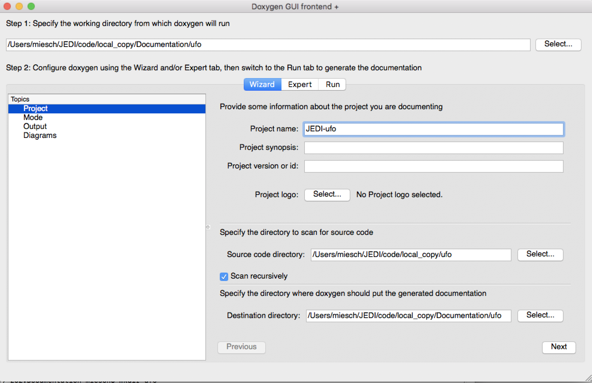
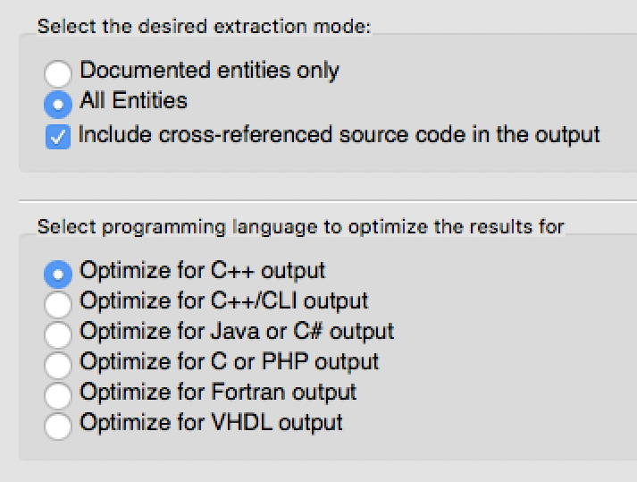
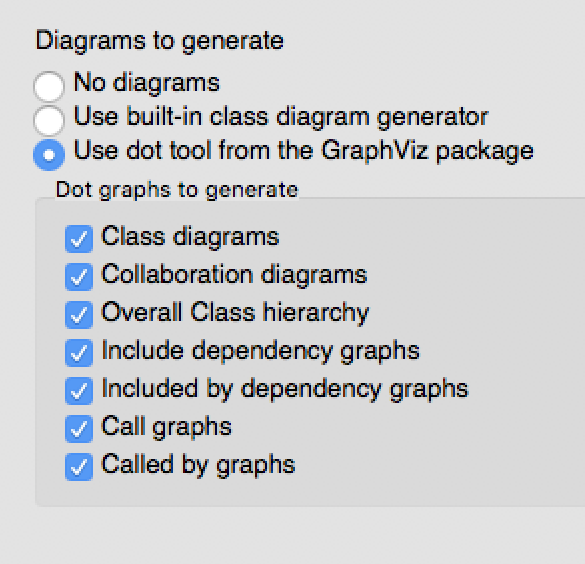
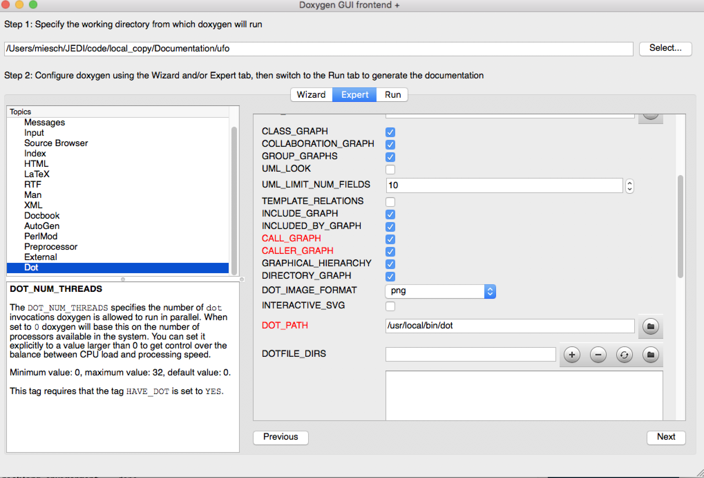
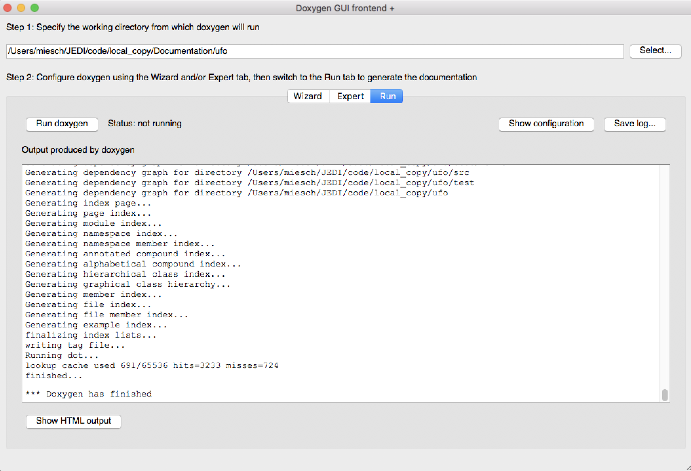
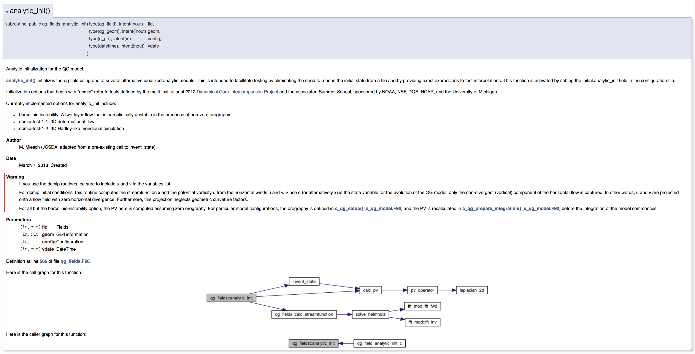

Doxygen
=======

We at JEDI use `Doxygen <http://www.stack.nl/~dimitri/doxygen/>`_ for generating man pages, inheritance diagrams, call trees and other types of html documentation that is linked to specific blocks of source code such as classes or functions.  For generating web-based manuals, guides, and tutorials we use :doc:`Sphinx <getting-started-with-sphinx>`.

Doxygen is open-source software that was developed by Dimitri van Heesch and is distributed under the GNU General Public License.  For further information on the project see `the Doxygen home page <http://www.stack.nl/~dimitri/doxygen/>`_ and for extensive documentation on how to use it see:

    `The Doxygen User Manual <http://www.stack.nl/~dimitri/doxygen/manual/index.html>`_

In what follows we give practical tips on how to use Doxygen within the context of JEDI.

Installing Doxygen
------------------

Doxygen is included in the :doc:`JEDI Singularity container <../jedi_environment/singularity>` and may already be installed on your system.  To check whether it is already installed, just type this at the command line:

.. code:: bash

  doxygen --help

If it is not already installed, you can obtain executable binary files for Mac OS X, Linux, and Windows through the
`Doxygen web page <http://www.stack.nl/~dimitri/doxygen/download.html>`_ or you can download the source code from
`GitHub <https://github.com/doxygen/doxygen>`_ and build it yourself.

Alternatively, if you have a Mac, you can install Doxygen with :doc:`Homebrew <homebrew>` 

.. code:: bash

  brew install doxygen # (Mac only)

.. _graphviztab:  

Depending on how you install Doxygen, you may be prompted for optional add-ons, including **Doxywizard** and **Graphviz**.  We recommend that you **say yes to both**.  `Doxywizard <https://www.stack.nl/~dimitri/doxygen/manual/doxywizard_usage.html>`_ is a convenient Graphical User Interface (GUI) for configuring and running Doxygen and `Graphviz <https://www.graphviz.org/>`_ is a plotting package that will enable you to generate inheritance diagrams and call trees.

In particular, Graphviz includes an interpreter for the `DOT <https://graphviz.gitlab.io/_pages/doc/info/lang.html>`_ graphical display language.  A dot interpreter might already be installed on your system.  For example, if you installed doxygen via Homebrew or if you use the :doc:`JEDI Singularity container <../jedi_environment/singularity>`, you may not need to install anything else.  To check, try running:

.. code:: bash

  dot --help

If it's not already there you can install Graphviz using the executable binaries available from their
`download site <https://www.graphviz.org/download/>`_ or you can install it explicitly with
:doc:`Homebrew <homebrew>`:

.. code:: bash

  brew install graphviz # (Mac only)

  
Running Doxygen
---------------

Doxygen documentation is inserted directly into the source code using specific directives.  Since these directives are located within comment blocks, they do not affect the compilation of the code.  And, since C++ and Fortran have different ways to define comment blocks, the instructions for adding Doxygen documentation to these source files are correspondingly different.  See below for instructions on how to add Doxygen documentation to :ref:`C++ <doxygen-Cpp>` and :ref:`Fortran 90 <doxygen-Fortran>` source code.

The JEDI source code already has some Doxygen documentation within it.  So, even before you add your own documentation, you can run Doxygen on a particular JEDI repo and view the results.  We use Doxygen to generate html files and man pages.  In this tutorial we will focus on the html files.  If you wish, you can also generate other types of output, including LaTex.

The easiest way to run Doxygen is with the `Doxywizard <https://www.stack.nl/~dimitri/doxygen/manual/doxywizard_usage.html>`_ GUI (if you'd rather skip Doxywizard, see :ref:`below <nowizard>`).  Just start it up and fill in the menu items as shown here:

		    
Take note in particular of **Step 1** at the top, namely specifying the directory from which Doxygen will run.  If you select **Save** when you exit Doxywizard, Doxygen will create a configuration file in this directory called **Doxyfile** that you can later load into Doxywizard (via the File-Open... menu item) or edit manually.  Then specify the source code directory and the destinattion directory (the project name is optional).

**Tip** Be sure you select the **Scan recursively** option when specifying the directory for the source code.

**Tip** For now it's a good idea to place the Doxygen output into a directory outside the JEDI repos.  Currently we do not include the Doxygen documentation in the GitHub repositories, though this may change.  If you do select an output directory within the JEDI repos, please exclude it from your commits so your files are not uploaded to the main JEDI repos on GitHub.

After you finish filling in this Project page, select **Mode** from the Topics menu on the left.  Here make sure you select **All Entries** and **Include cross-referenced source code in the output**.  Also, you may wish to optimize for either C++ or Fortran output.

.. describe running doxygen from the command line
   describe running with Doxywizard

Then proceed to the **Output** menu item on the left and make sure **html** is selected.  Then select **Diagrams** and, if you installed GraphViz as described :ref:`above <graphviztab>`, select **use dot tool from the GraphViz package**.  And, select the diagrams that you'd like dot to generate:

   
There is one more thing you may need to do in order to get dot to work correctly.  Select the **Expert** menu item at the top of the window (between *Wizard* and *Run*) and scroll down the menu on the left to select **dot**.  First make sure the **HAVE_DOT** item is checked and then scroll down to specify the **dot path**, which is likely /usr/local/bin/dot.

That is sufficient to run Doxygen but you may wish to browse some of the other items on the **Expert** menu, particularly under **Build**.  When you're finished, select **Run** from the top menu to get to the run screen and then select the **Run doxygen** button on the upper left to run Doxygen. 

.. _nowizard:

Wait patiently for it to run - it may take a few tens of seconds, particularly if you asked to generate many graphs. 
If you'd rather not use the Doxywizard GUI, you can do all of the above and more by creating the Doxyfile configuration file manually from the command line and then editing it directly to select the options you want.  To manually generate a Doxyfile, go to your directory of choice and type:

.. code:: bash

  doxygen -g

Then, after editing the file to specify your configuration options (including the source and output directories), just type this thereafter (from the directory that contains the Doxyfile):

.. code:: bash

  doxygen

To see the glorious abundance of configuration options, consult the `Doxygen Manual <https://www.stack.nl/~dimitri/doxygen/manual/config.html>`_.  

If you have any problems, try consulting the `Troubleshooting <https://www.stack.nl/~dimitri/doxygen/manual/trouble.html>`_ section of the Doxygen manual or the `Doxygen tag <https://stackoverflow.com/questions/tagged/doxygen>`_ on Stack Overflow - or email Mark (`miesch@ucar.edu <miesch@ucar.edu>`_) or Steve (`stephenh@ucar.edu <stephenh@ucar.edu>`_). 

Viewing the Output
-----------------------

If you have used Doxywizard to generate html output, then just select **Show HTML Output** from the **Run** menu to view the results.  Alternatively, if you are not using Doxywizard, you can navigate to the directory where you told Doxygen to put the output (if you don't know, search for the :code:`OUTPUT_DIRECTORY` declaration in the Doxyfile).  There you will find a directory called :code:`html` and inside the html directory you'll find an :code:`index.html` file.  Load this into your browser and behold.

Use the menus to peruse the files, functions, namespaces, classes, etc.  Selecting **Classes-Class Heirachy** will give you an inheritance diagram like this:

.. image:: images/doxygen_inheritance.png
    :height: 400px
    :align: center
	    
Selecting a file from the **File List** will let you see the documentation for the functions and classes it contains, including calll diagrams.  Here is an example of doxygen-generated documentation for a function - select the image for a closer look (note that most JEDI functions do not yet have this level of Doxygen documentation).
	    

This is only the beginning - we encourage you to dive in and explore!

To view the output as a man page, first make sure you have enabled the :code:`GENERATE_MAN` option by selecting it in the **Expert-Man** menu of Doxywizard or by editing the Doxyfile.  Then navigate to the :code:`man/man3` subdirectory of the output directory.  There you can type :code:`ls` to see what man pages are available to view.  These include files, namespaces, directories, and classes.  To view one, type e.g.
	    
.. code:: bash

   man ./qg_fields.3

The :code:`.3` extension (and the :code:`man3` directory name) refers to section 3 of the :code:`man` organizational structure, which is typically reserved for `library functions <https://en.wikipedia.org/wiki/Man_page>`_.  You can change this by changing the Doxygen variable :code:`MAN_EXTENSION`.

In the future, we plan to maintain a central directory tree for the man pages that you will be able to include in your :code:`MANPATH`, thus avoiding the :code:`./` syntax above.  But this is still under development.	  
	    
.. _doxygen-Cpp:

Documenting C++ source code
---------------------------

There are `several ways <https://www.stack.nl/~dimitri/doxygen/manual/docblocks.html#specialblock>`_ to include Doxygen documentation in C++ source files.  We recommend the Qt style, as illustrated in this example:

.. code:: c 
	  
   // -----------------------------------------------------------------------------
   /*! \brief Example function 
   * 
   * \details **myfunction()** takes a and b as arguments and miraculously creates c.
   * I could add many more details here if I chose to do so.  I can even make a list:
   * * item 1
   * * item 2
   * * item 3
   *
   * \param[in] a this is one input parameter
   * \param[in] b this is another
   * \param[out] c and this is the output
   *  
   * \author L. Skywalker (JCSDA)
   * 
   * \date A long, long, time ago: Created
   * 
   * \warning This isn't a real function!
   *
   */
   void myfunction(int& a, int& b, double& c) {
      [...]

A few things to note.  First, the documentation for a function or class comes in a Doxygen comment block immediately before the function or class is defined.  The Doxygen block begins with :code:`/*!` and ends with :code:`*/`.  Each line in between begins with :code:`*`.  Doxygen commands are indicated with :code:`\ ` or, alternatively, :code:`@`.  :code:`\brief` gives a brief description that will appear in html and other lists whereas :code:`\details` gives further details as would appear in a man page.  :code:`\param` describes the arguments of the function while multiple :code:`\author` and :code:`\date` items can provide a history, tracking the function's development.  :code:`\warning` provides useful usage tips to the user or developer.

These are only the essentials; there are many more...

   `Doxygen commands <https://www.stack.nl/~dimitri/doxygen/manual/commands.html>`_

...described in the online manual.

Note also that Doxygen supports `Markdown <https://www.stack.nl/~dimitri/doxygen/manual/markdown.html>`_ language features for further formatting of the output.  Examples of Markdown above include the asterisks in :code:`**myfunction()**` (bold type) and the bulleted list.

Doxygen also supports `latex <https://www.stack.nl/~dimitri/doxygen/manual/formulas.html>`_ for including formulae in latex and html output.  Latex math mode is delimited by :code:`\f$` symbols as follows:

.. code:: c 
	  
   /*! ...
   * This is an equation: \f$\nu = \sqrt{y_2}\f$
   */   

In order to render this properly in the html output you must enable the :code:`USE_MATHJAX` option by selecting it in the Expert-HTML menu of Doxywizard or by editing the Doxyfile configuration file.
   
.. _doxygen-Fortran:

Documenting Fortran source code
-------------------------------

Including Doxygen documentation in Fortran is similar to C++ as described :ref:`above <doxygen-Cpp>`, but with appropriate Fortran comment indicators.  Also, the Doxygen parameter descriptions can follow the argument declarations as demonstrated here:

.. code:: fortran 
	  
   ! -----------------------------------------------------------------------------
   !> \brief Example function 
   !! 
   !! \details **myfunction()** takes a and b as arguments and miraculously creates c.
   !! I could add many more details here if I chose to do so.  I can even make a list:
   !! * item 1
   !! * item 2
   !! * item 3
   !!
   !! \author L. Skywalker (JCSDA)
   !! 
   !! \date A long, long, time ago: Created
   !! 
   !! \warning This isn't a real function!
   !!

   subroutine myfunction(a, b, c)
      integer, intent(in)              :: a !< this is one input parameter 
      integer, intent(in)              :: b !< this is another
      real(kind=kind_rea), intent(out) :: c !< and this is the output
      [...]

The Doxygen code block here begins with :code:`!>`, and subsequent lines begin with :code:`!!`.  The parameter definitions begin with :code:`!<`.  The supported Doxygen commands are the same as in C++.
      

