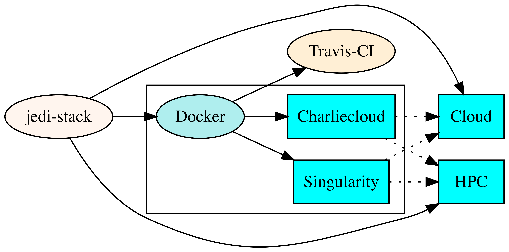

.. _top-Containers:

JEDI Portability
================

As emphasized :doc:`elsewhere <../../overview/index>`, one of our motivating visions behind JEDI is to make it generic, powerful, and efficient enough to be used for a wide range of applications from pedagogical and experimental toy models to coupled NWP systems capable of cutting-edge research and operational forecasting.  This means that JEDI users will use a wide range of computing platforms, from laptops and workstations to cloud platforms to HPC facilities at national centers.

But JEDI does not exist in a vacuum.  Like any modern, sophisticated software package, it leverages a number of `third-party libraries and applications <https://github.com/JCSDA/jedi-stack>`_ to enhance functionality and performance.  Examples include libraries to read and write NetCDF data files (NetCDF, HDF5, PNetCDF), to perform linear algebra computations (LAPACK, Eigen3), to communicate among processors through the message passing interface (MPI), and even to build the code itself (C++/C/Fortran compilers, cmake, ecbuild).  Sorting out all these dependencies can be frustrating for a user who just wants to get straight to the science.

In order to help JEDI users and developers quickly create a productive and consistent computing environment, the JEDI team provides a number of portability tools.  These include:

* Sofware Containers (:ref:`Docker <docker_overview>`, :doc:`Singularity <singularity>`, :doc:`Charliecloud <charliecloud>`)
* Machine images for cloud computing  (e.g. AMIs for `Amazon Web Services <https://aws.amazon.com>`_)
* :doc:`Environment modules <modules>` for selected HPC systems

These portability tools are themselves unified in order to further promote common computing environments across systems.  Our approach is summarized in the following diagram.

The (public) JCSDA `jedi-stack repository <https://github.com/JCSDA/jedi-stack>`_ contains common build scripts that specify the software packages, versions, and configuration options that are required to build and run jedi.  Tagged versions of the jedi-stack will be coordinated with public JEDI releases when they become available.  These build scripts are used to build a :ref:`Docker container <docker_overview>` that is in turn used to build Singularity and Charliecloud containers that can be run on laptops, workstations, cloud platforms, and HPC systems.  Alternatively, we also use the jedi-stack directly to build environment modules on cloud platforms (e.g. AMIs) and HPC systems.  We also leverage the Docker containers for continuous integration testing by means of `Travis-CI <https://travis-ci.org/>`_

In the remainder of this page, we describe in a bit more detail the rationale behind the use of software containers and how we use Docker.  :doc:`Singularity <singularity>`, :doc:`Charliecloud <charliecloud>`, and :doc:`environment modules <modules>` are then described in separate pages.   Stay tuned for further details on how to run JEDI in the cloud.

.. _Software-Containers:

Software Containers
-------------------

A working definition of a sofware container is **A packaged user environment that can be "unpacked" and used across different systems, from laptops to cloud to HPC**.

So, given our overview of JEDI Portability and use cases :ref:`above <top-Containers>`, containers seem like an ideal fit.

From a JEDI perspective, the main purpose of containers is **Portability**: they provide a uniform computing environment (software tools, libraries, compilers, etc) across different systems.  So, users and developers can focus on working with the JEDI code without worrying about whether their version of cmake is up to date or whether or not NetCDF was configured with parallel HDF5 support (for example).

But containers offer other advantages as well, including the following.

**BYOE: Bring Your Own Environment**: Containers let JEDI masters pick and choose which software packages and versions to include and which configuration options will allow them to work optimally with the JEDI code.  So, there is no need for users and developers to deal with compatibility issues.

**Reproducibility**:  Like the JEDI code itself, containers can be tagged with public releases so that specific results such as forecasts/reanalyses or numerical experiments can be reproduced.  For example, a researcher can specify the version of JEDI and the version of the container that was used in a particular publication so that others can reproduce the results presented.  `Singularity <https://journals.plos.org/plosone/article?id=10.1371/journal.pone.0177459>`_ takes particular care to ensure that results are reproducible.

**Workflow**: Containers enable new JEDI users to get up and running quickly.  They enable users to do code development on laptops and workstations, saving valuable HPC resources for production runs.  And, they allow for the optimal support of particular use cases.  For example, **development containers** include binary dependencies together with the compiler and MPI library that they were build with.  Users/developers would then download the JEDI source code from GitHub and compile it within the container.  By contrast, **application containers** include the compiled JEDI source code and dependencies, without the compilers themselves, ready to run (*plug and play*).  For a list of currently available containers, consult the `Containers page on the JCSDA Data Repository <http://data.jcsda.org/pages/containers.html>`_.

In contrast to virtual machines, containers do not include the necessary software to build an entire operating system.  Rather, they work with the host operating system to provide the desired functionality, including the libraries, applications, and other software tools that your code needs to run.  So containers generally require much less memory to store and to set up than virtual machines.  And, they are generally more efficient because they can interact with the hardware directly via the host kernal without the need for an intermediate interpretive layer called a `hypervisor <https://en.wikipedia.org/wiki/Hypervisor>`_.

.. _docker_overview:

Docker
------

The most popular container provider is `Docker <https://www.docker.com>`_.  This was introduced in 2013 and quickly became the industry standard, now supported by a wide variety of applications and computing platforms.  But Docker has a fatal design flaw that makes it unsuitable for High Performance Computing (HPC).  Namely, Docker containers run as a child process of a root daemon.  This poses severe security risks on HPC systems because it could allow users to escalate their access privileges.  This is unlikely to change because Docker was developed for business enterprise applications where this level of control is beneficial. `See Kurtzer et al (2017) for further discussion <https://journals.plos.org/plosone/article?id=10.1371/journal.pone.0177459>`_.

By contrast, :doc:`Singularity <singularity>` and :doc:`Charliecloud <charliecloud>` were developed by HPC professionals for HPC applications.  Singularity in particular includes HPC features such as native support for MPI schedulers (e.g. slurm) and GPU compute cores.  Furthermore, both Singularity and Charliecloud containers can be built from Docker containers (or, more appropriately, from Docker images, which are multi-layered files that spawn Docker containers).  So, this justifies the workflow in the diagram shown :ref:`above <top-Containers>`: our JEDI Singulary and Charliecloud containers are both generated from a common Docker image.

However, there is one distinguishing feature of Docker is that is worth mentioning: it does not rely on the linux user namespaces and other features (for example, SetUID) that Singularity and Charliecloud require.  This is what makes it unsuitable for HPC since it achieves containerization instead by means of the root daemon.  However, these linux features are not yet supported by Mac OS and Windows.  So, in short, Docker can run natively on laptops and PCs running Mac OS or Windows whereas Singularity and Charliecloud cannot.  Our recommendation for these systems is to run Singularity or Charliecloud within a :doc:`Virtual Machine <vagrant>`.  Still, some advanced developers may wish to work with the JEDI docker image directly.  Since the image is publically hosted on the `Docker Hub <https://hub.docker.com/>`_, they are free to do so:

.. code:: bash

    docker pull jcsda/docker-<name>:latest

Where ``<name>`` specifies the compiler suite, mpi library, and container type (e.g. development, application, or tutorial).  For example, a name of ``gnu-openmpi-dev`` is used for the Docker image built with the gnu compiler suite and the openmpi mpi library.  For a list of currently available JEDI Docker containers, `go to Docker Hub <https://hub.docker.com>`_ and search for ``jcsda``.

Again, this is **not** the recommended practice.  The JEDI :doc:`Singularity <singularity>` and :doc:`CharlieCloud <charliecloud>` containers are better supported and  provide a more familiar working environment for most users and developers.   The recommended practice is therefore to first establish a linux environment on your laptop or PC using a virtual machine provider like :doc:`Vagrant <vagrant>` and then to run the JEDI :doc:`Singularity <singularity>` or :doc:`Charliecloud <charliecloud>` container there.

If you do decide to run the JEDI Docker containers directly, be sure to log in as the user jedi, for example:

.. code:: bash

    docker run -u jedi --rm -it jcsda/docker-<name>:latest

If you log in as root (the default) then the mpi tests will likely fail.
