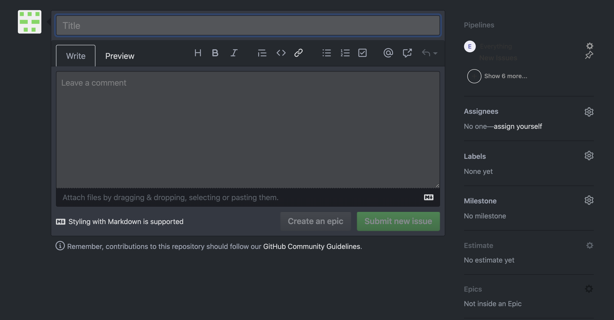

.. _issues-top:

Create PLEATED Issues to let your team know what you are working on
===================================================================

Issues in Github serve several functions.

First, issues serve as a **To Do** list to keep track of work that needs to be done.  For example, they may describe a feature that needs to be added or a bug that needs to be fixed.

Equally important, the second function of issues is that they enhance cooperation.  By moving an issue into the **In Progress** pipeline (see below), you are telling your teammates that you are working on this task.  Furthermore, GitHub issues serve as discussion threads, so others who are interested in the task at hand can comment, ask questions, offer to help, etc.

A third use of issues in JEDI is that they form an essential building block for project management, promoting accountability in issue tracking, facilitating project reporting, and promoting the planning of events such as code sprints.

Many, perhaps most issues may be created in project team meetings.  However, there will likely be occasions where you may encounter a bug or a missing feature and you want to note this as something that should be addressed.

JEDI uses the GitHub plugin `ZenHub <https://www.zenhub.com/>`_ to help manage issues within the framework of agile software development.  Most developers will not need to concern themselves with the project management features of ZenHub.  However, to be able to create and work with PLEATED issues as described below, it is recommended that you install the `ZenHub browser extension <https://www.zenhub.com/extension>`_.

You can create a new issue by going to the ZenHub project board and selecting the green **New Issue** button toward the upper right of the board.  Or, alternatively you can select the **Issues** tab in GitHub and find a similar **New Issue** button there.  This should bring up a window that looks something like the following:

What is a PLEATED issue?  PLEATED is a mnemonic to guide you in created a proper issue that can be used for all the functions referred to above (tracking, collaboration, and project management).  Each of the letters corresponds to metadata that you should provide, namely:

.. _pleated:

  * **P**: Pipeline
  * **L**: Label
  * **E**: Estimate
  * **A**: Assignees
  * **T**: Title
  * **E**: Epic
  * **D**: Description

We'll begin with the **T** and **D** toward the end of the mnemonic.  Be sure to give your issue an appropriate title and description (in the **leave a comment** text box).  The best titles are specific and measurable, making it clear what it means for the issue to be done.  For example, **Improve run time of test x by 20%** is better than **Improve run time of test x**.  The description should include a motivation for the proposed task and a brief overview of the code changes it may entail.  It could also be used to solicit input from others.

The **A** in PLEATED reminds you to identify the individuals (identified by GitHub user name) responsible for carrying out this task, namely the **Assignees**.  Like most of the other items in the mnemonic, you can specify this using the menus located in the right column of the window. The assignees may also include individuals who are interested in following the progress of the issue.  Further coordination of effort can be clarified in the discussion thread.

The **Pipeline** refers to how ZenHub organizes tasks.  In most cases you can select **Backlog** for this from the drop-down menu and it will be reviewed in the next project team meeting.  Lower priority items may be put in the **Icebox** pipeline.  Or, if it is a question for your colleagues (as in a discussion board), as opposed to a specific action item, you may wish to select **Review/QA**.

Immediately below the **Pipeline** specification is a drop-down menu for **Label**.  This describes the nature of issue; for example, is it a bug, a new feature (enhancement), an optimization, or just a question?  All JCSDA repositories on GitHub use a common set of labels.

This leaves the two **E**'s.  The first stands for **Estimate** - how much work do you think this task will take to complete?  This is notoriously difficult to get right and it is often acknowledged that all estimates are wrong to some degree.  Nevertheless, for planning and recording purposes, it is important to distinguish between minor changes that will take only an afternoon to complete and major refactoring of code that may involve several weeks of work.

The numerical scale you see when you select the drop-down menu for Estimate is nonlinear.  There is little rationale behind this scale other than the idea that some tasks are much harder than others.  The most accurate way to assign a numerical value to an amount of work is to collaboratively compare it to other tasks as an agile team.  But, in the absence of this process, a good rule of thumb is 1 point for half a day's work.  So, if this task can be completed in a free afternoon, give it an estimate of 1.  If you expect it to take a week or so of dedicated work, maybe give it an 8 or a 13.  Note that this need not mean it was done in a week because it is likely that not all your time has been solely dedicated to this particular feature branch.  Estimates can always be adjusted after the work is completed and/or after discussion in the team meetings.

The second **E** stands for **EPIC**.  In JEDI, Epics are generally linked to the JCSDA Annual Operating Plan (AOP).  So, this lets you link the task to some specific item in the AOP.  You can find the appropriate item using the searchable **Epics** menu in the right column.  It is possible to assign a task to more than one Epic.

You may optionally also specify a Milestone from the drop-down menu on the right.  The appropriate milestone should generally be determined at the project team meetings but it can be useful to suggest a value here.

The principle differences between Epics and Milestones are their scope and duration.  Milestones generally refer to focused efforts such as code sprints that span a month or less whereas Epics refer to longer-term objectives or projects.

For much more information on Epics, Milestones, and Estimates see the excellent documentation available from the `ZenHub Help Center <https://help.zenhub.com/support/home>`_.
