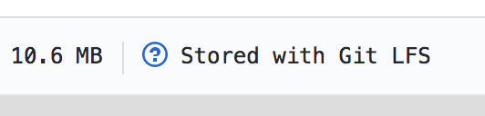

.. _git-lfs-devtools:

Git-LFS
=======

`Git-LFS <https://help.github.com/articles/about-git-large-file-storage/>`_ is a service to manage large files on GitHub repositories.  **LFS** stands for **Large File Storage**.

Standard GitHub has a strict limit of 100 MB per file.  Space limits for GitHub repositories are a little more
`fuzzy <https://help.github.com/articles/what-is-my-disk-quota/>`_ but you might get some polite complaints from user services if your repos exceed 1GB.

At JEDI, we use Git-LFS to get around these limits.  Git-LFS allows for individual files of up to 2 GB and provides storage in units of 50-GB data packs (each with 50GB/month bandwidth), for a monthly fee.

Git-LFS works by storing large files on a remote server (called a **Store**) and then including text pointers to these files in the appropriate GitHub repositories in place of the files themselves.  When the files are needed to run or compile your code, they are retrieved from the Store on an as-needed basis.

The logistics of how all this works will become more clear as you go through the process of installing and using Git-LFS.

Installing git-lfs
------------------

Git-LFS is a service but it is also an application.  The application is a command-line extension to :code:`git` that enables you to access and use the service.

If you are working from within the JEDI container then you can skip this section; the git-lfs application is already installed as part of the JEDI environment.

If you have a Mac, you can install the git-lfs application outside the container using :doc:`Homebrew <homebrew>`:

.. code-block:: bash

   brew install git-lfs

If you have a Windows or a Linux machine or if you use MacPorts instead of Homebrew, you can go `download and install the application from GitHub's git-lfs site <https://git-lfs.github.com/>`_.

.. _using-gitlfs:

Using git-lfs
-------------

The first step in using Git-LFS is to identify files that are too large to be included in a GitHub repository.  This certainly includes any files over 100 MB but it may also include smaller files that contain observational data sets or restart files for models - anything that is not code and that occupies a significant chunk of memory is a candidate for Git-LFS.  Remember that GitHub prefers it if repos occupy no more than 1GB.  So, even 10 MB files can push the limit if you have dozens of them.

If you plan to add any files to a JEDI repository that meet this description, then you should consult the section below on

     :ref:`Adding large files to a JEDI repository <gitlfs-addfiles>`

If you are only modifying code then you should not have to worry too much about Git-LFS.  Once it is set up for a given repository, the rest is pretty transparent to the user.  Any files that are tracked by git-lfs will not occupy memory in your GitHub repository but you'll still see them listed there just like the other files.  If you select one of those files you may notice an inconspicuous message like this:

Otherwise everything should look pretty much the same.  If it is a binary file you may see a polite message to the user that *we can't show files that are this big right now*.  However, you'd see the same message even if the file were not on LFS.  In either case, if you select :code:`View Raw` or :code:`Download`, then GitHub will download the file to your computer, retrieving it from the LFS Store if necessary.  If it's an image file, GitHub will just retrieve it from the LFS Store and display it for you to behold.

When you pull or fetch and checkout a particular commit, then git LFS will check to see if you already have the tracked files on your system.  This is called your **local LFS cache**.  If so, it will replace the pointers with your local files.  If not, it will download the LFS-tracked files from the remote Store.

An advantage of git LFS (in addition to the larger files sizes and more memory per repo) is that it takes less time to push, pull, and fetch repositories.  If the large files don't change, they can just sit on your local computer (in your local LFS cache) and there is no need to shunt them back and forth to and from GitHub.

Once Git LFS is installed, you can manage a LFS-enabled repo as you would any other; the standard fetch, pull, push, and clone commands work as before (beware of outdated documentation in google searches that says otherwise).

To see if Git LFS is enabled for a given repository and, if so, which files it tracks, go to the repository and enter

.. code-block:: bash

   git lfs track

This will show you the tracked patterns.  To see the actual files that are currently being tracked (i.e. stored on the LFS store instead of GitHub proper), enter

.. code-block:: bash

   git lfs ls-files

For a complete list of git-lfs commands, enter

.. code-block:: bash

   git lfs help

Or, to get more detailed information on any particular command, enter

.. code-block:: bash

   git lfs help <command>

For technical details on how the pointers are implemented see the official `Git LFS Specification <https://github.com/git-lfs/git-lfs/blob/master/docs/spec.md>`_.  And, for details on how to access the Git LFS Store directly, see the `Git LFS API <https://github.com/git-lfs/git-lfs/tree/master/docs/api>`_.

For further documentation and usage tips, see `GitHub's help page <https://help.github.com/articles/about-git-large-file-storage/>`_ and `this tutorial <https://github.com/git-lfs/git-lfs/wiki/Tutorial>`_.

.. _gitlfs-addfiles:

Adding large files to a JEDI repository
---------------------------------------

If you'd like to add one or more large files to an existing JEDI repository, it's likely that that repository is already set up to use Git LFS.  To see if this is the case, then go to the repository in question and enter

.. code-block:: bash

   git lfs track

If this command does not return anything then Git LFS is not yet implemented for this repository.  If that is the case, see :ref:`Activating Git-LFS for a JEDI repository <activating-gitlfs>` below.

More likely, the above command *will* return a list of the files in this repository that are currently being tracked by Git LFS.  For example:

.. code-block:: bash

   Listing tracked patterns
       test/testinput/*.nc (.gitattributes)
       test/testinput/*.nc4 (.gitattributes)

This tells you that Git LFS is tracking all netCDF files with the extension :code:`.nc` or :code:`.nc4` in the subdirectory :code:`test/testinput` (all paths are relative to the top directory of the repo).

If the file or files that you wish to add to the repository are already covered by these tracked patterns, then you are done.  There is nothing more you need to do.  For example, if the tracked patterns were as listed above and if I were to add a file called :code:`newfile.nc` to the :code:`test/testinput` directory, then this new file would be tracked by Git LFS.  If I then proceeded to commit this branch and push it to GitHub, :code:`newfile.nc` would be copied to the Git LFS Store and a pointer to it would be generated and stored on GitHub.

If the current LFS tracked patterns do not match the new or modified files you wish to add, then you need to define new patterns that do match.  You do this with the :code:`git lfs track` command, for example:

.. code-block:: bash

   git lfs track "*.nc"
   git lfs track "Documentation/*.ps"
   git lfs track "mydata/**"

The :code:`git lfs track` command accepts full directories or wildcards as as shown above.  The first command tells get to track :code:`.nc` files anywhere in the directory tree of the repository.  The double asterisk in the third command instructs git-lfs to recursively include all subdirectories.  Paths are relative to the top level of the repository.  You can specify as many patterns as you wish.  These will all be stored in the :code:`.gitattributes` file in the top directory of the repo and they can be listed with the :code:`git lfs track` command as described above (omitting arguments will generate the list).

Once you have your tracking patterns set up, then you can proceed to add your files.

.. note::

    **Be sure to set up the appropriate tracking patterns before you add your large files to the repository.**

So, you're ready to go.  However, it is worth emphasizing that space is limited even on the LFS store and it's
`not easy <https://stackoverflow.com/questions/34579211/how-to-delete-a-file-tracked-by-git-lfs-and-release-the-storage-quota>`_ to remove a file once it is there (only the repo administrator can do this).  Without careful attention, the accumulation of large files can add up quickly.  So, please be prudent when adding large files to a JEDI repository.

.. note::

   Before adding large files to a JEDI repository, please ask yourself these questions:
     * Will these files be useful to the JEDI community?
     * Am I only including the files/data necessary to run a particular test or demonstration (pruning out all unnecessary auxiliary files/data)?
     * Will these files remain useful indefinitely, without the need for frequent updating?

.. _activating-gitlfs:

Activating Git-LFS for a JEDI repository
----------------------------------------

Most JEDI users and developers can safely skip this section.  By the time you read this, most relevant JEDI repositories will have already been configured to use Git-LFS.

As described :ref:`above <gitlfs-addfiles>`, to see if the repository is already set up to use Git LFS, go to the repository and enter

.. code-block:: bash

   git lfs track

If this generates a listing of tracked patterns then you can skip this section; Git-LFS is already set up.

If it does not, then you can activate Git LFS by **going to the top directory of that repository** and entering

.. code-block:: bash

   git lfs install

This will activate git-lfs for that repository.

Now you have to tell git which files you want to store on the remote LFS Store.  You do this with the git-lfs :code:`track` command as described :ref:`above <gitlfs-addfiles>`, for example:

.. code-block:: bash

   git lfs track "*.nc"
   git lfs track "test/testinput/*.nc4"

Entering one or more of these commands will create (or append) a :code:`.gitattributes` file in the top level of your repository where your specifications will be stored.  So, in order to save your LFS specifications for posterity, you should tell git to track this file:

.. code-block:: bash

   git add .gitattributes

Now you can add your large files and the next time you commit and push this branch to GitHub, it will be properly configured for Git LFS.

**IMPORTANT: Existing files that satisfy your pattern specifications will not be moved to the LFS Store**.  The reason for this is that they are already part of your GitHub history.  They exist in previous commits so they already occupy memory on GitHub.  Replacing them with pointers would be pointless, so to speak, because it would not save any memory.  Even if you were to delete those files from your repository, re-commit, and then re-commit again after adding them back in, GitHub is smart enough to know that these are the same files that were there before so it will use the versions it already has in memory (unless you change the file names or the files themselves).

If you are really courageous and determined, there is a way to move existing files to LFS.  This would require you to first `delete the files from the repo history <https://help.github.com/articles/removing-files-from-a-repository-s-history/>`_ (make sure you move the files some place safe first!).  Then you can run :code:`git lfs install` and :code:`git lfs track` as described above and then move the files back to the repo.  Then when you commit and push to GitHub, the files will be stored on Git-LFS.  Another way to move existing files to the LFS Store is with the `git migrate command <https://github.com/git-lfs/git-lfs/wiki/Tutorial#migrating-existing-repository-data-to-lfs>`_.

However, you can only do this if you have push permission to the repository.  If you do have push permission please use this with **great caution** because it does (literally) rewrite history!  Pre-LFS versions of the repo may fail tests that they previously passed.

It is much better to:

.. note::

     **Use Git-LFS right from the beginning when you add large files to a JEDI repository**
