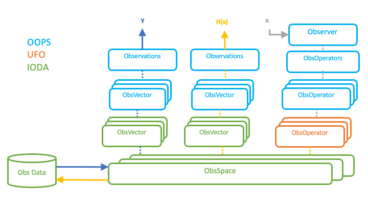

.. _top-ioda-details:

IODA Details
============

IODA Data Model and Classes
---------------------------

The IODA data model consists of three primary classes: Groups, Variables and Attributes (:numref:`ioda-data-model`, a).

.. _ioda-data-model:

   \a\) IODA data model primary classes and b) example of hierarchical IODA Group structure.
   Note in panel b that A, B, C and D are IODA Group objects and V1, V2 are IODA Variable objects.

These classes are combined to create a data model that strongly resembles a file system structure. The IODA Group is analogous to a directory where a Group can contain another Group to form a hierarchical structure (:numref:`ioda-data-model`, b).
The IODA Variable holds a particular data set (e.g., latitude, brightness temperature, u/v winds) and is contained within a Group much like a file exists in a directory.
Both Groups and Variables can contain a IODA Attribute.
The Attribute is used to annotate Groups and Variables with useful information.
For example a Group could hold an Attribute with a string describing the purpose of the Group, and a Variable could hold an Attribute with a string describing its units.

The hierarchical Group structure example (:numref:`ioda-data-model`, b) shows two variables, V1 and V2, which live at leaf positions in the tree.
Like a file system, these variables can be refenced in the system with a slash-separated path.
For example, the variable V1 can be referenced as "/A/B/V1" and the variable V2 can be refenced as "/A/C/D/V2".
Also in the manner of a file system, it is possible to traverse the Group structure and reference variables using a path from the current Group.
For example, the Group B can be opened and the Variable V1 can be access as "V1", or the Group C can be opened and the Variable V2 can be accessed as "D/V2".

:numref:`ioda-attributes-variables` shows details about the IODA Attribute (panel a) and Variable (panel b) classes.

.. _ioda-attributes-variables:

   \a\) IODA Attribute class and b) IODA Variable class

Both the Attribute and Variable classes support the fundamental C++ data types (int, float, char, etc.) as well as a number of C++ STL containers (e.g., string, vector, array, span) and can be dimensioned.
The dimensionality aspect refers to being able to organize the data as a vector (1D), array (2D), or a higher rank (n-D).
The primary difference between an Attribute and Variable is how the dimensionality is implemented.
In the case of the Attribute, the shape (sizes of each dimension) of the data is simply declared and stored with the Attribute (:numref:`ioda-attributes-variables`, a).
Instead for a Variable the dimensionality is declared and stored by means of special Variables called Dimension Scales (x and y in :numref:`ioda-attributes-variables`, b).
The Variable can be thought of as representing a coordinate axis system where each Dimension Scale Variable represents one of the axes in that system.
The Dimension Scale Variables hold the coordinate values associated with the coordinate axis they represent.

Another feature unique to the Variable class is the ability to perform subset selection on the variable data (:numref:`ioda-variable-selection`).

.. _ioda-variable-selection:

   Subset selection mechanism provided by the IODA Variable class

:numref:`ioda-variable-selection` shows an example where the middle four entries in the 1D variable v1 are selected.
This is done by means of the HDF "hyperslab" selection technique where a starting index and element count are used to specify the section of the variable being selected.
This selection mechanism can be applied both during variable reads and writes.

A subclass of the IODA Group called ObsGroup exists which provides organization and management capabilities for using Group, Variable and Attribute classes in the context of JEDI observation data containers.
Currently the IODA ObsSpace class instantiates a IODA ObsGroup object. These two classes will eventually be merged together.
When an ObsGroup is constructed it points to the top of a Group hierarchical structure.
The IODA ObsGroup class provides a "generate" function that instantiates an ObsGroup object along with its associated Dimension Scale Variables.
It also provides a resize function that will resize a list of given dimensions and every variable in the Group hierarchical structure using those dimensions according to new sizes specified with each dimension.

IODA includes a feature, called the Layout Policy, that makes the layout of the group/variable structure inside an ObsGroup object (:numref:`ioda-layout-policy`) appear consistent in the client API, regardless of how the layout is actually implemented.

.. _ioda-layout-policy:
.. figure:: images/IODA_LayoutPolicy.png
   :height: 400px
   :align: center

   IODA Layout Policy

The client API will automatically map path specifications to variables in its calls to whatever the corresponding path is in the implementation of the model.
This will help minimize having to update client calls to the IODA API whenever the underlying implementation is changed.
The left side of :numref:`ioda-layout-policy` shows the structure visible to clients through the IODA API.
The temperature (T) measurements (ObsValue) variable can be referenced as "ObsValue/T" with either of the structures shown in the implementations in the right side of :numref:`ioda-layout-policy`. 
With Implentation 1 "ObsValue/T" is automatically mapped to "T\@ObsValue", and with Implementation 2 "ObsValue/T" is mapped to "Initial/ObsValue/T" (with the understanding that "ObsValue/T" refers to the initial data from the provider and not to data derived by JEDI).

Relationship Between OOPS and IODA
----------------------------------

OOPS provides an abstract interface layer for classes involved in the DA operation.
The OOPS classes are templated so that a variety of concrete objects can be instantiated for those classes.
For example, in the current JEDI system there are two "toy" models, lorenz95 and qg, that implement their own concrete ObsVector class.
In addition, IODA provides a third concrete ObsVector class.
The selection of the ObsVector for a particular DA run is accomplished by declaring which ObsVector you want through the <OBS> template in the OOPS abstract ObsVector class.

IODA provides concrete implementations for two of the OOPS abstract classes, ObsVector and ObsSpace, as shown in :numref:`ioda-classes`.

.. _ioda-classes:
.. figure:: images/IODA_OOPS_Structure.png
   :height: 400px
   :align: center

   Class relationships between OOPS and IODA

The transition from the OOPS abstract class to the corresponding IODA concrete class is handled through a pointer to an instantiated object of the IODA class.
In the ObsVector case, the selection of the IODA ObsVector class is done by substituting "ioda::ObsVector" for the <OBS> type in the OOPS template, and the OOPS data member "data\_" is set up to point to an object of the IODA ObsVector.

The OOPS classes also define the interface to the concrete objects that lie below.
The member methods of the OOPS class simply call the same named methods, in the instantiated object, with the same list of arguments for those methods in the instantiated object.

Multiple ObsSpace Objects
-------------------------

Note that the ObsSpace structure contains a set of ObsSpace objects (:numref:`ioda-classes`).
At the top of the structure in OOPS there is a class, ObsSpaces (note the plural), that contains a vector of pointers (data member "spaces\_") that reference a set of OOPS ObsSpace (note the singular) objects with their corresponding IODA ObsSpace objects.

Each IODA ObsSpace object instantiated by OOPS ObsSpaces is associated with a corresponding UFO ObsOperator.
The ObsOperator is the object that simulates observation values, H(x).
The ObsSpace, ObsOperator pairs form according to observation type (e.g., radiance, radiosonde, aircraft) that only work on those types as opposed to the entire set of observations.
This breaks the problem up into smaller more manageable pieces, and facilitates the observation simulation since each observation type tends to require a different algorithm for its simulation.

Note that there will exist multiple ObsVector objects for two reasons.
First because of the multiple ObsSpace objects, and second because both actual observations (the y vector) and simulated observations (the H(x) vector) are stored in ObsVectors.
Each ObsVector is associated with a single ObsSpace that stores its values in the corresponding Obs Database (:numref:`ioda-classes`).

IODA Data Flow
--------------

The primary use of IODA in the JEDI system is to manage the original observations in the y vector, and simulated observations in the H(x) vector.
Both of these quantities are observation vectors which are stored in ObsVector objects.
:numref:`ioda-obj-dflow` depicts the manner in which y and H(x) are presented to JEDI for use in the DA cost function.

.. _ioda-obj-dflow:

   Data flow through IODA, UFO and OOPS objects

Two OOPS Observations objects are created to hold the total y and H(x) vectors, and one Observer object is created to transform the x vector (from the model) into the H(x) vector.
The Observations and Observer objects are how the rest of JEDI access the y and H(x) vectors.
Note that the resulting H(x) from the set of ObsOperator objects is stored in an Observations object since H(x) is a type of observation vector.

At various points in the DA run, results such as H(x), O-A, or O-B (i.e., any quantity corresponding to a observation vector) can be stored in an Observations object for subsequent writing out into a results file.
An example for H(x) is shown in :numref:`ioda-obj-dflow` with the orange arrow pointing from the set of ObsSpace objects to the Obs Data file.
The data written into the results file can later be used for analysis of the DA run.
