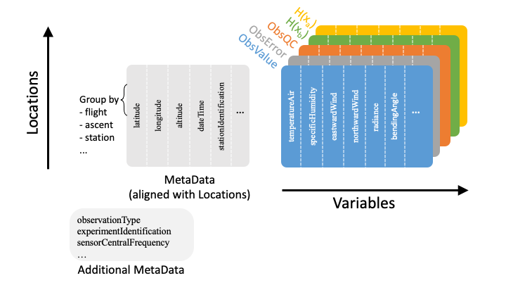
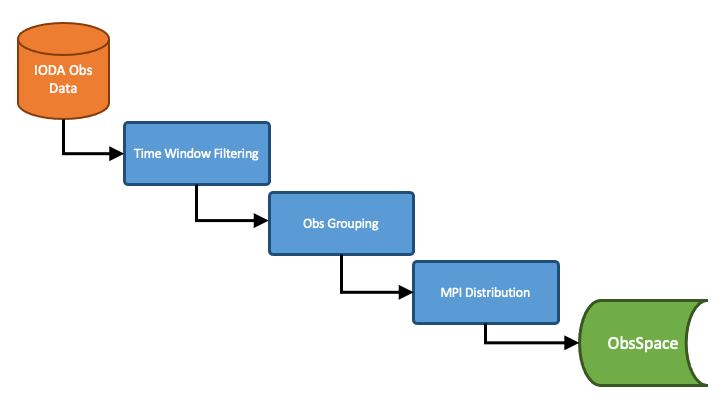

.. _top-ioda-interface:

IODA Interfaces
===============

Background
----------

In the context of running a DA flow, IODA interacts with external observation data on one side and with the OOPS and UFO components of JEDI on the other side (:numref:`ioda-jedi-structure`).
On the observation data side there exist huge amounts of data, thus creating the need to pare these data down to a manageable size for JEDI during a particular DA run.
The primary mechanism for accomplishing this is to filter out all of the observations that lie outside the current DA timing window, and present only that subset to be read into memory during a DA run.

There are many different types of observations that come with a variety of ways that the observation data are organized.
To the extent that is feasible, it is desirable to devise a common data organization of which all of these observation types can employ.
This is where the IODA Data Model (:numref:`ioda-data-model`) comes into play.
The IODA Data Model provides a means for storing conventional (1D trajectories) and radiance (2D images) data in a common Group, Variable and Attribute structure.

A schematic representation of the IODA data model is shown in (:numref:`ioda-schematic`).

.. _ioda-schematic:

   Schematic representation of the IODA data model

Central to this scheme are the 2D tables holding the observation data quantities (ObsValue, ObsError, HofX in :numref:`ioda-schematic`).
Note that a given Group (ObsValue, MetaData, etc.) in the IODA Data Model represents a particular table in the schematic, and the Variables contained by that group are represented by the columns of the associated table.
Each column of a given table holds a particular variable of observation data, where each variable can be a vector (1D), matrix (2D) or of higher rank.
The height of each column is equal to the number of unique locations, (x,y,z,t) or (x,y,t) tuple values, and the number of columns corresponds to the set of available observation variables.
Note that an ObsVector can be constructed using a subset of the variables (columns) in a given table.

In addition to the primary data tables (:numref:`ioda-schematic`, color), tables of meta data (:numref:`ioda-schematic`, gray) can be stored.
The MetaData table (related to locations) contains columns (variables) corresponding to meta data associated with each location.
Examples of location-related meta data are quantities that describe each location such as Latitude, Longitude, Date/Time, and descriptive quantities associated with locations such the Scan Angle of a satellite-borne instrument.

The Additional MetaData table is similar to the MetaData array, except that it holds meta data associated with other dimensions than the locations dimension.
An example for satellite instruments is a MetaData variable holding channel frequencies, which would be associated with the channels dimension.

A primary design principle for IODA is to not alter the original observations and meta data that was received from the data providers.
Nervertheless, there are still important fuctions that IODA needs to perform as shown in :numref:`ioda-operations`.

.. _ioda-operations:

   Operations performed by IODA when reading in observation data

IODA performs three operations that must go in the order shown in :numref:`ioda-operations`.
First all observations that lie outside the DA time window are removed.
Then the locations are organized into groups called "records" according to optional specifications that can be entered in the YAML configuration.
The default is to place each individual location into its own unique record (no grouping).
An example is to organize radiosonde locations by station ID and launch time (ie, locations with matching station ID and launch time values are grouped together into a single record) so that records contain individual soundings.
Lastly the records are distributed to MPI tasks according to distribution specifications in the YAML configuration.
The point of doing the observation grouping before the MPI distribution is to ensure that IODA does not break up the groups (e.g., radiosonde soundings) during the MPI distribution step.

IODA also handles the transfer of observation data between the Data Providers and the diagnostics/monitoring system (:numref:`ioda-hlev-dflow`).
As of the JEDI 1.1.0 release, the IODA architecture (:numref:`ioda-structure`) is targeted to handle these tasks and work is actively progressing to migrate the current implementaions (e.g. ioda converters, diagnostic plotting tools) to the IODA client API.

.. _radiosonde_example_yaml:

Example Radiosonde YAML
"""""""""""""""""""""""

The following is a YAML example for configuring the processing of radiosonde data in UFO.

.. code-block:: YAML

   time window:
     begin: 2018-04-14T21:00:00Z
     end: 2018-04-15T03:00:00Z
   observations:
     observers:
     - obs space:
         name: Radiosonde
         obsdatain:
           engine:
             type: H5File
             obsfile: Data/testinput_tier_1/sondes_obs_2018041500_m.nc4
           obsgrouping:
             group variables: [ stationIdentification ]
             sort variable: pressure
             sort order: "descending"
         obsdataout:
           engine:
             type: H5File
             obsfile: Data/sondes_obs_2018041500_m_out.nc4
         simulated variables: [airTemperature]
       obs operator:
         name: VertInterp
         vertical coordinate: air_pressure
       geovals:
         filename: Data/sondes_geoval_2018041500_m.nc4
       vector ref: GsiHofX
       tolerance: 1.0e-04  # in % so that corresponds to 10^-3
       linear obs operator test:
         iterations TL: 12
         tolerance TL: 1.0e-9
         tolerance AD: 1.0e-11

Note that the :code:`obs space.obsdatain` section is required, whereas the :code:`obs space.obsdataout` section is optional.

The :code:`obs space.obsdatain.obsgrouping` keyword is used to initate the obs grouping step in the IODA input flow (:numref:`ioda-operations`).
This specification is requesting that IODA group locations according the MetaData variable "stationIdentification" ("MetaData/stationIdentification").
All locations with the same unique station_id value will be grouped into an individual record
before doing the MPI distribution step.
The intent of this specification is to keep individual soundings intact during the MPI distribution step.
It is possible to define more than one grouping variable if that is necessary to uniquely identify records in the data set.
The observations will be grouped according to the first variable in the list, then each group will be divided further according to the second variable, etc.

IODA has an additional feature that provides functions that denote the sorting of locations within each record.
A MetaData variable and sort order is specified to enable and drive this feature.
The :code:`obs space.obsdatain.obsgrouping.sort variable` and :code:`obs space.obsdatain.obsgrouping.sort order` are telling IODA to use the values of the "MetaData/pressure" variable in corresponding locations to sort the soundings into ascending order (i.e., descending pressure values).

Under the :code:`obs space.obsdataout.engine.obsfile` specification, the output file is requested to be created in the path: :code:`Data/sondes_obs_2018041500_m_out.nc4`.
IODA tags the MPI rank number onto the end of the file name (before the ".nc4" suffix) so that multiple MPI tasks writing files do not collide.
If there are 4 MPI tasks, then the output will appear in the following four files:

.. code-block:: bash

    Data/sondes_obs_2018041500_m_out_0000.nc4
    Data/sondes_obs_2018041500_m_out_0001.nc4
    Data/sondes_obs_2018041500_m_out_0002.nc4
    Data/sondes_obs_2018041500_m_out_0003.nc4

More details about constructing and processing YAML configuration files can be found in :doc:`/using/building_and_running/config_content` and :doc:`/inside/jedi-components/configuration/index`.

Interfaces to other JEDI Components
-----------------------------------

For now, the ObsSpace and ObsVector interfaces remain backward compatible with the existing OOPS and UFO facing interfaces which are described below.
IODA development plans include the evolution of the existing OOPS and UFO facing interfaces to more directly utilize the IODA client API (:numref:`ioda-structure`).
See the `low-level description of the classes, functions, and subroutines in the IODA Doxygen documentation <http://data.jcsda.org/doxygen/Release/1.1.0/ioda/index.html>`_ for details about the IODA client API.

.. _ioda-oops-interface:

OOPS Interface
""""""""""""""

OOPS accesses observation data via C++ methods belonging to the ObsVector class.
The variables being assimilated are selected in the YAML configuration using the :code:`simulated variables` sub-keyword under the :code:`obs space` keyword.
In the :ref:`radiosonde example <radiosonde_example_yaml>` above, one variable "airTemperature" is being assimilated.
In this case, the ObsVector will read only the airTemperature row from the ObsSpace and load that into a vector.

The ObsVector class contains the following two methods, :code:`read()` for filling a vector from an ObsSpace in memory and :code:`save()` for storing a vector into an ObsSpace.

.. code-block:: C++

   // Interface prototypes
   void read(const std::string &);
   void save(const std::string &) const;

* The :code:`std::string` arguments are the names of the ObsSpace Group that is to be accessed.

Following is an example of reading into an observation vector.
Note that the ObsVector object yobs\_ has already been constructed which included the allocation of the memory to store the observation data coming from the :code:`read()` method.

.. code-block:: C++

   // Read observation values
   Log::trace() << "CostJo::CostJo start" << std::endl;
   yobs_.read("ObsValue");
   Log::trace() << "CostJo::CostJo done" << std::endl;

Here is an example of saving the contents of an observation vector, H(x), into an ObsSpace.
The ObsVector object yobs is constructed in the first line, and the third line creates an ObsSpace Group called "hofx" and stores the vector data into that ObsSpace.

.. code-block:: C++

   //  Save H(x)
   boost::scoped_ptr<Observations_> yobs(pobs->release());
   Log::test() << "H(x): " << *yobs << std::endl;
   yobs->save("hofx");

UFO Interface
"""""""""""""

UFO accesses observation data via Fortran functions and subroutines belonging to the ObsSpace class.
ObsSpace is implemented in C++ and a Fortran interface layer is provided for UFO.
The following three routines are used to access observation data, and unlike the ObsVector methods in the :ref:`ioda-oops-interface` above, access is available to ObsSpace Groups and all MetaData variables.
Reasons to access ObsSpace Groups from UFO would be for debugging purposes or for storing results, such as H(x), for post analysis.
Typically, only meta data are used in the actual H(x) calculations.

.. code-block:: Fortran

   ! Interface prototypes
   integer function obsspace_get_nlocs(obss)
   subroutine obsspace_get_db(obss, group, vname, vect)
   subroutine obsspace_put_db(obss, group, vname, vect)

* The :code:`obss` arguments are C pointers to ObsSpace objects.
* The :code:`group` arguments are names of the ObsSpace Group holding the requested variable
    * E.g., "HofX", "MetaData"
* The :code:`vname` arguments are names of the requested variable (column)
    * E.g., "airTemperature", "sensorScanAngle"
* The :code:`vect` argument is a Fortran array for holding the data values
    * The client (caller) is responsible for allocating the memory for the :code:`vect` argument

Following is an example from the CRTM radiance simulator, where meta data from the instrument are required for doing the simulation.

.. code-block:: Fortran

   ! Get nlocs and allocate storage
   nlocs = obsspace_get_nlocs(obss)
   allocate(TmpVar(nlocs))

   ! Read in satellite meta data and transfer to geo structure
   call obsspace_get_db(obss, "MetaData", "sensorZenithAngle", TmpVar)
   geo(:)%Sensor_Zenith_Angle = TmpVar(:)

   call obsspace_get_db(obss, "MetaData", "solarZenithAngle", TmpVar)
   geo(:)%Source_Zenith_Angle = TmpVar(:)

   call obsspace_get_db(obss, "MetaData", "sensorAzimuthAngle", TmpVar)
   geo(:)%Sensor_Azimuth_Angle = TmpVar(:)

   call obsspace_get_db(obss, "MetaData", "solarAzimuthAngle", TmpVar)
   geo(:)%Source_Azimuth_Angle = TmpVar(:)

   call obsspace_get_db(obss, "MetaData", "sensorScanPosition", TmpVar)
   geo(:)%Ifov = TmpVar(:)

   call obsspace_get_db(obss, "MetaData", "sensorScanAngle", TmpVar) !The sensorScanAngle is optional
   geo(:)%Sensor_Scan_Angle = TmpVar(:)

   deallocate(TmpVar)

An example for storing the results of a QC background check is shown below.
Note that the storage for "flags" has been allocated and "flags" has been filled with the background check results prior to this code.

.. code-block:: Fortran

   write(buf,*)'UFO Background Check: ',ireject,trim(var),' rejected out of ',icount,' (',iloc,' total)'
   call fckit_log%info(buf)

   ! Save the QC flag values
   call obsspace_put_db(self%obsdb, self%qcname, var, flags)
