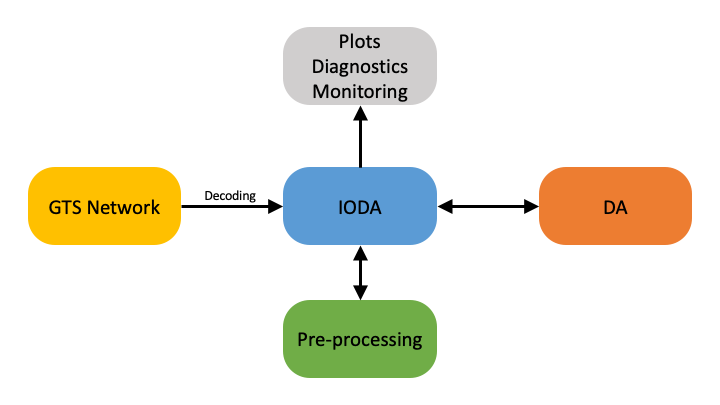
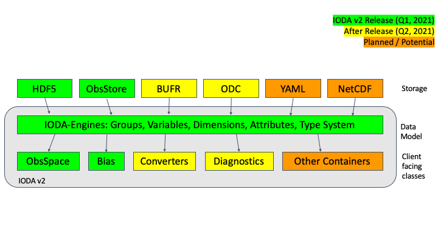
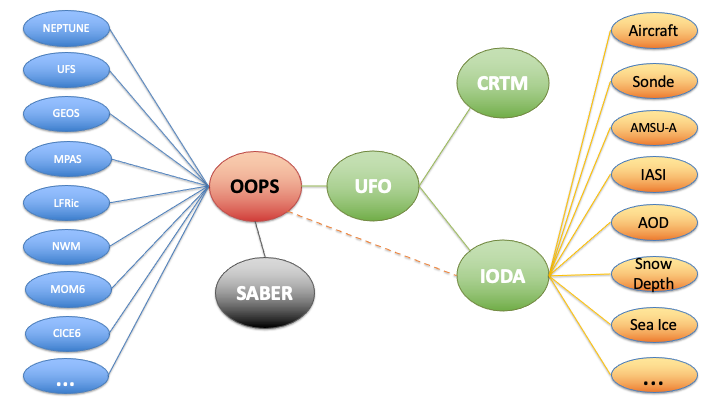

.. _top-ioda-intro:

IODA Introduction
=================

Overview
--------

The Interface for Observation Data Access (IODA) component of JEDI provides the interfaces that bridge the external observation data to the components within JEDI that utilize those data, namely OOPS and UFO.
As shown in :numref:`ioda-hlev-dflow`, observation data needs to be transferred between four primary systems: the data providers, the observation pre-processing system, the data assimilation (DA) process and the diagnostics processes.

.. _ioda-hlev-dflow:

   High level data flow through the IODA subsystem

Data provided by various centers are extracted, loaded into memory and presented through an interface to the JEDI OOPS and UFO subsystems.
The observation data is then trimmed down through UFO's QC and filtering system.
The DA run produces various results such as H(x), O-A, and O-B, which are (selectively) written out into files that can be used for plotting and other diagnostic purposes.

The goal for IODA is to be able to handle an immense amount of data from the providers (:numref:`ioda-hlev-dflow`, left side) without overwhelming the DA run.
In addition, IODA needs to present observation data in different manners (e.g., spatially localized clusters of observations) for consumption by UFO and OOPS as well as write DA results in a format amenable to the user's diagnostics tools.

IODA Structure
--------------

:numref:`ioda-structure` shows the internal structure of the IODA subsystem.

.. _ioda-structure:

   IODA architecture

The data model (:numref:`ioda-structure`, middle layer) is based on the `HDF <https://www.hdfgroup.org/>`_ data model, and consists of elements that allow the data to be organized in a similar fashion as a file system (see :doc:`IODA Implementation Details <./details>` for details).
The storage layer (:numref:`ioda-structure`, top layer) currently supports file and memory implementations, and is constructed in a manner that allows for the addition of more implementations (e.g., stream, YAML) for providing observation data.
The client API layer (:numref:`ioda-structure`, bottom layer) along with the data model provides a consistent, stable interface for the clients of ioda.

The structure of IODA contains an important feature in that it encapsulates the implementation of the observation data storage underneath the client API. This supports the "separation of concerns" concept which, in this case, allows scientists to focus on their investigations without needing to spend effort on how the observation data is transferred and stored.

JEDI Components that are Clients of IODA
----------------------------------------

As seen in :numref:`ioda-jedi-structure`, the clients of IODA within the JEDI system are UFO and OOPS.

.. _ioda-jedi-structure:

   JEDI structure

UFO, the primary client of IODA, is responsible for computing the simulated observations, H(x), from the model fields.
Therefore, UFO takes the observation location meta data from IODA, queries the model for the field values at those locations and then runs the corresponding forward operators to calculate H(x) at all of the observation locations.
One task for OOPS is to run minimization which operates in part on the difference between the actual observations, y, and the simulated observations, H(x).
OOPS collects H(x) from UFO and y from IODA to form a departure, y - H(x), that is used in the minimization process.

Data Providers and Output Diagnostics
-------------------------------------

The Data Providers, :numref:`ioda-hlev-dflow`, (e.g., `Global Telecommunication System (GTS) <https://public.wmo.int/en/programmes/global-telecommunication-system>`_ store observation data in a wide variety of formats.
Because of this, the general idea in IODA is to convert these formats to a common format, the IODA data model, to facilitate access by IODA.
This way, the different manners in which JEDI may want to select, query, or distribute the observation data can be done through one API to the IODA data model, as opposed to many API's to the various data provider formats.
After the DA run completes, it is often desired to analyze different aspects of that run.
IODA will provide diagnostics for this purpose whose contents will be selectable via the DA run configuration.
"O minus A" is an example of a quantity that could be saved in the diagnostics file.
