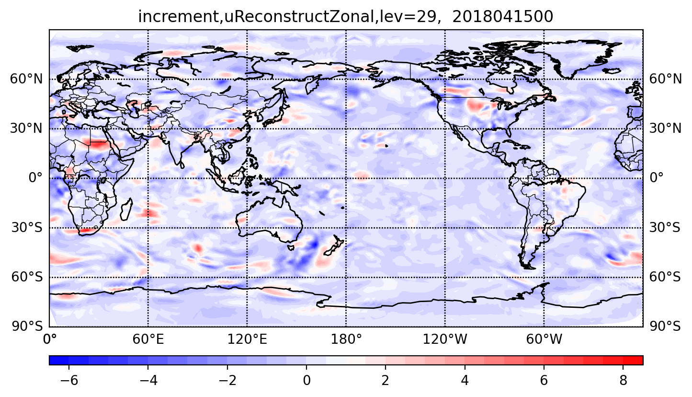

.. _top-mpas-jedi-diagnostics:

Diagnostics
===========

The purpose of this package is to help developers and users evaluate MPAS-JEDI performance, and
diagnose potential errors in the system. The package includes scripts for plotting the cost
function, the norm of the gradient, observation distribution, and analysis increment.
To support testing of EDA with MPAS-JEDI, the package includes probabilistic evaluations of the ensemble of
background forecasts. It also includes observation- and model-space verification tools for tracking the performance of cycling
experiments. Those tools evaluate traditional statistical measures (Mean, RMS, STD, etc...) for
surface and upper air variables. Additionally there is some capability for determining confidence
intervals for those verification measures. Both the model- and observation-space components provide
a means to store intermediate statistical measures and then visualize verification statistics. 

Cartopy, matplotlib, numpy, h5py, and netCDF4 Python packages are required to perform the diagnostics.

Analysis Increments
-------------------
A plot of analysis increments can help users to understand how the model analysis has adjusted to
assimilated observations. You can calculate the analysis increment and make figures for different
analysis fields by using :code:`mpas-bundle/mpas-jedi/graphics/plot_inc.py`. The following example is for
visualizing the analysis increment of the Zonal component of reconstructed horizontal velocity.

.. code-block:: bash

   python $GRAPHICS_DIR/plot_inc.py $DATE 3denvar uReconstructZonal 1 False

The argument :code:`1` means the analysis increment will be plotted by each level, and
the argument :code:`False` means the MPAS analysis will not be compared with corresponding GFS analysis.

.. _u-inc:

   Figure 1. Zonal wind increment at 0000 UTC 15 Apr 2018 on the 29th model level.

Observation-space verification
------------------------------

All scripts discussed in this section are located in :code:`GRAPHICS_DIR/cycling`, where
:code:`GRAPHICS_DIR = mpas-bundle/mpas-jedi/graphics`.

MPAS-JEDI utilizes the IODA and UFO file writing mechanisms to generate observation-space feedback
files from hofx and variational applications. That includes the standard IODA ObsSpace as well as
optional GeoVaLs and ObsDiagnostics. The standard IODA ObsSpace is written using the :code:`ObsSpace::save` method in IODA,
while GeoVaLs and ObsDiagnostics are written using the :code:`GeoVaLs::write` method in UFO.
The sample yaml setting to output the feedback file for hofx is as follows:

.. code:: yaml

    obsdataout:
      obsfile: dbOut/obsout_hofx_sondes.h5

and for variational:

.. code:: yaml

    obsdataout:
      obsfile: dbOut/obsout_variational_sondes.h5

In the Variational application, ObsGroups associated with :code:`EffectiveQC`, :code:`EffectiveError`, :code:`hofx`, and :code:`ObsBias` are saved with iteration number, such as :code:`EffectiveQC0`, :code:`EffectiveQC1`, which is not the case for the HofX application.
Those database files feed into a robust observation-space
python-based verification tool. The first part of the tool diagnoses fits to observations, and
writes binned statistics to intermediate NetCDF database files. If you perform verification on NCAR
CISL's Cheyenne HPC, run the :code:`ncar_pylib` command first in order to load all of the required python
modules.

Below is a sample shell script for writing the intermediate statistics database file for a single
time.

.. code-block:: bash

   mkdir diagnostic_stats
   cd diagnostic_stats
   ln $GRAPHICS_DIR/cycling/*.py .
   python DiagnoseObsStatistics.py -n $NumProcessors -p $ObsSpaceDirectory -app hofx -o obsout -g geovals -d ydiag >& diags.log

:code:`NumProcessors` is the number of processors available, each of which processes a different
observation type. For large data sets, this may need to be smaller than the number of processors on
a node due to memory overhead. :code:`ObsSpaceDirectory` is the location of the observation
feedback files. The :code:`app` argument can either be :code:`hofx` or :code:`variational`,
depending on which generic application was used to generate the data. The user can select the
prefixes of the different types of database files with the :code:`-o`, :code:`-g`, and :code:`-d`
arguments. Additional requirements for file naming conventions are described in :code:`JediDB.py`.
For example, this code is currently designed to handle multi-processor output with a process rank
suffix, each process having written its own file corresponding to a subset of the locations.
:code:`DiagnoseObsStatistics.py` generates one file per diagnosed observation type, each having the
:code:`stats_` prefix.

After statistics are created for more than one valid date, the analysis configuration script,
:code:`analyze_config.py`, gives directions for generating figures from a set of statistics files
across multiple valid dates. Settings such as :code:`user`, :code:`dbConf['expLongNames']`, and
:code:`dbConf['DAMethods']` need to match the directory structure of your workflow system.
:code:`dbConf['expNames']` is used to assign shorter label names for each experiment.
:code:`dbConf['cntrlExpIndex']` is used to choose which experiment is considered the control in
difference plots. Variables such as the first and last cycle dates and increment as well as the
first and last forecast durations and increment should also be modified.

Users can then run :code:`AnalyzeStats.py` on the command-line or submit many jobs, each one for a
different observation type, using :code:`SpawnAnalyzeStats.py`.  This procedure is described in
detail in :code:`analyze_config.py`. Take note that the automated job submission process is only
enabled on CISL's Cheyenne and Casper login nodes at this time.

Model-space verification
------------------------

Model-space verification can be used to verify an analysis or a forecast against gridded fields (e.g., GFS analyses).
Input files are GFS analyses (or other source) in MPAS grid and MPAS analyses or forecasts. Users can use a shell script to control model-space verification,
and the modelsp_utils.py includes variables needed when you setup environment variables in the shell script,
such as :code:`expLongNames`, :code:`initDate`, :code:`endDate`, :code:`intervalHours`, :code:`fcHours`, etc.

The sample shell script for write diagnostics and visualize verification statistics looks like:

.. code-block:: bash

   mkdir diagnostic_stats
   cd diagnostic_stats
   # Write diagnostics in NetCDF format.
   python $GRAPHICS_DIR/writediag_modelspace.py
   # Plot 2-D figures for upper air variables.
   python $GRAPHICS_DIR/plot_modelspace_ts_2d.py
   # Plot 1-D figures for surface variables.
   python $GRAPHICS_DIR/plot_modelspace_ts_1d.py

Here, diagnostic_stats is a subdirectory in your forecast directory.
Users wishing to compute aggregated statistics across cycling period can use the following commands:

.. code-block:: bash

   # Compute aggregated statistics and write diagnostics in NetCDF format.
   python $GRAPHICS_DIR/writediag_modelspace_aggr.py
   # Plot aggregated statistics for upper air variables.
   python $GRAPHICS_DIR/plot_modelspace_aggr.py
   # Plot aggregated statistics for surface variables.
   python $GRAPHICS_DIR/plot_modelspace_ts_1d_aggr.py

