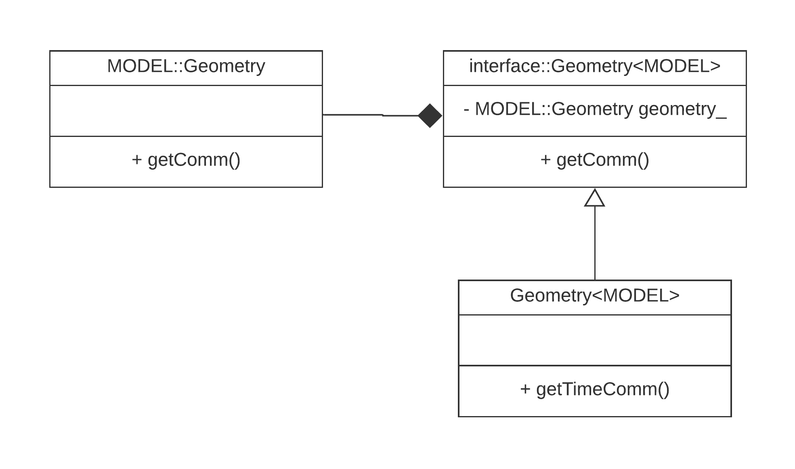
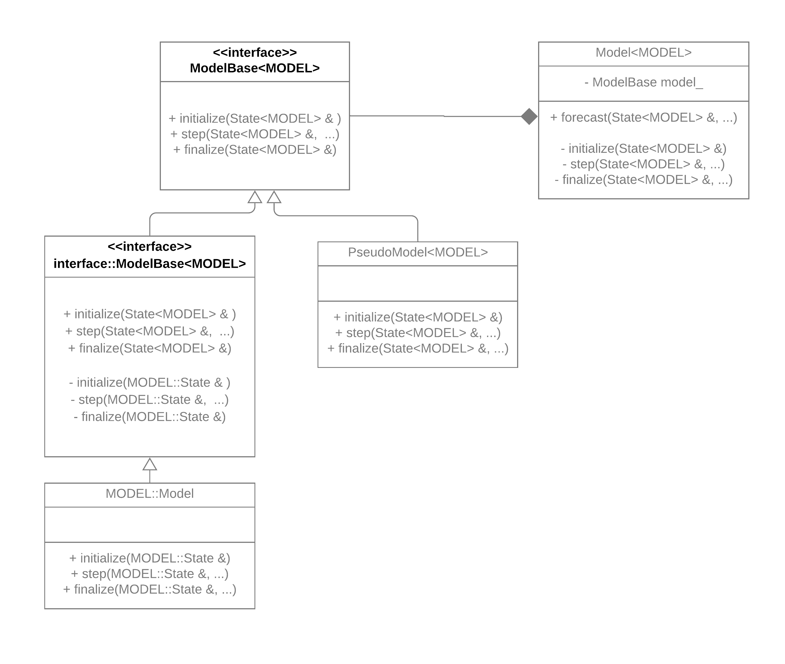

.. _top-oops-interfaces:

OOPS interfaces
===============

All OOPS applications interact with specific model- or observation- related implementations through interface classes. There are two kinds of interface classes, described below.

Interface classes chosen at build time
======================================

OOPS applications and classes are templated on OBS and/or MODEL traits. These traits are C++ structures defining which of the interface class implementations should be used in the current class or application.

:code:`OBS` traits contain interface classes that are related to the observation processing:

* :code:`ObsSpace`: observation data handling for one obs type;
* :code:`ObsVector`: observation vector (e.g. vector of observation values, or of computed H(x));
* :code:`ObsDataVector`: templated on data type vector in observation space (oops currently uses :code:`ObsDataVector<int>` and :code:`ObsDataVector<float>`);
* :code:`ObsOperator`: observation operator, used for computing H(x);
* :code:`LinearObsOperator`: tangent-linear and adjoint of the observation operator;
* :code:`ObsAuxControl`: auxiliary state related to observations (currently only used for bias correction coefficients, but can be used for other cases);
* :code:`ObsAuxIncrement`: auxiliary increment related to observations (currently only used for bias correction coefficient increments);
* :code:`ObsAuxCovariance`: auxiliary error covariance related to observations (currently only used for bias correction coefficient error covariances);
* :code:`Locations`: observations locations, used in the interface between model and observations, for interpolating model fields to observations locations to be used in H(x);
* :code:`GeoVaLs`: geophysical values at locations: model fields interpolated to the observation locations; used in H(x);
* :code:`ObsDiagnostics`: observation operator diagnostics: additional output from the observation operator that can be used in quality control;
* :code:`AnalyticInit`: analytic initialization for the :code:`GeoVaLs`, used in the interpolation tests.

There are currently three implementations of :code:`OBS` traits in JEDI: :code:`lorenz95::L95ObsTraits` used with the toy Lorenz95 model, :code:`qg::QgObsTraits` used with the toy quasi-geostrophic model, and :code:`ufo::ObsTraits` used with all realistic models connected to JEDI. :code:`ufo::ObsTraits` lists classes implemented in ioda and ufo as the implementations of above interfaces. All the new models added to JEDI can make use of :code:`ufo::ObsTraits` and do not have to implement any of the above classes.

:code:`MODEL` traits contain interface classes that are related to models:

* :code:`Geometry`: model grid description, MPI distribution;
* :code:`State`: analysis state, model state, ensemble member, etc;
* :code:`Increment`: perturbation to a state;
* :code:`GetValues`: interpolation from model grid to observation locations;
* :code:`LinearGetValues`: tangent-linear and adjoint of the interpolation;
* :code:`ModelAuxControl`: auxiliary state related to model (currently not used, could be e.g. model bias);
* :code:`ModelAuxIncrement`: auxiliary increment related to model;
* :code:`ModelAuxCovariance`: auxiliary error covariance related to model;
* :code:`ErrorCovariance`: background error covariance;
* :code:`GeometryIterator`: iterator over model grid points.

Classes in the :code:`MODEL` traits are typically implemented for each distinct model used in JEDI. Depending on the oops application, only a subset of these classes may have to be implemented.

Example of OOPS implementation of classes defined in traits
-----------------------------------------------------------

:numref:`oops-geometry-classdiagram` shows class diagram for the :code:`Geometry` class.

.. _oops-geometry-classdiagram:

   Class diagram for Geometry-related classes

Here :code:`MODEL::Geometry` implementation (an implementation of :code:`Geometry` specified in the :code:`MODEL` traits, e.g. Geometry implemented in Lorenz95 model, or fv3-jedi model, or mpas-jedi model) has to implement the interface defined in :code:`interface::Geometry<MODEL>`. :code:`interface::Geometry<MODEL>` holds a pointer to :code:`MODEL::Geometry` implementation; each of the methods in :code:`interface::Geometry<MODEL>` calls a corresponding method in :code:`MODEL::Geometry` (with added tracing and timing). If any of the :code:`interface::Geometry<MODEL>` methods took :code:`SomeClass<MODEL>` on input, :code:`MODEL::SomeClass` would be passed during the call to the :code:`MODEL::Geometry` implementation of the method.

:code:`Geometry<MODEL>` is a class that is used in oops classes interacting with geometries. It is a subclass of :code:`interface::Geometry<MODEL>` that has additional functionality that is implemented at oops level (and doesn’t have to be implemented in :code:`MODEL` implementations).

.. note:: Not all the interface classes are implemented with :code:`interface::Class` and :code:`Class` distinction yet.

Interface classes chosen at runtime
===================================

For classes in this category, there could be multiple implementations of the class, both *generic* and *specific*. *Generic* implementations are templated on the :code:`MODEL` and/or :code:`OBS` trait and can be instantiated for any (or at least multiple) implementations of these traits. :code:`MODEL`- and :code:`OBS`-*specific* implementations are not templated on :code:`MODEL` or :code:`OBS` -- they are tied to a specific implementation of these traits. The classes in this category are typically not defined in :code:`OBS` or :code:`MODEL` traits, and the class used in each particular case is decided at runtime, based on provided configuration file.

Some of the classes that are currently this category: :code:`Model`, :code:`VariableChange`, :code:`ObsError`, :code:`ObsFilter`.

:numref:`oops-model-classdiagram` shows class diagram for the :code:`Model` class.

.. _oops-model-classdiagram:

   Class diagram for Model-related classes

:code:`GenericModelBase<MODEL>` methods have templated parameters (e.g. :code:`State<MODEL>` in the example). Its subclasses, *generic* implementations of :code:`Model`, can operate on multiple implementations of :code:`MODEL` traits (e.g. :code:`PseudoModel<MODEL>` which "propagates" model by reading precomputed states from files).

:code:`ModelBase<MODEL>` is a subclass of :code:`GenericModelBase<MODEL>` that overrides all methods that take templated parameters with calls to the abstract methods that take parameters tied to a specific implementation of the traits (e.g. :code:`MODEL::State` in the example). Subclasses of :code:`ModelBase<MODEL>` are not templated on :code:`MODEL` and are tied to specific implementations of :code:`MODEL` trait (e.g. Lorenz95 prognostic model, FV3-GEOS, FV3-GFS, etc).

:code:`Model<MODEL>` holds a pointer to :code:`GenericModelBase<MODEL>`. It has methods that correspond to all the methods in :code:`GenericModelBase<MODEL>`; each of those methods calls a corresponding method in :code:`GenericModelBase<MODEL>` (with added tracing and timing). There is also additional functionality in :code:`Model<MODEL>` that is included at oops level (and doesn’t have to be included in the implementations), e.g. :code:`forecast` method.

.. note:: Not all the interface classes in this category are implemented according to the above class diagram yet, but the intention is to implement all of them in a similar way.
