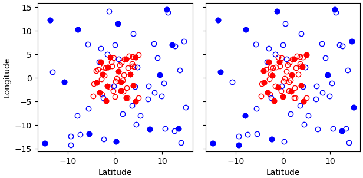

Generic QC Filters
==================

This section describes how to configure each of the existing QC filters in UFO. All filters can also use the :ref:`"where" statement <where-statement>` to act only on observations meeting certain conditions. By default, each pre and prior filter acts on all the variables marked as *observed variables* in the ObsSpace, where as post filters act on all *simulated variables* in the ObsSpace. The :code:`filter variables` keyword can be used to limit the action of the filter to a subset of these variables or to specific channels, as shown in the examples from the :ref:`Bounds Check Filter <bounds-check-filter>` section below.

.. _bounds-check-filter:

Bounds Check Filter
-------------------

This filter rejects observations whose values (:code:`ObsValue/` in the ioda files) lie outside specified limits:

.. code-block:: yaml

   - filter: Bounds Check
     filter variables:
     - name: brightnessTemperature
       channels: 4-6
     minvalue: 240.0
     maxvalue: 300.0

In the above example the filter checks if brightness temperature for channels 4, 5 and 6 is outside of the [240, 300] range. Suppose we have the following observation data with 3 locations and 4 channels:

* channel 3: [100, 250, 450]
* channel 4: [250, 260, 270]
* channel 5: [200, 250, 270]
* channel 6: [340, 200, 250]

In this example, all observations from channel 3 will pass QC because the filter isn't configured to act on this channel. All observations for channel 4 will pass QC because they are within [minvalue, maxvalue]. 1st observation in channel 5, and first and second observations in channel 6 will be rejected.

.. code-block:: yaml

   - filter: Bounds Check
     filter variables:
     - name: airTemperature
     minvalue: 230
   - filter: Bounds Check
     filter variables:
     - name: windEastward
     - name: windNorthward
     minvalue: -40
     maxvalue:  40

In the above example two filters are configured, one testing temperature, and the other testing wind components. The first filter would reject all temperature observations that are below 230. The second, all wind component observations whose magnitude is above 40.

In practice, one would be more likely to want to filter out wind component observations based on the value of the wind speed :code:`sqrt(windEastward**2 + windNorthward**2)`. This can be done using the :code:`test variables` keyword, which rejects observations of a variable if the value of *another* lies outside specified bounds. The "test variable" does not need to be a simulated or observed variable; in particular, it can be an :ref:`ObsFunction <obs-function-and-obs-diagnostic-suffixes>`, i.e. a quantity derived from simulated variables. For example, the following snippet filters out wind component observations if the wind speed is above 40:

.. code-block:: yaml

   - filter: Bounds Check
     filter variables:
     - name: windEastward
     - name: windNorthward
     test variables:
     - name: ObsFunction/Velocity
     maxvalue: 40

If there is only one entry in the :code:`test variables` list, the same criterion is applied to all filter variables. Otherwise the number of test variables needs to match that of filter variables, and each filter variable is filtered according to the values of the corresponding test variable.

Background Check Filter
-----------------------

This filter checks for bias corrected distance between observation value and model simulated value (:math:`y-H(x)`) and rejects obs where the absolute difference is larger than :code:`absolute threshold`, or :code:`threshold` * :math:`{\sigma}_o`, or :code:`threshold` * :math:`{\sigma}_b`, where :math:`{\sigma}_o` is observation error and :math:`{\sigma}_b` is background error. This filter can also adjust observation error through a constant inflation factor when the filter action is set to :code:`inflate error`. If no action section is included in the yaml, the filter is set to reject the flagged observations.

.. code-block:: yaml

   - filter: Background Check
     filter variables:
     - name: airTemperature
     threshold: 2.0
     absolute threshold: 1.0
     action:
       name: reject
   - filter: Background Check
     filter variables:
     - name: windEastward
     - name: windNorthward
     threshold: 2.0
     where:
     - variable:
         name: MetaData/latitude
       minvalue: -60.0
       maxvalue: 60.0
     action:
       name: inflate error
       inflation: 2.0
   - filter: Background Check
     filter variables:
     - name: sea_surface_height
     threshold wrt background error: true
     threshold: 2.0

The first filter would flag temperature observations where :math:`|y-(H(x)+bias)| > \min (` :code:`absolute_threshold`, :code:`threshold` * :math:`{\sigma}_o)`, and
then the flagged data are rejected due to the filter action being set to :code:`reject`.

The second filter would flag wind component observations where :math:`|y-(H(x)+bias)| >` :code:`threshold` * :math:`{\sigma}_o` and latitude of the observation location are within 60 degree. The flagged data will then be inflated with a factor 2.0.

Please see the :ref:`Filter Actions <filter-actions>` section for more detail.

The third filter compares the departure against the background error rather than the observation error. It would flag sea surface height observations where :math:`|y-(H(x)+bias)| >` :code:`threshold` * :math:`{\sigma}_b`, and reject the flagged observations as no filter action is specified. If :code:`threshold wrt background error` is set to :code:`true`, then :code:`threshold` must be set and :code:`absolute threshold` must not.

There is an option for the background check filter to check for distance between observation value and model simulated value without bias correction (:math:`y-H(x)`) when the additional parameter :code:`bias correction parameter` is set to 1.0 and rejects obs where the absolute difference is larger than :code:`absolute threshold` or :code:`threshold` * :math:`{\sigma}_o` when the filter action is set to :code:`reject`. If no action section is included in the yaml, the filter is set to reject the flagged observations.

.. code-block:: yaml

  - filter: Background Check
    filter variables:
    - name: brightnessTemperature
      channels: 1-24
    absolute threshold: 3.5
    bias correction parameter: 1.0
    action:
      name: reject

This filter would flag temperature observations where :math:`|y-H(x)| > \min (` :code:`absolute_threshold`, :code:`threshold` * :math:`{\sigma}_o)`, and then the flagged data are rejected due to filter action is set to reject.

Bayesian Background Check Filter
--------------------------------

Similar to the standard Background Check filter, which rejects observations based on the difference between observation value and model simulated value (:math:`y-H(x)`), the Bayesian Background Check also takes into account the probability that an observation is "bad", i.e. "in gross error". It is expected that the initial Probability of Gross Error (PGE) is set before calling the Bayesian Background Check filter (e.g. using a Variable Assignment filter). In the Bayesian Background Check filter, this initial :code:`PGE` value determines the  weight given to the uniform ("bad") probability distribution - while :code:`(1-PGE)` is the weight given to the "good" distribution (a Gaussian in :math:`[y-H(x)]`, with variance :math:`{\sigma}^2` given by the sum of background uncertainty and observation uncertainty variances). The initial :code:`PGE` divided by the combined probability distribution, gives the conditional probability that the observation is in gross error. This conditional probability value is the after-check PGE, :code:`PGEBd`. It is saved in the ObsSpace for optional later use in the buddy check, and observations are also rejected if it exceeds a given threshold. There is also the option of the Bayesian Background Check filter performing a "squared difference" check, to reject observations if :math:`[y-H(x)]^2/{\sigma}^2` exceeds a threshold.

The .yaml file requires the following filter parameter:

- :code:`prob density bad obs` (:code:`PdBad`): the value of the prior uniform probability distribution for the observation to be bad (e.g. 0.1/K for a domain 273-283 K for some temperature observation).

The .yaml file can also contain optional filter parameters, which override the default values in ufo/filters/BayesianBackgroundCheck.h and ufo/utils/ProbabilityOfGrossErrorParameters.h:

- :code:`PGE threshold` (:code:`PGECrit`, default 0.1): if the adjusted (after-check) PGE exceeds this value, the observation is rejected;

- :code:`perform obs minus BG threshold check` (:code:`PerformSDiffCheck`: default :code:`true`): if true perform an additional squared difference check, that :math:`[y-H(x)]^2/{\sigma}^2` does not exceed a threshold;

- :code:`obs minus BG threshold` (:code:`SDiffCrit`, default 100.0): threshold value for the squared difference check;

- :code:`max exponent` (:code:`ExpArgMax`, default 80.0): maximum allowed value of the exponent in the "good" probability distribution;

- :code:`obs error multiplier` (:code:`ObErrMult`, default 1.0): weight of observation error in the combined error variance;

- :code:`BG error multiplier` (:code:`BkgErrMult`, default 1.0): weight of background error in the combined error variance;

- :code:`bg error`: constant background error term. If present this will be used instead of the real background errors;

- :code:`bg error suffix` (:code:`BkgErrSuffix`, default "_background_error"): suffix which has been appended to variable name for background errors which are to be read in;

- :code:`bg error group` (:code:`BkgErrGroup`, default "ObsDiag"):
  group name which background errors for each variable are stored in;
  
- :code:`save total pd` (:code:`SaveTotalPd`, default false): if true, save the total (combined) probability distribution to the :code:`GrossErrorProbabilityTotal` group. This is required as an input by the Bayesian Whole Report filter.

- :code:`max error variance` (:code:`ErrVarMax`): a maximum value for the error variance. If not set, no maximum is applied.

.. code-block:: yaml

     - filter: Variable Assignment
       assignments:
       - name: GrossErrorProbability/ice_area_fraction
         type: float
         value: 0.04
     - filter: Bayesian Background Check
       filter variables:
       - name: ice_area_fraction
       prob density bad obs: 1.0
       PGE threshold: 0.07
       obs minus BG threshold: 100.0

Note that this filter requires the background value (HofX) and background error. Unless a constant background error term 'bg error' is provided in the yaml, the latter is accessed from the obs diagnostics - as an interim measure, supplied in a separate .nc4 file (see .yaml snippet below), with variable name e.g. :code:`ice_area_fraction_background_error` (no group name) to go with :code:`ice_area_fraction`.

.. code-block:: yaml

     HofX: HofX
     obs diagnostics:
       filename: Data/ufo/testinput_tier_1/background_errors_for_bayesianbgcheck_test.nc4

By default, a filter variable is treated as scalar. But for vectors, such as wind, the two components must be specified one after the other in the .yaml, and the first must have the option :code:`first_component_of_two` set to true.

.. code-block:: yaml

     - filter: Bayesian Background Check
       filter variables:
       - name: windEastward
         options:
             first_component_of_two: true
       - name: windNorthward

Bayesian Background check currently only works for single-level observations, not profiles.

Bayesian Background QC Flags filter
-----------------------------------

The Bayesian Background QC Flags filter sets Met Office OPS QC flags based on values of probability of gross error (PGE).
This filter should be invoked after any other filters which modify PGE, such as the Bayesian background check and the buddy check, have been run.
If the PGE is larger than a chosen threshold then the observation is rejected by setting flags at the observation location.
Eventually the Met Office QC flags will be replaced with Diagnostic Flags, but the core functionality will remain the same.

The following filter parameters can be set:

- :code:`PGE threshold`: value of PGE above which an observation is rejected.

- :code:`PGE variable name substitutions`: a list of pairs of variable names.
  The PGE of the second variable in each pair is used to set the QC flags
  of the first variable; by default this happens for wind u and v components.

An example yaml section is as follows:

.. code-block:: yaml

     - filter: Bayesian Background QC Flags
       filter variables: [airTemperature, windEastward, windNorthward]
       PGE threshold: 0.8
       PGE variable name substitutions: {"windEastward", "windNorthward"}

Air temperature QC flags are set if the temperature PGE is greater than 0.8.
Due to the use of the variable name substitutions, both eastward and northward wind flags are set if the northward wind PGE is greater than 0.8.
This could be useful if the PGE of only one of the wind components has been modified by the QC filters.

Bayesian Whole Report Filter
----------------------------

Synoptic stations typically provide reports at regular intervals. A report is a combination of variables observed by different sensors at a single location. Reports may include some, but not necessarily all, of pressure, temperature, dew point and wind speed and direction.

This filter calculates the probability that a whole report is affected by gross error, through the Bayesian combination of the probability of gross error of individual observations. This is based on the logic that if multiple observations within a report appear dubious based on a Bayesian Background check, it is likely that the whole report is affected by, for example, location error. This filter should be called after the Bayesian Background Check. The probability that whole report is affected by gross error is calculated from all the gross error probability of all the variables in the :code:`filter variables` list, except where the :code:`not_used_in_whole_report` option is specified for a given variable.

Once the probability that whole report is affected by gross error has
been calculated, it is used to update the probability of gross error
for each variable in the :code:`filter variables` list. Where this
updated probability of gross error exceeds the :code:`PGE threshold`,
the observation is flagged. :code:`PGE threshold` is an optional yaml parameter
which applies to the whole filter, and has a default value of :code:`0.1`.

Variables can be either scalar or vector (with two Cartesian components, such as the eastward and northward wind components). In
the latter case the two components need to be specified one after the other in the :code:`filter variables` list, with the second component having the :code:`second_component_of_two option` set to true.

For each variable, the optional parameter :code:`probability_density_bad` (default value :code:`0.1`) is used
to set the prior probability density of that variable being
"bad". The filter can also apply a specific prior probability density of bad observations for the following observation types, identified by the integer ID :code:`MetaData/ObsType`:

* Bogus :code:`bogus_probability_density_bad`
* Synop (SynopManual, SynopAuto, MetarManual, MetarAuto, SynopMob,
  SynopBufr, WOW) :code:`synop_probability_density_bad`

These are both optional parameters. If they are not specified,
:code:`probability_density_bad` is used in their place, as for all other observation types.

For each filter variable, the following groups must be available from the ObsSpace:

* :code:`GrossErrorProbability/`: the latest value of GrossErrorProbability,
* :code:`GrossErrorProbabilityInitial/`: the initial value of GrossErrorProbability before updates by any other filter, which can be saved using the Variable Assignment filter,
* :code:`GrossErrorProbabilityTotal/`: the total (combined) probability distribution, which is optionally saved the Bayesian Background Check filter,
* :code:`QCFlags/`: Met Office QC flags, which will eventually be replaced with Diagnostic Flags, must be initialized before this filter.
      
Additionally, the prior probability of gross error applying to the whole report must be available from :code:`MetaData/grossErrorProbabilityReport`. 

Example:

.. code-block:: yaml

   - filter: Bayesian Whole Report
     filter variables:
     - name: pressure_at_model_surface
       options:
         probability_density_bad: 0.1
         bogus_probability_density_bad: 0.1
     - name: air_temperature_at_2m
       options:
         probability_density_bad: 0.1
     - name: windEastward
       options:
         probability_density_bad: 0.1
         synop_probability_density_bad: 0.1
         bogus_probability_density_bad: 0.1
     - name: windNorthward
       options:
         not_used_in_whole_report: true
         second_component_of_two: true
     - name: relativeHumidityAt2M
       options:
         not_used_in_whole_report: true
         probability_density_bad: 0.1
     PGE threshold: 0.15

Domain Check Filter
-------------------

This filter retains all observations selected by the :ref:`"where" statement <where-statement>` and rejects all others. Below, the filter is configured to retain only observations
* taken at locations where the sea surface temperature retrieved from the model is between 200 and 300 K (inclusive)
* with valid :code:`height` metadata (not set to "missing value")
* taken by stations with IDs 3, 6 or belonging to the range 11-120
* without valid :code:`pressure` metadata.

.. code-block:: yaml

   - filter: Domain Check
     where:
     - variable:
         name: GeoVaLs/sea_surface_temperature
       minvalue: 200
       maxvalue: 300
     - variable:
         name: MetaData/height
       is_defined:
     - variable:
         name: MetaData/stationIdentification
       is_in: 3, 6, 11-120
     - variable:
         name: MetaData/pressure
       is_not_defined:

BlackList Filter
----------------

This filter behaves like the exact opposite of Domain Check: it rejects all observations selected by the :ref:`"where" statement <where-statement>` statement. The status of all others remains the same. Below, the filter is configured to reject observations taken by stations with IDs 1, 7 or belonging to the range 100-199:

.. code-block:: yaml

   - filter: BlackList
     where:
     - variable:
         name: MetaData/stationIdentification
       is_in: 1, 7, 100-199

RejectList Filter
-----------------

This is an alternative name for the BlackList filter.

AcceptList Filter
-----------------

This filter sets the QC flag to `pass` for all observations selected by the :ref:`"where" statement <where-statement>` that have previously been rejected for any reason other than missing data, a pre-processing flag indicating rejection, or failure of the ObsOperator. This is mostly useful in QC procedures where all observations are initially rejected and then those fulfilling certain criteria are accepted, overriding the rejection.

Below, the filter is configured to accept only observations taken by stations with IDs 1, 7 or belonging to the range 100-199 (inclusive):

.. code-block:: yaml

   - filter: RejectList  # initially reject all observations
   - filter: AcceptList  # accept back selected observations
     where:
     - variable:
         name: MetaData/stationIdentification
       is_in: 1, 7, 100-199

Perform Action Filter
---------------------

This filter performs the action specified in the :code:`action` parameter on observations selected by the :ref:`"where" statement <where-statement>`.

Example 1
^^^^^^^^^

Here the filter is configured to inflate errors of all observations from the Southern hemisphere by a factor of two:

.. code-block:: yaml

   - filter: Perform Action
     action:
       name: inflate error
       inflation: 2.0
     where:
     - variable: latitude
       maxvalue: 0

.. note::

  Technically, the same result could be obtained by replacing :code:`Perform Action` in the listing
  above by :code:`RejectList`. However, having a :code:`RejectList` filter that does not actually
  reject any observations can be confusing.

Example 2
^^^^^^^^^

The filter configured in this way behaves like :code:`RejectList`:

.. code-block:: yaml

   - filter: Perform Action
     action:
       name: reject

Example 3
^^^^^^^^^

The filter configured in this way behaves like :code:`AcceptList`:

.. code-block:: yaml

   - filter: Perform Action
     action:
       name: accept

Thinning Filter
---------------

This filter rejects a specified fraction of observations, selected at random. It supports the following YAML parameters:

- :code:`amount`: the fraction of observations to reject (a number between 0 and 1).
- :code:`random seed` (optional): an integer used to initialize a random number generator if it has not been initialized yet. If not set, the seed is derived from the calendar time.

Note: because of how this filter is implemented, the fraction of rejected observations may not be exactly equal to :code:`amount`, especially if the total number of observations is small.

Example:

.. code-block:: yaml

  - filter: Thinning
    amount: 0.75
    random seed: 125

.. _GaussianThinningFilter:

Gaussian Thinning Filter
------------------------

This filter thins observations by preserving only one observation in each cell of a grid. Cell assignment can be based on an arbitrary combination of:

- horizontal position
- vertical position (in terms of height or pressure)
- time
- category (arbitrary integer associated with each observation).

Selection of the observation to preserve in each cell is based on

- its position in the cell
- optionally, its priority.

The following YAML parameters are supported:

- Horizontal grid:

  * :code:`horizontal_mesh`: Approximate width (in km) of zonal bands into which the
    Earth's surface is split. Thinning in the horizontal direction is disabled if
    this parameter is negative. Default: approx. 111 km (= 1 deg of latitude).

  * :code:`use_reduced_horizontal_grid`: True to use a reduced grid, with high-latitude
    zonal bands split into fewer cells than low-latitude bands to keep cell size nearly uniform.
    False to use a regular grid, with the same number of cells at all latitudes. Default: :code:`true`.

  * :code:`round_horizontal_bin_count_to_nearest`:
    True to set the number of zonal bands so that the band width is as close as possible to
    :code:`horizontal_mesh`, and the number of cells ("bins") in each zonal band so that the
    cell width in the zonal direction is as close as possible to that in the meridional direction.
    False to set the number of zonal bands so that the band width is as small as possible, but
    no smaller than :code:`horizontal_mesh`, and the cell width in the zonal direction is as small as
    possible, but no smaller than in the meridional direction.

    Defaults to :code:`false` unless the :code:`ops_compatibility_mode` option is enabled, in which
    case it's set to :code:`true`.

  * :code:`partition_longitude_bins_using_mesh`:
    True to calculate partioning of longitude bins explicitly using horizontal mesh distance.
    By default this option is set to :code:`false` and calculating the number
    of longitude bins per latitude bin index involves the integer number of latitude
    bins. Setting this option to :code:`true` adopts the Met Office OPS method whereby the
    integer number of latitude bins is replaced, in the calculation of longitude bins, by the
    Earth half-circumference divided by the horizontal mesh distance.

    Defaults to :code:`false` unless the :code:`ops_compatibility_mode` option is enabled, in which
    case it's set to :code:`true`.

  * :code:`define_meridian_20000_km`:
    True to define horizontalMesh with respect to a value for the Earth's meridian distance
    (half Earth circumference) of exactly 20000.0 km. By default this option is set to :code:`false`
    and the Earth's meridian is defined for the purposes of calculating thinning boxes as
    :code:`pi*Constants::mean_earth_rad` ~ 20015.087 km.

    Defaults to :code:`false` unless the :code:`ops_compatibility_mode` option is enabled, in which
    case it's set to :code:`true`.

- Vertical grid:

  * :code:`vertical_mesh`: Cell size in the vertical direction.
    Thinning in the vertical direction is disabled
    if this parameter is not specified or negative.

  * :code:`vertical_min`: Lower bound of the vertical coordinate interval split into cells of size
    :code:`vertical_mesh`. Default: 100 (Pa).

  * :code:`vertical_max`: Upper bound of the vertical coordinate interval split into cells of size
    :code:`vertical_mesh`. This parameter is rounded upwards to the nearest multiple of
    :code:`vertical_mesh` starting from :code:`vertical_min`. Default: 110,000 (Pa).

  * :code:`vertical_coordinate`: Name of the observation vertical coordinate.
    Default: :code:`pressure`.

- Temporal grid:

  * :code:`time_mesh`: Cell size in the temporal direction.
    Temporal thinning is disabled if this this parameter is not specified or set to 0.

  * :code:`time_min`: Lower bound of the time interval split into cells of size :code:`time_mesh`.
    Temporal thinning is disabled if this parameter is not specified.

  * :code:`time_max`: Upper bound of the time interval split into cells of size :code:`time_mesh`.
    This parameter is rounded upwards to the nearest multiple of :code:`time_mesh` starting from
    :code:`time_min`. Temporal thinning is disabled if this parameter is not specified.

- Observation categories:

  * :code:`category_variable`: Variable storing integer-valued IDs associated with observations.
    Observations belonging to different categories are thinned separately.

- Selection of observations to consider for thinning:

  * :code:`retain_only_if_all_filter_variables_are_valid`: Determines how to treat observations where
    multiple filter variables are present and their QC flags may differ (for example, a satellite
    observation with multiple channels).

    + :code:`true`: include an observation in the set of locations to be thinned only if all filter
      variables have passed QC. For invalid observation locations (selected by a where clause but
      where one or more filter variables have failed QC) any remaining unflagged filter variables
      are rejected.

    + :code:`false`: include an observation in the set of locations to be thinned if any filter
      variable has passed QC.

    Default: :code:`false`.

- Selection of observations to retain:

  * :code:`priority_variable`: Variable storing observation priorities.
    Among all observations in a cell, only those with the highest priority are considered
    as candidates for retaining. If not specified, all observations are assumed to have equal priority.

  * :code:`distance_norm`: Determines which of the highest-priority observations lying in a cell
    is retained. Allowed values:

    + :code:`geodesic`: retain the observation closest to the cell center in the horizontal direction
      (the vertical coordinate and time are ignored when selecting the observation to retain)

    + :code:`maximum`: retain the observation lying furthest from the cell's bounding box in the
      system of coordinates in which the cell is a unit cube (all dimensions along which thinning
      is enabled are taken into account).

    Defaults to :code:`geodesic` unless the :code:`ops_compatibility_mode` option is enabled, in
    which case it's set to :code:`maximum`.

  * :code:`records_are_single_obs`: When set to :code:`true`, thinning is performed on whole records (profiles), rather than treating every observation in every record as an individual observation. (See :ref:`here <radiosonde_example_yaml>` for an example of using the :code:`obs space.obsdatain.obsgrouping` YAML option to group observations into records.) Thus if a record (specifically the earliest non-missing observation in a record) is deemed to be thinned, or accepted, every observation in that record is respectively thinned or accepted. This option does nothing if observations are not grouped into records. Can be used in combination with other options, such as :code:`priority_variable` and :code:`category_variable`. If :code:`category_variable` is not empty and :code:`records_are_single_obs` is :code:`true`, an exception will be thrown if the elements in any profile lie in two or more categories.

  * :code:`select_median`: When set to :code:`true`, retain the observation whose :code:`ObsValue` (or :code:`DerivedObsValue` - the latest modified valid type) is closest to the median value of all observations in the cell. (Cells containing no observations are ignored; option not tested with :code:`priority_variable` or :code:`category_variable` set.)
  
  * :code:`min_num_obs_per_bin`: Set to an integer to retain observations only from cells with greater than or equal to this number of observations in the cell. All observations in cells with less than this many observations are rejected. If set to <= :math:`1`, accept the single observation in any cell with only one observation. (Only applies when :code:`select_median: true`; otherwise this option does nothing; if :code:`min_num_obs_per_bin` is not set when :code:`select_median: true`, the default value is :math:`5`.)

  * :code:`tiebreaker_pick_latest`: Set this option to :code:`true` to make the filter select the
    observation with the later time within a cell, when the distance to the centre of
    the cell is equal between the observations being compared and the observations have equal priorities.

  * :code:`ops_compatibility_mode`: Set this option to :code:`true` to make the filter produce
    identical results as the :code:`Ops_Thinning` subroutine from the Met Office OPS system when
    both are run serially (on a single process).

    This modifies the filter behavior in the following ways:

    - The :code:`round_horizontal_bin_count_to_nearest` option is set to :code:`true`.

    - The :code:`distance_norm` option is set to :code:`maximum`.

    - The :code:`partition_longitude_bins_using_mesh` option is set to :code:`true`.

    - The :code:`define_meridian_2000_km` option is set to :code:`true`.

    - Bin indices are calculated by rounding values away from rather towards zero. This can alter
      the bin indices assigned to observations lying at bin boundaries.

    - The bin lattice is assumed to cover the whole real axis (for times and pressures) or the
      [-360, 720] degrees interval (for longitudes) rather than just the intervals
      [:code:`time_min`, :code:`time_max`], [:code:`pressure_min`, :code:`pressure_max`] and
      [0, 360] degrees, respectively. This may cause observations lying at the boundaries of the
      latter intervals to be put in bins of their own, which is normally undesirable.

    - A different (non-stable) sorting algorithm is used to order observations before inspection.
      This can alter the set of retained observations if some bins contain multiple equally good
      observations (with the same priority and distance to the cell center measured with the
      selected norm). If this happens for a significant fraction of bins, it may be a sign the
      criteria used to rank observations (the priority and the distance norm) are not specific
      enough.

Example 1 (thinning by the horizontal position only):

.. code-block:: yaml

    - filter: Gaussian Thinning
      horizontal_mesh:   1111.949266 #km = 10 deg at equator

Example 2 (thinning observations from multiple categories and with non-equal priorities by their horizontal position, pressure and time):

.. code-block:: yaml

    - filter: Gaussian Thinning
      distance_norm:     maximum
      horizontal_mesh:   5000
      vertical_mesh:    10000
      time_mesh: PT01H
      time_min: 2018-04-14T21:00:00Z
      time_max: 2018-04-15T03:00:00Z
      category_variable:
        name: MetaData/instrument_id
      priority_variable:
        name: MetaData/thinningPriority

.. _TemporalThinningFilter:

Temporal Thinning Filter
------------------------

This filter thins observations so that the retained ones are sufficiently separated in time. It supports
the following YAML parameters:

* :code:`min_spacing`:  Minimum spacing between two successive retained observations. Default: :code:`PT1H`.

* :code:`seed_time`: If not set, the thinning filter will consider observations as candidates for retaining
  in chronological order.

  If set, the filter will start from the observation taken as close as possible to :code:`seed_time`,
  then consider all successive observations in chronological order, and finally all preceding
  observations in reverse chronological order.

* :code:`category_variable`: Variable storing integer-valued IDs associated with observations.
  Observations belonging to different categories are thinned separately. If not specified, all
  observations are thinned together.

* :code:`priority_variable`: Variable storing integer-valued observation priorities.
  If not specified, all observations are assumed to have equal priority.

* :code:`tolerance`: Only relevant if :code:`priority_variable` is set.

  If set to a nonzero duration, then whenever an observation *O* lying at least :code:`min_spacing`
  from the previous retained observation *O'* is found, the filter will inspect all observations
  lying no more than :code:`tolerance` further from *O'* and retain the one with the highest priority.
  In case of ties, observations closer to *O'* are preferred.

Example 1 (selecting at most one observation taken by each station per 1.5 h,
starting from the observation closest to seed time):

.. code-block:: yaml

    - filter: Temporal Thinning
      min_spacing: PT01H30M
      seed_time: 2018-04-15T00:00:00Z
      category_variable:
        name: MetaData/call_sign

Example 2 (selecting at most one observation taken by each station per 1 h,
starting from the earliest observation, and allowing the filter to retain an observation
taken up to 20 min after the first qualifying observation if its quality score is higher):

.. code-block:: yaml

    - filter: Temporal Thinning
      min_spacing: PT01H
      tolerance: PT20M
      category_variable:
        name: MetaData/call_sign
      priority_variable:
        name: MetaData/score

.. _PoissonDiskThinningFilter:

Poisson Disk Thinning Filter
----------------------------

This filter thins observations by iterating over them in random order and retaining each observation
lying outside the *exclusion volumes* (ellipsoids or cylinders) surrounding observations that
have already been retained.

The following YAML parameters are supported:

- Exclusion volume:

  * :code:`min_horizontal_spacing`: Size of the exclusion volume in the horizontal direction (in km).

    If the priority_variable parameter is set, this parameter may be a map assigning an
    exclusion volume size to each observation priority, or a floating-point constant.
    If the priority_variable parameter is not set (and hence all observations have the same
    priority), this parameter must be a floating-point constant. Exclusion volumes of
    lower-priority observations must be at least as large as those of higher-priority ones.
    If this parameter is not set, horizontal position is ignored during thinning.

    Note: Owing to a bug in the eckit YAML parser, maps need to be written in the JSON style,
    with keys quoted. Example::

      min_horizontal_spacing: {"1": 123, "2": 321}

    This will not work::

      min_horizontal_spacing: {1: 123, 2: 321}

    and neither will this::

      min_horizontal_spacing:
        1: 123
        2: 321

    nor this::

      min_horizontal_spacing:
        "1": 123
        "2": 321

  * :code:`min_vertical_spacing`: Size of the exclusion volume in the vertical direction (in Pa).

    Like :code:`min_horizontal_spacing`, this parameter can be either a constant or a map.
    If not set, vertical position is ignored during thinning.

  * :code:`min_time_spacing`: Size of the exclusion volume in the temporal direction.

    Like :code:`min_horizontal_spacing`, this parameter can be either a constant or a map.
    If not set, observation time is ignored during thinning.

  * :code:`exclusion_volume_shape`: Shape of the exclusion volume surrounding each observation.

    Allowed values:

    - :code:`cylinder`: the exclusion volume of an observation taken at latitude *lat*, longitude *lon*,
      pressure *p* and time *t* is the set of all locations (lat', lon', p', t') for which all of
      the following conditions are met:

      * the geodesic distance between (lat, lon) and (lat', lon') is smaller than
        min_horizontal_spacing

      * \|p - p'| < min_vertical_spacing

      * \|t - t'| < min_time_spacing.

    - :code:`ellipsoid`: the exclusion volume of an observation taken at latitude *lat*, longitude *lon*,
      pressure *p* and time *t* is the set of all locations (lat', lon', p', t') for which
      the following condition is met:

      geodesic_distance((lat, lon), (lat', lon'))^2 / min_horizontal_spacing^2 +
      (p - p')^2 / min_vertical_spacing^2 + (t - t')^2 / min_time_spacing^2 < 1.

    Default: :code:`cylinder`.

- Observation categories:

  * :code:`category_variable`: Variable storing integer-valued IDs associated with observations.
    Observations belonging to different categories are thinned separately. If not set, all
    observations are thinned together.

- Selection of observations to retain:

  * :code:`priority_variable`: Variable storing observation priorities. An observation will not
    be retained if it lies within the exclusion volume of an observation with a higher priority.

    As noted in the documentation of :code:`min_horizontal_spacing`, the exclusion volume size must be a
    (weakly) monotonically decreasing function of observation priority, i.e. the exclusion volumes
    of all observations with the same priority must have the same size, and the exclusion volumes
    of lower-priority observations must be at least as large as those of higher-priority ones.

    If this parameter is not set, all observations are assumed to have equal priority.

  * :code:`shuffle`: If true, observations will be randomly shuffled before being inspected as
    candidates for retaining. Default: true.

    Note: It is recommended to leave shuffling enabled in production code, since the performance
    of the spatial point index (kd-tree) used in the filter's implementation may be degraded if
    observation locations are ordered largely monotonically (and random shuffling essentially
    prevents that from happening).

  * :code:`random_seed`: Seed with which to initialize the random number generator used to shuffle
    the observations if :code:`shuffle` is set to true.

    If omitted, a seed will be generated based on the current (calendar) time.

  * :code:`select median`: If true, the retained observation is the one that has the median value
    of the observations in the exclusion volume. If there is an even number of observations in the
    exclusion volume, the first of the central pair is retained unless :code:`write median` is set
    to true. The name of one (and only one) filter variable must be passed to the filter (see
    example 3). Default: false.

    Note: the overlap of exclusion volumes of retained observations may mean that the shape and size
    of the exclusion volume from which the median is calculated is not consistent with what might be
    expected. The code was implemented to enable consistency with a Met Office legacy code base and
    is expected to be deprecated once this requirement no longer exists.

  * :code:`write median`: If true, the median observation value in each exclusion volume is written
    to the :code:`DerivedObsValue` group. Values that contributed to the median but which were not 
    the median are set to missing. If there are an even number of observations contributing to the
    median, the value that is written is the mean of the two central observations. Default: false.

    Note: this can only be used if :code:`select median` is set to true.

Example 1
^^^^^^^^^

With the following parameters, observations are thinned by horizontal position only. The exclusion
volume size depends on the observation priority. Each scan is thinned separately.

.. code-block:: yaml

    - filter: Poisson Disk Thinning
      min_horizontal_spacing: {"0": 600, "1": 200} # priority -> km
      category_variable:
        name: MetaData/scan_index
      priority_variable:
        name: MetaData/thinningPriority
      random_seed: 12345

   Results of running the Poisson-disk thinning filter on sample data with the above parameters and two
   different random seeds. All observations have the same scan index. Observations with priorities 1 and 0
   are marked with red and blue circles, respectively. Circles denoting retained observations are filled;
   those denoting rejected observations are empty. Note how blue (low-priority) observations are retained
   only in regions without red (high-priority) observations.

Example 2
^^^^^^^^^

With the following parameters, observations are thinned by the horizontal position, vertical
position and time. The exclusion volumes are ellipsoidal. Shuffling is disabled.

.. code-block:: yaml

    - filter: Poisson Disk Thinning
      min_horizontal_spacing: 1000 # km
      min_vertical_spacing: 10000 # Pa
      min_time_spacing: PT1H
      exclusion_volume_shape: ellipsoid
      shuffle: false

Example 3
^^^^^^^^^

With the following parameters, observations are thinned by selecting the median observation within an
exclusion volume.

.. code-block:: yaml

    - filter: Poisson Disk Thinning
      filter variables:
      - name: waterTemperature
      min_horizontal_spacing: 50
      shuffle: false
      select median: true

Stuck Check Filter
------------------

This filter thins observations by iterating over them by station and flagging each observation that
is part of a "streak" of sequential observations. The first condition for a "streak" is that the
observation values are the same over a certain count of sequential observations. The second
condition is either (a) that this set of observations is longer than a user-defined duration or (b)
that it covers the full trajectory of a station.

Alternatively, a percentage can be specified, where if observation values are the same over more than this percentage of all non-missing values in a record, they are flagged as a streak. See :ref:`here <radiosonde_example_yaml>` for an example of using the :code:`obs space.obsdatain.obsgrouping` YAML option to group observations into records. With no obsgrouping, the full set of valid observations counts as a single record.

The observation values which are used for evaluation of whether a "streak" exists are the
:code:`filter variables`. If multiple :code:`filter variables` are present, then each variable is
considered independently. In other words the filter flags observations based on each variable,
independent to the other variables. Any observations that form streaks in at least one
variable will be flagged.

The following YAML parameters are supported:

* :code:`filter variables`: the variables to use to classify observations as "stuck".
  This required parameter must be entered as a string vector.

* :code:`number stuck tolerance`: the maximum number of observations in a row with the same
  observation value before its classification as a potential streak is made.
  This required parameter must be entered as a non-negative integer.

* :code:`time stuck tolerance`: the maximum time duration before a potential streak is rejected
  This required parameter must be entered in ISO 8601 duration format. If
  :code:`number stuck tolerance` is exceeded and all of the station's observations are part of the
  same streak, :code:`time stuck tolerance` is ignored and all of the observations are rejected
  regardless of the duration.

* :code:`percentage stuck tolerance`: the maximum percentage out of all non-missing values in each record, above which this many observations with the same value in a row are rejected as a streak. The percentage is first converted to a number for each record; if the number is less than 2, no observations are flagged in that record (otherwise every observation would be flagged as a streak of 1).

If :code:`percentage stuck tolerance` is defined, :code:`number stuck tolerance` and :code:`time stuck tolerance` must NOT be defined.

If :code:`number stuck tolerance` and :code:`time stuck tolerance` are defined, :code:`percentage stuck tolerance` must NOT be defined.

Example 1
^^^^^^^^^

With the following parameters, a "streak" of observations is defined as sequential observations with
identical air temperature measured values. All observations in the streak will be flagged if the
streak (a) consists of more than 2 observations and (b) lasts longer than 2 hours or consists of the
full set of observations from the station.

.. code-block:: yaml

  - filter: Stuck Check:
    filter variables: [airTemperature]
    number stuck tolerance: 2
    time stuck tolerance: PT2H

Example 2
^^^^^^^^^

With the following parameters, 2 types of streaks will be identified independently and the
observations will be flagged accordingly if either of the following observed values are classified
as "stuck": air temperature and air pressure.

.. code-block:: yaml

  - filter: Stuck Check:
    filter variables: [airTemperature, pressure]
    number stuck tolerance: 2
    time stuck tolerance: PT2H

Say we have 5 observations each taken an hour apart. Let the air temperature values equal: 274, 274,
274, 275, 275; and the air pressure values equal 4, 4, 5, 5, 5. In this case, all of the
observations would be rejected.

Example 3
^^^^^^^^^

With the following parameters, a "streak" of observations is defined as sequential observations with
identical air temperature measured values. A streak is rejected if it is longer than 50 % of the record.

.. code-block:: yaml

  - filter: Stuck Check:
    filter variables: [airTemperature]
    percentage stuck tolerance: 50
    
Say we have 5 observations in one record: 274, 274, 274, 275, 275; and 4 in another: 274, 274, 275, 275. The first 3 observations in the first record form a streak and are rejected (3 is greater than 50 % of 5). They are the only ones rejected. This is because the next record comprises 2 streaks each 2 observations long, and 2 is exactly 50 % of 4, not greater than 50 % of 4; therefore neither clear the threshold for rejection.

Difference Check Filter
-----------------------

This filter will compare the difference between a reference variable and a second variable and assign a QC flag if the difference is outside of a prescribed range.

For example:

.. code-block:: yaml

   - filter: Difference Check
     reference: ObsValue/brightnessTemperature_8
     value: ObsValue/brightnessTemperature_9
     minvalue: 0

The above YAML is checking the difference between :code:`ObsValue/brightnessTemperature_9` and :code:`ObsValue/brightnessTemperature_8` and rejecting negative values.

In psuedo-code form:
:code:`if (ObsValue/brightnessTemperature_9 - ObsValue/brightnessTemperature_8 < minvalue) reject_obs()`

The options for YAML include:
 - :code:`minvalue`: the minimum value the difference :code:`value - reference` can be. Set this to 0, for example, and all negative differences will be rejected.
 - :code:`maxvalue`: the maximum value the difference :code:`value - reference` can be. Set this to 0, for example, and all positive differences will be rejected.
 - :code:`threshold`: the absolute value the difference :code:`value - reference` can be (sign independent). Set this to 10, for example, and all differences outside of the range from -10 to 10 will be rejected.

Note that :code:`threshold` supersedes :code:`minvalue` and :code:`maxvalue` in the filter.

Derivative Check Filter
-----------------------

This filter will compute a local derivative over each observation record and assign a QC flag if the derivative is outside of a prescribed range.

By default, this filter will compute the local derivative at each point in a record.
 - For the first location (1) in a record:
   :code:`dy/dx = (y(2)-y(1))/(x(2)-x(1))`
 - For the last location (n) in a record:
   :code:`dy/dx = (y(n)-y(n-1))/(x(n)-x(n-1))`
 - For all other locations (i):
   :code:`dy/dx = (y(i+1)-y(i-1))/(x(i+1)-x(i-1))`

Alternatively if one wishes to use a specific range/slope for the entire observation record, :code:`i1` and :code:`i2` can be defined in the YAML.
For this case, For all locations in the record:
:code:`dy/dx = (y(i2)-y(i1))/(x(i2)-x(i1))`

Note that this filter really only works/makes sense for observations that have been sorted by the independent variable and grouped by some other field.

An example:

.. code-block:: yaml

   - filter: Derivative Check
     independent: datetime
     dependent: pressure
     minvalue: -50
     maxvalue: 0
     passedBenchmark:  238      # number of passed obs

The above YAML is checking the derivative of :code:`pressure` with respect to :code:`datetime` for a radiosonde profile and rejecting observations where the derivative is positive or less than -50 Pa/sec.

The options for YAML include:
 - :code:`independent`: the name of the independent variable (:code:`dx`)
 - :code:`dependent`: the name of the dependent variable (:code:`dy`)
 - :code:`minvalue`: the minimum value the derivative can be without the observations being rejected
 - :code:`maxvalue`: the maximum value the derivative can be without the observations being rejected
 - :code:`i1`: the index of the first observation location in the record to use
 - :code:`i2`: the index of the last observation location in the record to use

A special case exists for when the independent variable is 'distance', meaning the dx is computed from the difference of latitude/longitude pairs converted to distance.
 Additionally, when the independent variable is 'datetime' and the dependent variable is set to 'distance', the derivative filter becomes a speed filter, removing moving observations when the horizontal speed is outside of some range.

.. _spikeandstep-check-filter:

Spike and Step Check Filter
---------------------------

This filter goes through each record and flags observations where the value of the dependent variable (as specified by the user) is classified as a spike or step relative to adjacent points along the (user-specified) independent variable, e.g. profiles of ocean temperature against depth. (Only tested for data grouped into records - set grouping with the :code:`obs space.obsdatain.obsgrouping.group_variable` YAML option. An example of its use can be found in the :ref:`Profile consistency checks <profconcheck_filtervars>` section.)

A spike is a point whose dependent variable value differs from the adjacent points on either side of it by more than a given tolerance. A step is when two adjacent points' dependent variable values differ from each other by more than the tolerance. The tolerance can vary along the independent variable (more below). Points only count as spikes or steps if they are isolated, and not part of a trend spanning multiple points. A spike results in the point in question being flagged; a step results in both points on either side of the step being flagged.

Required parameters:

- :code:`independent`: the independent (:math:`x`) variable, e.g. depth in ocean profiles. (Must be float type.)

- :code:`dependent`: the dependent (:math:`y`) variable, e.g. temperature or salinity in ocean profiles. (Must be float type.) NB: only one of each must be given.

- :code:`tolerance.nominal value`: the tolerance value where :math:`x = 0`. The tolerance is the value against which adjacent differences :math:`dy` in the dependent variable are compared, to determine whether points are spikes or steps.

Optional parameters:

- :code:`count spikes`: If false, do not count spikes. Default: true.

- :code:`count steps`: If false, do not count steps. Default: true.

- :code:`tolerance.threshold`: For checking conditions for a large spike or large consistent gradient. The smaller :code:`tolerance.threshold` is, the more symmetrical a spike must be to be considered a spike, and the more tightly the point must be aligned with the points on either side to be considered a consistent gradient (in which case the point would not be considered a spike). Default: :math:`0.5`.

- :code:`tolerance.gradient`: :math:`dy/dx` tolerance. If a point doesn't meet the conditions for a large spike, it may yet count as a small spike if its gradient on either side exceeds the gradient tolerance (plus other conditions). Default: numeric maximum, i.e. nothing can exceed the gradient tolerance - small spikes are not counted if this option is left out.

- :code:`tolerance.gradient x resolution`: precision of :math:`dx` when calculating :math:`dy/dx`. Default: epsilon, i.e. the smallest possible to avoid a divide by :math:`0` error.

- :code:`tolerance.factors` and :code:`tolerance.x boundaries`: vector floats of respectively the multiplier factors and :math:`x`-points which when joined by straight line segments, determine the tolerance against :math:`x`: tolerance equals nominal tolerance multiplied by this line segment function thus defined. Either both :code:`factors` and :code:`x boundaries` must be given and of the same size, or neither given. :code:`x boundaries` must be given in order of increasing :math:`x` (and :code:`factors` must match up with them). Default: nominal tolerance applies across whole :math:`x` domain if neither are given.

- :code:`boundary layer.x range`: a 2-element vector :code:`[min, max]` defining the :math:`x`-domain, :code:`min`:math:`\le x <`:code:`max`, such that within it, the tolerance is modified (see :code:`step tolerance range` below). Default: :code:`{0, 0}`.

- :code:`boundary layer.step tolerance range`: if :math:`x` is within the boundary layer defined by :code:`boundary layer.x range`, then if the adjacent difference :math:`dy` is within the range defined by this 2-element vector :code:`step tolerance range`, it cannot count as a step. Default: :code:`{0, 0}`.

- :code:`boundary layer.maximum x interval`: a 2-element vector [within, outside] such that if the spacing :math:`dx` between two points is greater than the first element (when :math:`x` within the :code:`boundary layer.x range`) or the second (when :math:`x` outside the :code:`boundary layer.x range`), then ignore the corresponding :math:`dy`; do not check if it is a spike or step. Default: {numeric max, numeric max}, i.e. check every observation.

A call to Spike and Step Check MUST be preceded by creating Diagnostic Flags for the dependent variables in question, and the flags MUST be named "spike" and "step":

.. code-block:: yaml

  - filter: Create Diagnostic Flags
    filter variables:
      - name: waterTemperature
      - name: salinity
    flags:
    - name: spike
      initial value: false
    - name: step
      initial value: false

This is because the Spike and Step Check sets these flags separately within the code itself. The flags thus set can then be used in the YAML, e.g. to count how many spikes and steps are in each record, and reject entire records whose sum of spikes and steps exceeds a given threshold. An example of this can be found in `qc_spike_and_step_check.yaml <https://github.com/JCSDA-internal/ufo/blob/develop/test/testinput/qc_spike_and_step_check.yaml>`_

An example of applying the Spike and Step Check filter:

.. code-block:: yaml

  - filter: Spike and Step Check
    filter variables:
      - name: ObsValue/waterTemperature
    dependent: ObsValue/waterTemperature  # dy/
    independent: MetaData/depthBelowWaterSurface      # dx
    count spikes: true
    count steps: true
    tolerance:
      nominal value: 10  # K, in the case of temperature (not real value)
      gradient: 0.1      # K/m - if dy/dx greater, could be a spike
      gradient x resolution: 10       # m - can't know dx to better precision
      factors: [1.0, 1.0, 0.5, 0.5, 0.1]        # multiply tolerance, for ranges bounded by...
      x boundaries: [0, 200, 300, 600, 600] # ...these values of x (depth in m)
    boundary layer:
      x range: [0.0, 300.0]               # when bounded by these x values (depth in m)...
      step tolerance range: [-1.0, -2.0]  # ...relax tolerance for steps in boundary layer...
      maximum x interval: [50.0, 100.0]   # ...and ignore level if dx greater than this
    action:
      name: reject

In this case, both spikes and steps are counted for :code:`waterTemperature` profiles, and rejected for :code:`waterTemperature` only, since that is the only :code:`filter variable` listed. If other filter variables were listed, they would all be rejected at locations where spikes and steps in :code:`waterTemperature` (the dependent variable) are found. If looking for spikes and steps in other variables, the Spike and Step Check needs to be called again on each of them as the dependent variable separately.

.. figure:: images/spikestepQC_img.png
   :alt: The tolerance function specified by 'tolerance.factors' and 'tolerance.x boundaries': straight line segments joining (0, 1.0), (200, 1.0), (300, 0.5), (600, 0.5), (600, 0.1), and constant at 0.1 subsequently.

   The tolerance function specified by :code:`tolerance.factors` and :code:`tolerance.x boundaries`: straight line segments joining :math:`(0, 1.0)`, :math:`(200, 1.0)`, :math:`(300, 0.5)`, :math:`(600, 0.5)`, :math:`(600, 0.1)`, and constant at :math:`0.1` subsequently.

The tolerance value as a function of :math:`x`, is the :code:`nominal value` (:math:`10` K) multiplied by the tolerance factor function. In this example, the filter is more sensitive to spikes and steps the deeper you go. Note that tolerance function is constant at the last value in :code:`factors` when :math:`x` exceeds the last value in :code:`x boundaries`. For jumps in tolerance such as at :math:`x = 600` m, the value on the left hand side (smaller :math:`x`) is used.

The temperature gradient (in K/m) is computed for each profile, and any point that does not count as a large spike but whose gradient on either side exceeds the gradient tolerance :math:`0.1` K/m (amongst other conditions), is counted as a small spike. (The flagging does not distinguish between large and small spikes, they are all spikes.) For any points separated by less than :math:`10` m (:code:`gradient x resolution`), the gradient is computed as the dependent variable adjacent difference :math:`dy` divided by :math:`10` m, preserving the sign of :math:`dx`.

The boundary layer is defined by :code:`boundary layer.x range` to be :code:`0`:math:`\le x <`:code:`300` m. When :math:`x` is within the boundary layer, a step is unflagged if :math:`dy` is within the :code:`step tolerance range` multiplied by the tolerance function - as shown in the figure below:

.. figure:: images/spikestepQC_img2.png
   :alt: Adjacent points with dy exceeding the tolerance (positive or negative) are flagged as steps; but if x is within the boundary layer, the tolerance to steps is relaxed by the factors given in 'step tolerance range'.

   Adjacent points with :math:`dy` exceeding the tolerance (positive or negative) are flagged as steps; but if :math:`x` is within the boundary layer, the tolerance to steps is relaxed by the factors given in :code:`step tolerance range`.

If two adjacent points have :math:`y` value differing by more than the tolerance at their level :math:`x`, and if neither is a spike nor part of a large consistent gradient, they are flagged as a step (i.e. if :math:`dy` is in the dark grey region). However, the condition is more lenient within the boundary layer, :code:`0`:math:`\le x <`:code:`300` m: the points are accepted as not a step if their :math:`dy` falls within the light grey region, which is :math:`-1` to :math:`-2` times the tolerance (:code:`boundary layer.step tolerance range: [-1.0, -2.0]`).

Additionally, if the spacing :math:`dx` between adjacent points is :math:`> 50` m while :math:`x` within the boundary layer, then the corresponding :math:`dy` is skipped when checking for spikes and steps. That is, points spaced too far apart cannot be confidently flagged as spikes or steps. Outside of the boundary layer, the condition is applied when :math:`dx > 100` m, as :code:`boundary layer.maximum x interval: [50.0, 100.0]`.

The reason for the :code:`boundary layer` options section is to accomodate a thermocline or halocline in the ocean, where a large negative gradient is expected and is not cause to flag a step, unless very large indeed, or large and positive. There is no impact on spike flagging. If the section is left out, the rest of the code applies, there is no relaxation of tolerance conditions anywhere.

Note that this filter does not currently support use of :ref:`"where" clauses <where-statement>`.

Track Check Filter
------------------

This filter checks tracks of mobile weather stations, rejecting observations inconsistent with the
rest of the track.

Each track is checked separately. The algorithm performs a series of sweeps over the
observations from each track. For each observation, multiple estimates of the instantaneous
speed and (optionally) ascent/descent rate are obtained by comparing the reported position with the
positions reported during a number a nearby (earlier and later) observations that haven't been
rejected in previous sweeps. An observation is rejected if a certain fraction of these
estimates lie outside the valid range. Sweeps continue until one of them fails to reject any
observations, i.e. the set of retained observations is self-consistent.

Note that this filter was originally written with aircraft observations in mind. However, it can
potentially be useful also for other observation types.

The following YAML parameters are supported:

- :code:`temporal_resolution`: Assumed temporal resolution of the observations,
  i.e. absolute accuracy of the reported observation times. Default: PT1M.

- :code:`spatial_resolution`: Assumed spatial resolution of the observations (in km),
  i.e. absolute accuracy of the reported positions.

  Instantaneous speeds are estimated conservatively with the formula

  speed_estimate = (reported_distance - spatial_resolution) / (reported_time + temporal_resolution).

  The default spatial resolution is 1 km.

- :code:`num_distinct_buddies_per_direction`, :code:`distinct_buddy_resolution_multiplier`:
  Control the size of the set of observations against which each observation is compared.

  Let O_i (i = 1, ..., N) be the observations from a particular track ordered chronologically.
  Each observation O_i is compared against *m* observations immediately preceding it and
  *n* observations immediately following it. The number *m* is chosen so that
  {O_{i-m}, ..., O_{i-1}} is the shortest sequence of observations preceding O_i that contains
  :code:`num_distinct_buddies_per_direction` observations *distinct* from O_i that have not yet
  been rejected. Two observations taken at times *t* and *t*' and locations *x* and *x*'
  are deemed to be distinct if the following conditions are met:

  - \|t' - t| > :code:`distinct_buddy_resolution_multiplier` * :code:`temporal_resolution`

  - \|x' - x| > :code:`distinct_buddy_resolution_multiplier` * :code:`spatial_resolution`

  Similarly, the number *n* is chosen so that {O_{i+1}, ..., O_{i+n)} is the shortest sequence
  of observations following O_i that contains :code:`num_distinct_buddies_per_direction`
  observations distinct from O_i that have not yet been rejected.

  Both parameters default to 3.

- :code:`max_climb_rate`: Maximum allowed rate of ascent and descent (in Pa/s).
  If not specified, climb rate checks are disabled.

- :code:`max_speed_interpolation_points`: Encoding of the function mapping air pressure
  (in Pa) to the maximum speed (in m/s) considered to be realistic.

  The function is taken to be a linear interpolation of a series of (pressure, speed) points.
  The pressures and speeds at these points should be specified as keys and values of a
  JSON-style map. Owing to a bug in the eckit YAML parser, the keys must be enclosed in quotes.
  For example,
  ::

    max_speed_interpolation_points: { "0": 900, "100000": 100 }

  encodes a linear function equal to 900 m/s at 0 Pa and 100 m/s at 100000 Pa.

- :code:`rejection_threshold`: Maximum fraction of climb rate or speed estimates obtained by
  comparison with other observations that are allowed to fall outside the allowed ranges before
  an observation is rejected. Default: 0.5.

- :code:`station_id_variable`: Variable storing string- or integer-valued station IDs.
  Observations taken by each station are checked separately.

  If not set and observations were grouped into records when the observation space was
  constructed, each record is assumed to consist of observations taken by a separate
  station. If not set and observations were not grouped into records, all observations are
  assumed to have been taken by a single station.

  Note: the variable used to group observations into records can be set with the
  :code:`obs space.obsdatain.obsgrouping.group_variable` YAML option.

Example:

.. code-block:: yaml

   - filter: Track Check
     temporal_resolution: PT30S
     spatial_resolution: 20 # km
     num_distinct_buddies_per_direction: 3
     distinct_buddy_resolution_multiplier: 3
     max_climb_rate: 200 # Pa/s
     max_speed_interpolation_points: {"0": 1000, "20000": 400, "110000": 200} # Pa: m/s
     rejection_threshold: 0.5
     station_id_variable: MetaData/stationIdentification

Ship Track Check Filter
-----------------------

This filter checks tracks of mobile weather stations, rejecting observations inconsistent with the
rest of the track. It differs from :code:`Track Check Filter` in that it only considers
inconsistencies in the lat-lon and time dimensions of each observation.

Each track is checked separately. The algorithm starts by performing the following calculations
between consecutive observations:

1. Distances between each observation
2. The speed between each observation
3. Angles of the track formed by each triplet of consecutive observations

Various track statistics will be calculated:

1. The number of track segments (tracks between two consecutive observations) with less than an
   hour between the two observations.
2. The number of track segments which exceed a user-defined maximum speed.
3. The average speed of all track segments which do not fall into categories (1) and (2).
4. The number of track angles which are greater than or equal to 90 degrees.

If (1), (2), and (4) exceed a percentage of the total observations and the user-defined
:code:`early break check` setting is enabled, then the track is skipped over, with all
observations left unflagged.

If the filter proceeds, observations are flagged iteratively by removing one of the two
observations forming the fastest segment, until either (a) the segment with the fastest speed is
less than a user-defined :code:`max speed (m/s)` and the angles formed by this segment with its
adjacent segments are both less than 90 degrees or (b) the segment with the fastest speed is less
than 80 percent of :code:`max speed (m/s)`.

Numerous criteria are applied to choose which of the two observations forming the fastest track
segment should be removed, and track statistic (3) is heavily used in this assessment.
If the percentage of observations rejected rises greater than a
user-defined :code:`rejection threshold` fraction, the full track is rejected.

The following YAML parameters are supported:

* :code:`temporal resolution`: Assumed temporal resolution of the observations (i.e. absolute
  accuracy of the reported observation times), used for the speed calculations. Required parameter.

* :code:`spatial resolution (km)`: Assumed spatial resolution of the observations (in km), i.e.
  absolute accuracy of the reported positions. Required parameter.

* :code:`max speed (m/s)`: The maximum speed (in m/s) between any two observations, above which
  requires the rejection of one of the comprising observations. Required parameter.

* :code:`rejection threshold`: The maximum fraction of track observations to be rejected, above
  which causes the full track to be rejected. Required parameter.

* :code:`early break check`: A boolean setting that determines if a track should be skipped
  (unfiltered) if its count of track statistics (1), (2), and (4) are too large a percentage of the
  total number of observations. Required parameter.

* :code:`input category`: The type of input source. If a static source such as BUOY, track
  statistic (1) will not be considered in deciding if a track should be skipped. Default: SHPSYN.
  The supported sources are: LNDSYN, SHPSYN, BUOY, MOBSYN, OPENROAD, TEMP, BATHY, TESAC, BUOYPROF,
  LNDSYB, and SHPSYB.

* :code:`records_are_single_obs`: If true, then treat each record as a single location within the track - accept or reject entire records according to the above criteria. Default: false. If option set to true while observations are not grouped into records, an error will be thrown. Set grouping with the :code:`obs space.obsdatain.obsgrouping.group_variable` YAML option. An example of its use can be found in the :ref:`Profile consistency checks <profconcheck_filtervars>` section.

* :code:`station_id_variable`: The variable that defines the tracks - note that this may be different from the obs grouping variable(s) that define records (there may be multiple records per track). If not given and if :code:`records_are_single_obs: true` OR if not given while not grouped into records at all, then all the observations (records or individual) are treated as belonging to a single continuous track. However, if not given while grouped into records but :code:`records_are_single_obs: false`, then each record is treated as a separate track.

Example:

.. code-block:: yaml

  - filter: Ship Track Check
    temporal resolution: PT30S
    spatial resolution (km): .1
    max speed (m/s): 3.0
    rejection threshold: 0.5
    station_id_variable:
      name: MetaData/stationIdentification
    records_are_single_obs: true

Met Office Buddy Check Filter
-----------------------------

This filter cross-checks observations taken at nearby locations against each other, updating their gross error probabilities (PGEs) and rejecting observations whose PGE exceeds a threshold specified in the filter parameters. For example, if an observation has a very different value than several other observations taken at nearby locations and times, it is likely to be grossly in error, so its PGE is increased. PGEs obtained in this way can be taken into account during variational data assimilation to reduce the weight attached to unreliable observations without necessarily rejecting them outright.

The YAML parameters supported by this filter are listed below.

- General parameters:

  - :code:`filter variables` (a standard parameter supported by all filters): List of the variables to be checked.  Surface data, single-level and multi-level variables. are supported. Variables can be either scalar or vector (with two Cartesian components, such as the eastward and northward wind components). In the latter case the two components need to be specified one after the other in the :code:`filter variables` list, with the first component having the :code:`first_component_of_two` option set to true. Example:

    .. code:: yaml

      filter variables:
      - name: airTemperature
      - name: windEastward
        options:
          first_component_of_two: true
      - name: windNorthward

  - :code:`rejection_threshold`: Observations will be rejected if the gross error probability lies at or above this threshold. Default: 0.5.

  - :code:`traced_boxes`: A list of quadrangles bounded by two meridians and two parallels. Tracing information (potentially useful for debugging) will be output for observations lying within any of these quadrangles. Example:

    .. code:: yaml

      traced_boxes:
        - min_latitude: 30
          max_latitude: 45
          min_longitude: -180
          max_longitude: -150
        - min_latitude: -45
          max_latitude: -30
          min_longitude: -180
          max_longitude: -150

    Default: empty list.

- Buddy pair identification:

  - :code:`num_levels`: Number of levels.  Optional parameter.

    This would not be specified for surface fields. It should be set to 1 for single level fields and be set to >1 for multi-level fields (i.e. corresponding to the number of levels).

  - :code:`search_radius`: Maximum distance between two observations that may be classified as buddies, in km. Default: 100 km.

  - :code:`station_id_variable`: Variable storing string- or integer-valued station IDs.

    If not set and observations were grouped into records when the observation space was constructed, each record is assumed to consist of observations taken by a separate station. If not set and observations were not grouped into records, all observations are assumed to have been taken by a single station.

    Note: the variable used to group observations into records can be set with the
    :code:`obs space.obsdatain.obsgrouping.group_variable` YAML option. An example of its use can be found in the :ref:`Profile consistency checks <profconcheck_filtervars>` section above.

  - :code:`override_obs_grouping`: Override observation space grouping (default :code:`true`).

    If the observation space has been divided into records according to at least one grouping variable then, by default, the multi-level buddy check will be performed.
    However, if the parameter `num_levels` is equal to 1, the division into records is disregarded if the parameter `override_obs_grouping` is set to `true`.
    In that case individual observations are treated separately in the buddy check.
    The value of `override_obs_grouping` only has an effect if `num_levels` has been set to 1. In all other cases it is ignored.

  - :code:`num_zonal_bands`: Number of zonal bands to split the Earth's surface into when building a search data structure.

    Note: Apart from the impact on the speed of buddy identification, both this parameter and :code:`sort_by_pressure` affect the order in which observations are processed and thus the final estimates of gross error probabilities, since the probability updates made when checking individual observation pairs are not commutative.

    Default: 24.

  - :code:`sort_by_pressure`: Whether to include pressure in the sorting criteria used when building a search data structure, in addition to longitude, latitude and time. See the note next to :code:`num_zonal_bands`. Default: false.

  - :code:`max_total_num_buddies`: Maximum total number of buddies of any observation.

    Note: In the context of this parameter, :code:`max_num_buddies_from_single_band` and :code:`max_num_buddies_with_same_station_id`, the number of buddies of any observation *O* is understood as the number of buddy pairs (*O*, *O*') where *O*' != *O*. This definition facilitates the buddy check implementation (and makes it compatible with the original version from the OPS system), but is an underestimate of the true number of buddies, since it doesn't take into account pairs of the form (*O*', *O*).

    Default: 15.

  - :code:`max_num_buddies_from_single_band`: Maximum number of buddies of any observation belonging to a single zonal band. See the note next to :code:`max_total_num_buddies`. Default: 10.

  - :code:`max_num_buddies_with_same_station_id`: Maximum number of buddies of any observation sharing that observation's station ID. See the note next to :code:`max_total_num_buddies`. Default: 5.

  - :code:`use_legacy_buddy_collector`: Set to true to identify pairs of buddy observations using an algorithm reproducing exactly the algorithm used in Met Office's OPS system, but potentially skipping some valid buddy pairs. Default: false.

- Control of gross error probability updates:

  - :code:`horizontal_correlation_scale`: Encoding of the function that maps the latitude (in degrees) to the horizontal correlation scale (in km).

    The function is taken to be a piecewise linear interpolation of a series of (latitude, scale) points. The latitudes and scales at these points should be specified as keys and values of a JSON-style map. Owing to a limitation in the eckit YAML parser (https://github.com/ecmwf/eckit/pull/21), the keys must be enclosed in quotes. For example,

    .. code:: yaml

      horizontal_correlation_scale: { "-90": 200, "90": 100 }

    encodes a function varying linearly from 200 km at the south pole to 100 km at the north pole.

    Default: :code:`{ "-90": 100, "90": 100 }`, i.e. a constant function equal to 100 km everywhere.

  - :code:`horizontal_correlation_scale_2` (optional): In the same format as :code:`horizontal_correlation_scale`, define a second latitude-dependent length scale to use in the calculation of the PGE adjustment. E.g. the oceans use mesoscale and synoptic length scales. N.B.: for this option to be used, both :code:`anisotropy`, :code:`anisotropy_2` and :code:`background_error_group_2` must be specified (see below).

  - :code:`anisotropy`: Latitude-dependent anisotropy factor, specified in the same format as :code:`horizontal_correlation_scale`. Must be given if using 2-scale Buddy Check. A factor of 1 means isotropic; >1 means a buddy pair of observations a given distance apart would cause a greater PGE increase if the line joining them is aligned closer to an E-W line than to N-S. If not specified, the filter reverts to 1-scale isotropic.

  - :code:`anisotropy_2`: As for :code:`anisotropy`, but to match the second length scale. Must be given if using 2-scale Buddy Check. If not specified, the filter reverts to 1-scale isotropic.

  - :code:`temporal_correlation_scale`: Temporal correlation scale. Default: PT6H.

  - :code:`vertical_correlation_scale`: Vertical correlation scale which relates to the ratio of pressures.  Default: 6.

  - :code:`damping_factor_1` Parameter used to "damp" gross error probability updates using method 1 described in section 3.8 of the OPS Scientific Documentation Paper 2 to make the buddy check better-behaved in data-dense areas. See the reference above for the full description. Default: 1.0.

  - :code:`damping_factor_2` Parameter used to "damp" gross error probability updates using method 2 described in section 3.8 of the OPS Scientific Documentation Paper 2 to make the buddy check better-behaved in data-dense areas. See the reference above for the full description. Default: 1.0.

  - :code:`background_error_group`: Group name of the background error variable. Default: :code:`ObsDiag`.

  - :code:`background_error_suffix`: Suffix of the background error variable. Default: :code:`_background_error`, i.e. if neither the group nor suffix are specified, the background error is assumed to be :code:`ObsDiag/<var>_background_error` for the corresponding filter variable :code:`<var>`.

  - :code:`background_error_group_2`: As for :code:`background_error_group`, but for the second length scale. If not specified, the filter reverts to 1-scale isotropic.

  - :code:`background_error_suffix_2`: As for :code:`background_error_suffix`, but for the second length scale. Default: :code:`""`, e.g. if not specified but :code:`background_error_group_2: MesoscaleError`, then the second background error is assumed to be :code:`MesoscaleError/<var>` for the filter variable :code:`<var>`.

Example:

.. code:: yaml

  - filter: Met Office Buddy Check:
    filter variables:
    - name: windEastward
      options:
        first_component_of_two: true
    - name: windNorthward
    - name: airTemperature
    rejection_threshold: 0.5
    traced_boxes: # trace all observations
    - min_latitude: -90
      max_latitude:  90
      min_longitude: -180
      max_longitude:  180
    search_radius: 100 # km
    station_id_variable:
      name: MetaData/stationIdentification
    num_zonal_bands: 24
    sort_by_pressure: false
    max_total_num_buddies: 15
    max_num_buddies_from_single_band: 10
    max_num_buddies_with_same_station_id: 5
    use_legacy_buddy_collector: false
    horizontal_correlation_scale: { "-90": 100, "90": 100 }
    temporal_correlation_scale: PT6H
    damping_factor_1: 1.0
    damping_factor_2: 1.0

Implementation Notes
^^^^^^^^^^^^^^^^^^^^

The implementation of this filter consists of four steps: sorting, buddy pair identification, PGE update and observation flagging. Observations are grouped into zonal bands and sorted by (a) band index, (b) longitude, (c) latitude, in descending order, (d) pressure (if the :code:`sort_by_pressure` option is on), and (e) datetime. Observations are then iterated over, and for each observation a number of nearby observations (lying no further than :code:`search_radius`) are identified as its buddies. The size and "diversity" of the list of buddy pairs can be controlled with the :code:`max_total_num_buddies`, :code:`max_num_buddies_from_single_band` and :code:`max_num_buddies_with_same_station_id` options. Subsequently, the PGEs of the observations forming each buddy pair are updated. Typically, the PGEs are decreased if the signs of the innovations agree and increased if they disagree. The magnitude of this change depends on the background error correlation between the two observation locations, the error estimates of the observations and background values, and the prior PGEs of the observations: the PGE change is the larger, the stronger the correlation between the background errors and the narrower the error margins. Once all buddy pairs have been processed, observations whose PGEs exceed the specified :code:`rejection_threshold` are flagged.

In calculation of the background error correlation, for both surface and multi-level fields, a vertical correlation of 1 is assumed.  For single-level data, the estimate of the background error correlation depends upon the ratio of pressures between each pair of observations.

History Check Filter
--------------------

This filter runs the Ship Track Check filter and/or the Stuck Check filter (depending on the
observation type) on an auxiliary obs space. The auxiliary obs space should be a superset of the original
obs space, with an earlier start time than the assimilation window and either the same, or optionally a later,
end time. The equivalent observations to those which were flagged in the auxiliary obs space are then
flagged in the original obs space. This filter is motivated by the fact that the Ship Track Check
and Stuck Check filters both rely on viewing observations within the context of their surrounding
observations. Thus, this filter makes the underlying filters more reliable for observations close to the 
temporal boundaries of the assimilation window. The filters are run independently: any observations within the assimilation
window flagged by either of the sub-filters will be flagged by this filter.

The following YAML parameters are supported:

* :code:`input category`: Surface observation subtype which determines if the ship track check
  and/or the stuck check filters should be run. Supported options are LNDSYN, SHPSYN, BUOY, MOBSYN,
  OPENROAD, TEMP, BATHY, TESAC, BUOYPROF, LNDSYB, and SHPSYB. Required parameter.

* :code:`time before start of window`: The duration of time before the start of the assimilation
  window to collect for the history check. This required parameter must be entered in ISO 8601
  duration format.
  
* :code:`time after end of window`: The duration of time after the end of the assimilation
  window to collect for the history check. This optional parameter must be entered in ISO 8601
  duration format.

* :code:`ship track check parameters`: The options for running the ship track check filter, should
  the  subtype not be LNDSYN or LNDSYB. These must be filled in for the ship track check filter to
  run. The particular sub-parameters to fill in are :code:`temporal resolution`,
  :code:`spatial resolution (km)`, :code:`max speed (m/s)`, :code:`rejection threshold`, and
  :code:`early break check`. Please refer to the Ship Track Check filter documentation for additional
  details on how each of these sub-parameters works. Optional parameter.

* :code:`stuck check parameters`: The options for running the stuck check filter, should the subtype
  not be TEMP, BATHY, TESAC, or BUOYPROF. These must be filled in for the stuck check filter to run.
  The particular sub-parameters to fill in are :code:`number stuck tolerance` and
  :code:`time stuck tolerance`. Please refer to the Stuck Check Filter documentation for additional
  details on how each of these sub-parameters works. Optional parameter.

* :code:`obs space`: The options used to create the auxiliary obs space that is determined by the
  observation subtype. A user needs to enter the following fields: name, simulated variables,
  and obsdatain. It additionally may be necessary to specify the distribution as
  InefficientDistribution. This prevents the observations from distributing to different
  processors between the original obs space and the auxiliary obs space, which could cause
  in-window observations flagged in the auxiliary obs space to be left unflagged in the original
  obs space. Required parameter.

* :code:`station_id_variable`: Variable storing string- or integer-valued station IDs. Observations
  taken by each station are checked separately. Applies to assimilation observation space. Optional parameter.

  If not set and observations were grouped into records when the observation space was
  constructed, each record is assumed to consist of observations taken by a separate
  station. If not set and observations were not grouped into records, all observations are
  assumed to have been taken by a single station.

Example:
^^^^^^^^

With the following parameters, the history check filter will be run on the obs space explicitly
simulated, using the generated air temperature values for the stuck check and the lat-lon-dt values
for the ship track check. :code:`time before start of window` set as 3 hours will cause the
filters to run from 3 hours before the start of the assimilation window (regardless of the time
range present in the auxiliary obs space).

.. code-block:: yaml

   - filter: History Check
     input category: 'SHPSYN'
     time before start of window: PT3H
     filter variables: [airTemperature]
     stuck check parameters:
       number stuck tolerance: 2
       time stuck tolerance: PT2H
     ship track check parameters:
       temporal resolution: PT1S
       spatial resolution (km): 0.001
       max speed (m/s): 0.01
       rejection threshold: 0.5
       early break check: false
     station_id_variable:
       name: MetaData/stationIdentification
     obs space:
       name: Ship
       distribution: InefficientDistribution
       simulated variables: [airTemperature]
       generate:
         list:
           lats: [-37.1, -37.2, -37.3]
           lons: [82.5, 82.5, 82.5]
           datetimes: [ '2010-01-01T00:00Z', '2010-01-01T01:30Z', '2010-01-01T03:00Z']
         obs errors: [1.0]

.. _VariableAssignmentFilter:

Variable Assignment Filter
--------------------------

This "filter" (it is not a true filter; rather, a "processing step") assigns specified values to
specified variables at locations selected by the :code:`where` statement, or at all locations if
the :code:`where` keyword is not present. The :code:`where operator` parameter can be used to
specify the logical operator used to combine conditions used in the :code:`where` statement.
The possible values are :code:`and` (the default) and :code:`or`.
Note that it is possible to use the :code:`where operator` option without the :code:`where` statement.
The option has no impact in that case.

The assigned values can be constants, existing ObsSpace variables or vectors generated by
ObsFunctions. If the variables don't exist yet, they are created; in this case locations not
selected by the :code:`where` statement are initialized with missing-value markers.

The values assigned to individual variables are specified in the :code:`assignments` list in the
YAML file. Each element of this list can contain the following options:

- :code:`name`: Name of the variable to which new values should be assigned. The variable can be
  from any group except for :code:`ObsValue` (use :code:`DerivedObsValue` instead).

- :code:`channels`: (Optional) Set of channels to which new values should be assigned.

- :code:`value`: Value to be assigned to the specified variable. If this parameter is set to the
  string :code:`missing`, the variable will be set to the relevant missing value at all locations that pass
  the :code:`where` clause. The missing value to use is deduced from the type of the variable.
  Note it is therefore not possible to assign the string :code:`missing` to a variable
  because it will be automatically converted to the missing string signifier.
  Exactly one of the :code:`value`, :code:`source variable` and :code:`function` options must be present.

- :code:`source variable`: Variable that should be copied into the destination variable (specified
  in the :code:`name` option). Exactly one of the :code:`value`, :code:`source variable` and
  :code:`function` options must be present.

- :code:`function`: An ObsFunction that should be evaluated and assigned to the specified variable.
  Exactly one of the :code:`value`, :code:`source variable` and :code:`function` options must be
  present.

- :code:`type`: Type (:code:`int`, :code:`float`, :code:`string` or :code:`datetime`) of the
  variable to which new values should be assigned. This option only needs to be provided if the
  variable doesn't exist yet. If this option is provided and the variable already exists, its type
  must match the value of this option, otherwise an exception is thrown.

It is possible to assign variables or ObsFunctions of type :code:`int` to variables of type
:code:`float` and vice versa. No other type conversions are supported.

If the modified variable belongs to the :code:`DerivedObsValue` group and is a observed variable,
QC flags previously set to :code:`missing` are reset to :code:`pass` at locations where a valid
observed value has been assigned. Conversely, QC flags previously set to :code:`pass` are reset to
:code:`missing` at locations where the observed value has been set to missing.

Example 1
^^^^^^^^^

Create new variables :code:`GrossErrorProbability/airTemperature` and
:code:`GrossErrorProbability/relativeHumidity` and set them to 0.1 at all locations.

.. code:: yaml

    - filter: Variable Assignment
      assignments:
      - name: GrossErrorProbability/airTemperature
        type: float  # type must be specified if the variable doesn't already exist
        value: 0.1
      - name: GrossErrorProbability/relativeHumidity
        type: float
        value: 0.1

Example 2
^^^^^^^^^

Set :code:`GrossErrorProbability/airTemperature` to 0.05 at all locations in the tropics.

.. code:: yaml

    - filter: Variable Assignment
      where:
      - variable:
          name: MetaData/latitude
        minvalue: -30
        maxvalue:  30
      assignments:
      - name: GrossErrorProbability/airTemperature
        value: 0.05

Example 3
^^^^^^^^^

Set :code:`GrossErrorProbability/relativeHumidity` to values computed by an ObsFunction
(0.1 in the southern extratropics and 0.05 in the northern extratropics, with a linear
transition in between).

.. code:: yaml

    - filter: Variable Assignment
      assignments:
      - name: GrossErrorProbability/relativeHumidity
        function:
          name: ObsFunction/ObsErrorModelRamp
          options:
            xvar:
              name: MetaData/latitude
            x0: [-30]
            x1: [30]
            err0: [0.1]
            err1: [0.05]

Example 4
^^^^^^^^^

Copy the variable :code:`MetaData/height` to :code:`DerivedMetaData/geopotentialHeight`.

.. code:: yaml

    - filter: Variable Assignment
      assignments:
      - name: DerivedMetaData/geopotentialHeight
        type: float  # type must be specified if the variable doesn't already exist
        source variable: MetaData/height

Example 5
^^^^^^^^^

Initialise the variable :code:`MetaData/pressure` to the missing floating-point value
at all locations.

.. code:: yaml

    - filter: Variable Assignment
      assignments:
      - name: MetaData/pressure
        type: float  # type must be specified if the variable doesn't already exist
        value: missing

.. _create-diagnostic-flags-filter:

Create Diagnostic Flags Filter
------------------------------

This "filter" (it is not a true filter; rather, a "processing step") makes it possible to define new diagnostic flags and to reinitialize existing ones.

Diagnostic flags are stored in Boolean ObsSpace variables. A diagnostic flag *Flag* associated with a observed variable *var* is stored in the variable :code:`DiagnosticFlags/Flag/var`.

The diagnostic flags to create or reinitialize are specified in the :code:`flags` list in the
YAML file. Each element of this list can contain the following keys:

- :code:`name` (required): The flag name. Conventionally, flag names follow the CamelCase naming convention (like group names).
- :code:`initial value`: Initial value for the flag (either :code:`true` or :code:`false`). If not specified, defaults to :code:`false`.
- :code:`force reinitialization`: Determines what happens if the flag already exists. By default, the flag is not reinitialized, i.e. its current value is preserved. Set :code:`force reinitialization` to :code:`true` to reset the flag to :code:`initial value`.

In addition, the filter recognizes the standard filter options :code:`filter variables` and :code:`defer to post`, but not :code:`where` or :code:`action`.

Setting and unsetting of diagnostic flags is normally performed using actions on a given filter; examples can be seen in :ref:`Filter Actions <filter-actions>`.

Example 1
^^^^^^^^^

The following YAML snippet creates diagnostic flags :code:`Duplicate` and :code:`ExtremeValue` for all observed variables and initializes them to :code:`false` unless they already exist, in which cause their current values are preserved.

.. code:: yaml

  - filter: Create Diagnostic Flags
    flags:
    - name: Duplicate
    - name: ExtremeValue

For instance, if the list of observed variables in the ObsSpace is :code:`[airTemperature, relativeHumidity]`, the filter will create the following Boolean variables: :code:`DiagnosticFlags/Duplicate/airTemperature`, :code:`DiagnosticFlags/Duplicate/relativeHumidity`, :code:`DiagnosticFlags/ExtremeValue/airTemperature` and :code:`DiagnosticFlags/ExtremeValue/relativeHumidity`.

Example 2
^^^^^^^^^

The following YAML snippet creates a diagnostic flag :code:`OriginallyMeasuredInMmHg` for the observed variable :code:`stationPressure` and initializes it to :code:`true`, overwriting any current values if this flag already exists:

.. code:: yaml

  - filter: Create Diagnostic Flags
    filter variables: [stationPressure]
    flags:
    - name: OriginallyMeasuredInMmHg
      initial value: true
      force reinitialization: true

RTTOV 1D-Var Check (RTTOVOneDVar) Filter
----------------------------------------

This filter performs a 1-dimensional variational assimilation (1D-Var) that produces optimal retrievals of physical parameters that describe the atmosphere and surface on which there is information in the measurement. It takes as input a set of observations (brightness temperatures) and model background fields which are used to initialise the retrieval profile.  A retrieval (or analysis) is performed using an iterative procedure that attempts to find the minimum of a cost function that represents the most likely profile vector given the error characteristics of the two data sources.

The elements contained in the retrieval profile depend on the sensitivity of the measuring instruments to atmospheric and surface properties and also what can be modelled with a relatively high degree of accuracy. Most retrieval profiles will consist of atmospheric temperature and humidity, and surface skin temperature, with other possible constituents being liquid and ice water or some other cloud parameter measure, and emissivity parameters.

The filter provides some retrieval parameters to the main assimilation which may be missing in the background or insufficiently accurate, such as surface skin temperature, and to filter out observations for which a retrieval could not be performed and thus may be difficult to assimilate in the full variational assimilation.

The filter is a port of the Met Office OPS 1D-Var and makes use of the Fortran RTTOV interface within JEDI.  The code is written predominantly in Fortran.  Files containing the observation error covariance (R) and the background error covariance (B) are expected as inputs.

This filter requires the following YAML parameters:

* :code:`BMatrix`:  path to the b-matrix file.
* :code:`RMatrix`:  path to the r-matrix file.
* :code:`nlevels`:  the number of levels used in the retrieval profile.
* :code:`retrieval variables from geovals`:  list of retrieval variables (e.g. temperature etc) which form the 1D-Var retrieval vector (x) and are provided by the model interface.  These need to be in the b-matrix file.
* :code:`ModOptions`: options needed for the observation operator (RTTOV only at the moment).
* :code:`filter variables`:  list of variables (brightnessTemperature) and channels which form the 1D-Var observation vector (y).

The following are optional YAML parameters with defaults listed where a variable has a default value:

* :code:`retrieval variables not from geovals`:  list of retrieval variables (e.g. pressureAtCloudTop etc) which form the 1D-Var retrieval vector (x) and are not provided by the model interface.  These need to be in the :code:`ObsSpace` and b-matrix file.
* :code:`ModName`:  forward model name (only RTTOV at the moment). Default: :code:`RTTOV`.
* :code:`surface emissivity`:  there is a parameter section which includes all the options required for the surface emissivity.  There is a separate section below which describes all the available options.
* :code:`qtotal`:  flag for total humidity (qt = q + qclw + qi). If this is true the b-matrix must include qt or the code will abort. If this is false then the b-matrix must not contain qt or the code will abort. Default: :code:`false`.
* :code:`UseQtSplitRain`:  flag to choose if rain is included in the non-vapour part of qtotal when split. e.g. qnv = ql + qi + qr. Default: :code:`true`.
* :code:`RTTOVMWScattSwitch`:  flag to make sure the retrieval profile is setup for use with output with RTTOV-Scatt. Default: :code:`false`.
* :code:`RTTOVUseTotalIce`:  flag to use the total ice option for cloud ice water with RTTOV-Scatt.  This will only have an effect if the above :code:`RTTOVMWScattSwitch` is true. Default: :code:`true`.
* :code:`UseMLMinimization`:  flag to turn on the Marquardt-Levenberg minimizer otherwise a Newton minimizer is used.  Default: :code:`false`.
* :code:`UseJforConvergence`:  flag to use the cost function value (J) for the measure of convergence. Default is comparison of the profile absolute differences to background error multiplied by :code:`ConvergenceFactor`. Default: :code:`false`.
* :code:`UseRHwaterForQC`:  flag to use liquid water in the q saturation calculations. Default: :code:`true`.
* :code:`UseColdSurfaceCheck`:  flag to reset low level temperatures over sea ice and cold low land. Default: :code:`false`.
* :code:`Store1DVarLWP`:  flag to write the retrieved liquid water path to the observation database. Default: :code:`false`.
* :code:`Store1DVarIWP`:  flag to write the retrieved ice water path to the observation database. Default: :code:`false`.
* :code:`Store1DVarCLW`:  flag to write the retrieved liquid water profiles to the observation database. Default: :code:`false`.
* :code:`Store1DVarTransmittance`:  flag to write the retrieved surface to space transmittance to the observation database. Default: :code:`false`.
* :code:`RecalculateBT`:  flag to recalculate the brightness temperatures using retrieved surface variables (emissivity, skin temperature) and retrieved cloud layer variables (CTP, ECA). Default: :code:`false`.
* :code:`Max1DVarIterations`:  maximum number of iterations. Default: :code:`7`.
* :code:`JConvergenceOption`:  integer to select convergence option.  1 equals percentage change in cost function value tested between iterations.  Otherwise the absolute change in cost function value is tested between iterations. Default: :code:`1`.
* :code:`IterNumForLWPCheck`:  choose which iteration to start checking the liquid water path. Default: :code:`2`.
* :code:`MaxMLIterations`:  the maximum number of iterations for the internal Marquardt-Levenberg loop. Default: :code:`7`.
* :code:`ConvergeCheckChansAfterIteration`:  if the iteration number is greater than this value then the channels specified by :code:`ConvergeCheckChans` have the observation error inflated to 100000.0.  Default: :code:`3`.
* :code:`ConvergeCheckChans`:  a vector of channels which will have there error inflated to 100000.0 after the number of iterations specified by :code:`ConvergeCheckChansAfterIteration` is exceeded.
* :code:`RetrievedErrorFactor`:  a float value which is multiplied by the ObsError to provide a bounds check for the retrieved brightness temperatures.  If any of the channels used in the retrieval fail this check the profile is rejected.  When retrieving pressureAtTopOfCloud only those channels which are active after the cloudy channel selection are evaluated in this test.  If this value is less than zero then this check is not performed.  Default: :code:`4.0`.
* :code:`ConvergenceFactor`:  the factor used when the absolute difference in the profile is used to determine convergence. Default: :code:`0.4`.
* :code:`CostConvergenceFactor`:  the cost function threshold used for convergence check when cost function value is used for convergence. Default: :code:`0.01`.
* :code:`IRCloud_Threshold` the fraction of the air_temperature Jacobian (:math:`\partial BT_i/ \partial T_j`) integrated (in ln(pressure)) from the top of the atmosphere to the surface that is permitted to be below the retrieved pressureAtTopOfCloud when retrieving a cloud layer in the IR.  Default :code:`0.01`.
* :code:`SkinTempErrorLand` the value to scale the skin temperature error over land.  If less than zero no scaling is applied.  Default :code:`-1.0`.
* :code:`MaxLWPForCloudyCheck` the maximum value, in kg/m\ :sup:`2`, of the liquid water path when checking the profile during the minimization.  Default :code:`2.0`.
* :code:`MaxIWPForCloudyCheck` the maximum value, in kg/m\ :sup:`2`, of the ice water path when checking the profile during the minimization.  Default :code:`2.0`.

The following are the options contained in the :code:`surface emissivity` section of the YAML parameters.  For all options, if the :code:`emissivity` is set to zero, rttov will calculate the value when called.

* :code:`type`:  there are five different options which setup how the surface emissivity will be initialized and in some cases how it will be retrieved.  The default method is :code:`fixed`.

  #. :code:`rttovtocalculate`: this specifies that rttov will calculate the :code:`emissivity` for all surface types.  The model used can be specified in the :code:`ModOptions` or the RTTOV default will be used.
  #. :code:`fixed`: The :code:`emissivity` values specified by :code:`EmissSeaDefault`, :code:`EmissLandDefault` and :code:`EmissSeaIceDefault` will be used for a given surface type.
  #. :code:`readfromdb`:  The :code:`emissivity` values are read from the :code:`ObsSpace` from the group specified by the :code:`group in obs space` option within this parameter.
  #. :code:`readfromdbwitherror`:  The :code:`emissivity` and associated :code:`emissivityError` are read from the :code:`ObsSpace`.  The values should both be present in the group specified by the :code:`group in obs space` option within this parameter.
  #. :code:`principalcomponent`:  This will setup the principal component object within the code which is needed when retrieving principal component emissivity.  Initial values are set depending on the presence of an atlas.

* :code:`EmissSeaDefault`:  the default emissivity value to use over sea surface types. Default: :code:`0.0`.
* :code:`EmissLandDefault`:  the default emissivity value to use over land surface types. Default: :code:`0.95`.
* :code:`EmissSeaIceDefault`:  the default emissivity value to use over seaice surface types. Default: :code:`0.92`.
* :code:`group in obs space`:  the group in the :code:`ObsSpace` where the :code:`emissivity` (and :code:`emissivityError` if requested) are read from.  This is relevant for the :code:`readfromdb` and :code:`readfromdbwitherror` types.
* :code:`EmisEigVecPath`:  the filename for the eigenvector file needed when the :code:`type` is :code:`principalcomponent`.
* :code:`EmisAtlas`:  the filename for the emissivity eigenvector atlas to setup the first values of the emissivity.  This is used with the :code:`principalcomponent` type and is optional.  If this file is not included a first guess value for each channel is available from the file specified by the `EmisEigVecPath`.
* :code:`mwEmissRetrieval`:  a flag to set the emissivity retrieval as active for the mw instruments.  The b-matrix file must contain entries for this retrieval to work correctly.  Default is :code:`false`.
* :code:`number of surface emissivity retrieval elements`:  the number of emissivity channels to retieve.  This must match the number in the b-matrix file.  This option is used if :code:`mwEmissRetrieval` is true.  Default is :code:`5`.
* :code:`emissivity to channel mapping`:  a vector of channels corresponding to the emissivity channels to be retrieved.  The size of this vector must match the :code:`number of surface emissivity retrieval elements`.  This option is used if :code:`mwEmissRetrieval` is true.  Default is :code:`1, 2, 3, 16, 17`.
* :code:`channel to emissivity mapping`:  a vector of emissivity elements.  This needs to be the same size as the number of channels used in the 1d-var.  This option is used if :code:`mwEmissRetrieval` is true.  Default is :code:`1, 2, 3, 3, 3, 3, 3, 3, 3, 3, 3, 3, 3, 3, 4, 4, 5, 5, 5, 5`.

The following are optional YAML parameters to provide diagnostics for developers:

* :code:`FullDiagnostics`:  flag to turn on full diagnostics. Default: :code:`false`.
* :code:`StartOb`:  the starting observation number for the main loop over all observations.  This has been added for testing to allow a subset of observations in an ObsSpace to be evaluated by the filter. Default: :code:`0`.
* :code:`FinishOb`:  the finishing observation number for the main loop over all observations.  This has been added for testing to allow a subset of observations in an ObsSpace to be evaluated by the filter. Default: :code:`0`.
* :code:`obs bias group for testing`:  specify the group which contains the ObsBias value.  This allows for testing without an obs bias section.  If this is not specified then the ObsBias passed into the filter is used.

`Follow this hyperlink for example 1 in a test yaml <https://github.com/JCSDA-internal/ufo/blob/develop/test/testinput/unit_tests/filters/iasi_rttov_ops_qc_rttovonedvarcheck.yaml>`_.

.. code:: yaml

    ### Example 1 for IASI hyperspectral IR ###
    - filter: RTTOV OneDVar Check
      ModOptions:
        Absorbers: *rttov_absorbers
        obs options:
          RTTOV_default_opts: UKMO_PS45
          SatRad_compatibility: false # done in filter
          RTTOV_GasUnitConv: *gasunitconv
          UseRHwaterForQC: false
          UseColdSurfaceCheck: false
          RTTOV_ScaleRefOzone: *RTTOV_ScaleRefOzone
          WMO_ID: *wmo_id
          Sat_ID: *sat_id
          Instrument_Name: *instrument_id
          CoefficientPath: *coefpath
          RTTOV_clw_data: false
      BMatrix: ../resources/bmatrix/rttov/iasi_bmatrix_70_test.dat
      RMatrix: ../resources/rmatrix/rttov/iasi_metopb_rmatrix_test.nc4
      filter variables:
      - name: brightnessTemperature
        channels: *1dvarchannels
      retrieval variables from geovals:
      - air_temperature # 1
      - specific_humidity  # 2
      - surface_temperature # 3
      - specific_humidity_at_two_meters_above_surface # 4
      - skin_temperature # 5
      - surface_pressure # 6
      retrieval variables not from geovals:
      - cloud_top_pressure # 16
      - cloud_fraction # 17
      - emissivity_pc # 18
      nlevels: 70
      UseMLMinimization: true
      obs bias group for testing: ObsBias
      Max1DVarIterations: 10
      MaxMLIterations: 10
      SkinTempErrorLand: 5.0
      surface emissivity:
        type: principalcomponent
        EmisEigVecPath: ../resources/auxillary/IASI_EmisEigenVec.dat
      RecalculateBT: true

`Follow this hyperlink for example 2 in a test yaml <https://github.com/JCSDA-internal/ufo/blob/develop/test/testinput/unit_tests/filters/atovs_rttovonedvar_multiplatform.yaml>`_.

.. code:: yaml

    ### Example 2 for ATOVs mw sounder ###
    - filter: RTTOV OneDVar Check
      ModOptions:
        Absorbers: *rttov_absorbers
        obs options:
          RTTOV_default_opts: UKMO_PS45
          SatRad_compatibility: false
          RTTOV_GasUnitConv: true 
          UseRHwaterForQC: false
          UseColdSurfaceCheck: false
          Do_MW_Scatt: true
          RTTOV_clw_data: *rttovclwdata
          WMO_ID: *wmo_id
          Sat_ID: *sat_id
          Instrument_Name: *inst_name
          QtSplitRain: *qtsplitrain
          CoefficientPath: Data/
      BMatrix: ../resources/bmatrix/rttov/atms_bmatrix_70_test.dat   #using atms to ignore emiss for now
      RMatrix: ../resources/rmatrix/rttov/atovs_metopb_rmatrix_test.nc4
      filter variables:
      - name: brightnessTemperature
        channels: *all_channels
      retrieval variables from geovals:
      - air_temperature # 1
      - specific_humidity  # 10
      - mass_content_of_cloud_liquid_water_in_atmosphere_layer
      - mass_content_of_cloud_ice_in_atmosphere_layer
      - surface_temperature # 3
      - specific_humidity_at_two_meters_above_surface # 4
      - skin_temperature # 5
      - surface_pressure # 6
      surface emissivity:
        type: fixed # default
        EmissSeaDefault: 0.0 # default
        EmissLandDefault: 0.95 # default
        EmissSeaIceDefault: 0.92 # default
      nlevels: 70
      qtotal: true
      UseQtSplitRain: false
      UseJforConvergence: true
      JConvergenceOption: 2
      CostConvergenceFactor: 0.05
      Max1DVarIterations: 20
      MaxLWPForCloudyCheck: 6.0
      MaxIWPForCloudyCheck: 6.0
      RTTOVMWScattSwitch: true
      UseRHwaterForQC: *UseRHwaterForQC
      UseColdSurfaceCheck: *UseColdSurfaceCheck
      Store1DVarLWP: true
      Store1DVarIWP: true
      Store1DVarTransmittance: true

ModelOb Threshold Filter
----------------------------------------

This filter applies a threshold to a model profile interpolated to the observation
height.

The specified model profile variable is linearly (vertical) interpolated
to the observation height using the specified model vertical coordinate variable.
This is referred to as the "ModelOb". Note that the ModelOb is not necessarily
one of the HofX variables.

The observation height must be in the same coordinate system as that specified
for the model vertical coordinate, e.g. both pressure.

The ModelOb is compared against a set of height-dependent thresholds.
We supply a vector of threshold values, and a vector of vertical coordinate
values corresponding to those thresholds. The coordinate values must be in the same
vertical coordinate as the observation, e.g. pressure. The threshold values are
then linearly interpolated to the observation height.

The observation is flagged for rejection if the ModelOb lies outside the threshold
value according to threshold type - min or max. E.g. if the threshold type is min,
then the observation is flagged if ModelOb is less than the interpolated threshold
value.

This filter requires the following YAML parameters:

* :code:`model profile`: name of the model profile variable (GeoVaLs).
* :code:`model vertical coordinate`: name of the model vertical coordinate variable (GeoVal).
* :code:`observation height`: name of the observation height variable to interpolate to.
* :code:`thresholds`: vector of threshold values.
* :code:`coordinate values`: vector of vertical coordinate values corresponding to :code:`thresholds`.
* :code:`threshold type`: :code:`min`. or :code:`max`.

Example

.. code:: yaml

    - filter: ModelOb Threshold
      model profile:
        name: GeoVaLs/relative_humidity
      model vertical coordinate:
        name: GeoVaLs/air_pressure
      observation height:
        name: MetaData/pressure
      thresholds: [50,50,40,30]
      coordinate values: [100000,80000,50000,20000]
      threshold type: min

Satwind Inversion Filter
----------------------------------------

This filter is a processing step which modifies the assigned pressure of AMV observations if a
temperature inversion is detected in the model profile and defined criteria
are met.

The model profile is searched for the presence of a temperature
inversion. Where there are multiple temperature inversions, only the lowest one is found.
This is intended only for use on low level AMVs, typically below 700 hPa height.

The pressure of the AMV is corrected downwards in height if the following conditions are true:

* Originally assigned pressure is greater than or equal to min_pressure (Pa).
* AMV derived from IR and visible channels only.
* Temperature inversion is present in the model profile for pressures less than or equal to
  max_pressure (Pa).
* In order to be considered significant, the temperature difference across the top and base of
  the inversion must be greater than or equal to the inversion_temperature (K) value.
* Relative humidity at the top of the inversion is less than the rh_threshold value.
* AMV has been assigned above the height of the inversion base.

The AMV is then re-assigned to the base of the inversion.

Reference for initial implementation:

Cotton, J., Forsythe, M., Warrick, F., (2016). Towards improved height assignment and
quality control of AMVs in Met Office NWP. Proceedings for the 13th International Winds
Workshop 27 June - 1 July 2016, Monterey, California, USA.

This filter requires the following YAML parameters:

* :code:`observation pressure`: name of the observation pressure variable to correct.
* :code:`RH threshold`: relative humidity (%) threshold value.

The following are optional YAML parameters with appropriate defaults:

* :code:`minimum pressure`: minimum AMV pressure (Pa) to consider for correction. Default: :code:`70000.` Pa.
* :code:`maximum pressure`: maximum model pressure (Pa) to consider. Default: :code:`105000.` Pa.
* :code:`inversion temperature`: temperature difference (K) between the inversion base and top. Default: :code:`2.0` K.

Example:

.. code:: yaml

    - filter: Satwind Inversion Correction
      observation pressure:
        name: MetaData/pressure
      RH threshold: 50
      maximum pressure: 96000

GNSS-RO 1D-Var Check (GNSSROOneDVar) Filter
-------------------------------------------

This filter performs a 1-dimensional variational assimilation (1D-Var) that acts as a quality-control check for GNSS-RO profile data.  It finds the optimal set of bending angles based on the background departures from the observations.  If these optimal values are too far from the observation, or the minimisation does not converge within a given number of iterations, then the full profile of observations is rejected.  Other, smaller, tests are also included.

The bending angle observations are normally stored individually, rather than being kept as a profile.  Therefore the profile is constructed using the record number as an identifier for which observations belong to a given profile.  These observations are sorted according to their impact parameter (smallest first) and the GeoVaL for the first observation is used to represent the model background values for the whole profile.  This filter is currently tied to the Met Office's bending angle operator for GNSS-RO and thus requires the appropriate inputs for that operator.

This filter requires the following parameters to be set in the yaml:

* :code:`bmatrix_filename`: The file-name of the background-error covariance used.
* :code:`capsupersat`: If true calculate saturation vapour pressure with respect to water and ice (below zero degrees), else calculate it with respect to water everywhere.
* :code:`cost_funct_test`: The profile is rejected if the final cost-function is larger than :code:`cost_funct_test` times the number of observations.
* :code:`Delta_ct2`: The minimisation is considered to have converged if the absolute value of the change in the solution for an iteration, divided by the gradient in the cost-function is less than :code:`Delta_ct2` times the number of observations in the profile, divided by 200.
* :code:`Delta_factor`: The minimisation is considered to have converged if the absolute change in the cost-function at this iteration is less than :code:`Delta_factor` times either the previous value of the cost-function or the number of observations (whichever is the smaller).  That is, the minimisation has converged if: :code:`ABS(J_new - J_old) < Delta_factor * min(J_old, nObs)`
* :code:`min_temp_grad`: Threshold for the minimum temperature gradient before a profile is considered isothermal (units: K per model level).  Only applies if pseudo-levels are being used.
* :code:`n_iteration_test`: The maximum number of iterations - the profile is rejected if it does not converge in time.
* :code:`OB_test`: If the RMS difference between the observations and the background bending angle is greater than :code:`OB_test` then the whole profile is rejected.
* :code:`pseudo_ops`: Whether to use pseudo-levels to reduce interpolation errors in the forward model.
* :code:`vert_interp_ops`: If true use linear interpolation in ln(pressure), otherwise use linear interpolation in exner.
* :code:`y_test`: If an observation is more than :code:`y_test` times the observation error away from the solution bending angle, then the observation (not the whole profile) is rejected.

Example

.. code::yaml

  - filter: GNSS-RO 1DVar Check
    bmatrix_filename: ../resources/bmatrix/gnssro/gnssro_bmatrix.txt
    capsupersat: false
    cost_funct_test: 2
    defer to post: true
    Delta_ct2: 1
    Delta_factor: 0.01
    filter variables:
    - name: bendingAngle
    min_temp_grad: 1.0e-6
    n_iteration_test: 20
    OB_test: 2.5
    pseudo_ops: true
    vert_interp_ops: true
    y_test: 5

Model Best Fit Pressure Filter
----------------------------------------

This filter calculates the model best-fit pressure and flags cases where this estimate is poorly constrained. Optionally, it can output the best-fit eastward and northward wind vectors, which are the model background winds interpolated to the model best-fit pressure.

The model best-fit pressure is defined as the model pressure (Pa) with the smallest vector difference between the AMV and model background wind, but additionally is not allowed to be lower than the threshold specified in the top pressure parameter. Vertical interpolation is performed between model levels to find the minimum vector difference.

Checking if the pressure is well-constrained:

* Remove any winds where the minimum vector difference between the AMV u (windEastward) and v (windNorthward) and the background column u and v is greater than the threshold specified in the upper vector diff parameter. This check aims to remove cases where there is no good agreement between the AMV and the winds at any level in the background wind column.
* Remove any winds where the vector difference is less than the lower vector diff anywhere outside the band of width 2 * pressure band half-width centered around the best-fit pressure level. This aims to catch cases where there are secondary minima or very broad minima. In both cases the best-fit pressure is not well constrained.

This filter accepts the following YAML parameters:

* :code:`observation pressure`: Name of the observation pressure variable. Required parameter.
* :code:`model pressure`: Name of the model pressure variable. Required parameter.
* :code:`top pressure`: Minimum allowed pressure region. Default: :code:`10000.` Pa.
* :code:`pressure band half-width`: Pressure band, for calculating constraint. Default: :code:`10000.` Pa.
* :code:`upper vector diff`: Max vector difference allowed, for calculating constraint. Default: :code:`4.` m/s.
* :code:`lower vector diff`: Min vector difference allowed, for calculating constraint. Default: :code:`2.` m/s.
* :code:`tolerance vector diff`: Tolerance for vec_diff comparison. Default: :code:`1.0e-8` m/s.
* :code:`tolerance pressure`: Tolerance for pressure comparison. Default: :code:`0.01` Pa.
* :code:`calculate bestfit winds`: To calculate best-fit winds by linear interpolation. Output stored in "DerivedValue/model_bestfit_eastward_wind" and "DerivedValue/model_bestfit_northward_wind". Default: :code:`false`

Example

.. code:: yaml

    - filter: Model Best Fit Pressure
    observation pressure:
      name: MetaData/pressure
    model pressure:
      name: GeoVaLs/air_pressure_levels
    top pressure: 10000
    pressure band half-width: 10000
    upper vector diff: 4
    lower vector diff: 2
    tolerance vector diff: 1.0e-8
    tolerance pressure: 0.01
    calculate bestfit winds: true

Process AMV QI
--------------

This "filter" (it is not a true filter; rather, a "processing step") converts AMV Quality Index (QI) values stored in the 3-10-077 BUFR template into variables with names corresponding to the wind generating application number.

If not present, new QI variables are created. Created QI variables depend on "windGeneratingApplication_<number>" and fills them with the values found in "windPercentConfidence_<number>".

The wind generating application numbers are associated as below:

.. list-table:: Wind generating application variables
   :widths: 20 20 20
   :header-rows: 1

   * - Wind generating application number
     - QI type
     - Variable name
   * - 1
     - Full weighted mixture of individual quality tests
     - QI_full_weighted_mixture
   * - 2
     - Weighted mixture of individual tests, but excluding forecast comparison
     - QI_weighted_mixture_exc_forecast_comparison
   * - 3
     - Recursive filter function
     - qiRecursiveFilterFunction
   * - 4
     - Common quality index (QI) without forecast
     - QI_common
   * - 5
     - QI without forecast
     - qiWithoutForecast
   * - 6
     - QI with forecast
     - qiWithForecast
   * - 7
     - Estimated Error (EE) in m/s converted to a percent confidence
     - QI_estimated_error

This filter accepts the following YAML parameters:

* :code:`number of generating apps`: How many generating application variables to search for. Required parameter.

Example

.. code:: yaml

    - filter: Process AMV QI
      number of generating apps: 4

Satname Filter
--------------

This filter creates a string variable that makes it simpler to
identify Satwind (AMV) observations by combining satellite and channel information. 
This is useful for later processing where we want to apply filters to subsets of observations.

To identify the type of motion that has been tracked, AMV BUFR observations
are supplied with a channel central frequency (Hz) and a wind computation method
as described in code table 002023 below:

==== ================ =========================================================
Num  Method           Description
==== ================ =========================================================
  0  Reserved         
  1  Infrared         Motion observed in the infrared channel
  2  Visible          Motion observed in the visible channel
  3  Vapour cloud     Motion observed in the water vapour channel
  4  Combination      Motion observed in a combination of spectral channels
  5  Vapour clear     Motion observed in the water vapour channel in clear air
  6  Ozone            Motion observed in the ozone channel
  7  Vapour           Motion observed in water vapour channel (cloud or clear)
  13 Root-mean-square 
==== ================ =========================================================

The most common use of the wind computation method is to distinguish between clear-sky and
cloudy water vapour targets.

This filter combines this channel information, together with the satellite name, to
create a string ``MetaData/satwind_id`` that defines the satellite/channel combination of each observation.
We also output a diagnostic variable ``Diag/satwind_id`` which provides information on unidentified
satellites or channels.

Required variables:

* ``MetaData/sensorCentralFrequency``
* ``MetaData/satelliteIdentifier``
* ``MetaData/windComputationMethod``

Outputs variables:

* ``MetaData/satwind_id``
* ``Diag/satwind_id``

This filter requires the following YAML parameters:

* :code:`min WMO Satellite id`: Minimum WMO platform number to consider
* :code:`max WMO Satellite id`: Maximum WMO platform number to consider
* :code:`min frequency`: For each channel, the minimum central frequency (Hz) 
* :code:`max frequency`: For each channel, the maximum central frequency (Hz) 
* :code:`wind channel`: For each channel, the string name to call this channel
* :code:`Sat ID`: For each satellite, the WMO identifier for each platform
* :code:`Sat name`: For each satellite, the string name for this platform

This following YAML parameter is optional:

* :code:`satobchannel`: Wind computation method number, ignored if none.

Example:

.. code:: yaml

  - filter: satname
    SatName assignments:
    - min WMO Satellite id: 1
      max WMO Satellite id: 999
      Satellite_comp:
      - satobchannel: 1
        min frequency: 2.6e+13
        max frequency: 2.7e+13
        wind channel: ir112
      - satobchannel: 1
        min frequency: 7.5e+13
        max frequency: 8.2e+13
        wind channel: ir38
      Satellite_id:
      - Sat ID: 270
        Sat name: GOES16

This yaml will attempt to identify two infrared channels with computation method
value of 1 and central frequencies falling between the min and max frequency bounds.
If observations are identified from GOES-16 (platform number 270) they are also labelled.
This will fill ``MetaData/satwind_id`` with values of "GOES16ir112","GOES16ir38" if these are present
in the observations.

If either the satellite or channel are not identified, then ``MetaData/satwind_id`` is set to
"\*** MISSING \***". To help track down why observations are set to missing, ``Diag/satwind_id``
has the form ``id<satellite identifier>_comp<cloud motion method>_freq<central frequency>``.
For example, if the satellite is identified but the channel is not "GOES16_comp3_freq0.484317e14",
if the satellite is not identified but the channel is "id270ir112".

Met Office Duplicate Check Filter
---------------------------------

This filter can be used to thin data that are both spatially and temporally dense.
The algorithm employed is designed to reproduce the operation of the Met Office OPS code; more generic thinning algorithms can be performed with the
:ref:`Gaussian Thinning <GaussianThinningFilter>`, :ref:`Temporal Thinning <TemporalThinningFilter>` and :ref:`Poisson Disk Thinning <PoissonDiskThinningFilter>` filters.

The duplicate check algorithm divides the globe into latitude bands of width :code:`latitude band width` (degrees).
Observations in each latitude band are sorted on longitude from lowest to highest; for simplicity, the discontinuity at the edges is not considered.
Starting at the band nearest to the North Pole, and moving southwards, the check determines whether any pairs of observations are colocated inside a volume defined by the parameters
:code:`latitude bin half-width` (degrees), :code:`longitude bin half-width` (degrees), :code:`time bin half-width` (Pa) and :code:`pressure bin half-width` (s).

If such a pair is found, the observation with the largest value of the priority variable is retained.
The priority variable is in the :code:`MetaData` group and its name is governed by the parameter :code:`priority name`.
In the event of a tie in values of priority, the observation with the lower value of longitude is retained.
For a given latitude band the algorithm searches in that band and the adjacent one in order to avoid discontinuities at band edges.
This filter is designed to reproduce the Met Office OPS code so the sorting by longitude is performed using the Met Office sorting algorithm.

All of the parameters listed above are mandatory and none of them have default values.
An example configuration of this filter is as follows:

.. code:: yaml

  - filter: Met Office Duplicate Check
    priority name: thinningPriority
    latitude band width: 1.5
    latitude bin half-width: 1.0
    longitude bin half-width: 1.0
    time bin half-width: 30.0
    pressure bin half-width: 250.0

In this example the globe is divided into bands of width 1.5 degrees. The search volume spans 2 degrees in latitude, 2 degrees in longitude, 500 Pa in pressure and 60 seconds in time.
The priority variable name is :code:`MetaData/thinningPriority`; observations with higher values of this variable are retained in preference to those with lower values.
