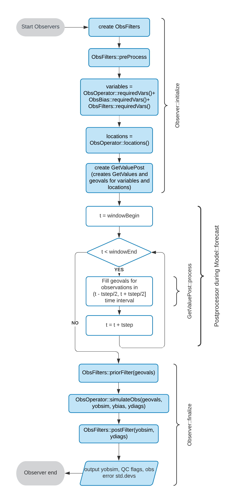

.. _top-ufo-qc:

Background
==========

OOPS Observation Processing Flow
--------------------------------

The flow of H(x) computation and QC filters application in OOPS is shown in the figure below.

.. _ufo-observer-flow:

   Flow chart for computing H(x) and running QC filters

The :code:`Observer` calls the :code:`preProcess` method of :code:`ObsFilters` before the loop over time steps. After the loop, it calls the :code:`priorFilter` and :code:`postFilter` methods just before and just after calling the :code:`simulateObs` method of :code:`ObsOperator`. The observation filters are very generic and can perform a number of tasks, but mostly they are used for quality control.

In variational data assimilation, the above flow happens inside of the observation term of the cost function (J\ :sub:`o`) evaluation.

.. _Observation-Filters:

Observation Filters
-------------------

Observation filters have access to:
 - Observation values and metadata
 - Model values at observations locations (GeoVaLs)
 - Simulated observation value (for post-filter)
 - Their own private data

Most filters are written once and used with many observation types; several such generic filters already exist and are decribed below. Filters applied to observations from a specific ObsSpace need to be listed in the :code:`observations.observers.obs filters` section of the input YAML configuration file, together with any options controlling their behavior. Example:

.. code-block:: yaml

  observations:
    observers:
    - obs space:
        name: AMSUA-NOAA19
        obsdatain:
          engine:
            type: H5File
            obsfile: Data/obs/testinput_tier_1/amsua_n19_obs_2018041500_m.nc4
        simulated variables: [brightness_temperature]
        channels: 1-15
      obs filters:
      - filter: Bounds Check
        filter variables:
        - name: brightness_temperature
          channels: 1-15
        minvalue: 100.0
        maxvalue: 500.0
      - filter: Background Check
        filter variables:
        - name: brightness_temperature
          channels: 1-15
        threshold: 3.0

An alternative to using :code:`obs filters` is to specify the sequence of filters explicitly using the :code:`obs pre filters`, :code:`obs prior filters`
and :code:`obs post filters` options. Further information on that can be found in the following section.

Order of Filter Application
---------------------------

The order in which filters are run can be specified in two ways:

- Determine the ordering automatically based on the data required by each filter.

- Specify the ordering explicitly.

Automatic filter ordering is requested using the :code:`obs filters` option. By default, all filters that do not require access to GeoVaLs, ObsDiagnostics or the HofX vector are run first, in the order they are listed in the :code:`obs filters` section in the YAML file. Subsequently, GeoVaLs are calculated and all filters that require access to GeoVaLs (so-called prior filters) are run. Finally, the observation operator is applied, producing the HofX vector and possibly some ObsDiagnostics, and all filters that require access to these quantities (so-called post filters) are run. It is possible to force a filter to be treated as a post filter and thus defer its execution until after the application of the observation operator by setting the :code:`defer to post` option to :code:`true`.

Explicit filter ordering is requested using the :code:`obs pre filters`, :code:`obs prior filters` and :code:`obs post filters` options.
Filters that appear in the :code:`obs pre filters` section will be run before the GeoVaLs are requested; those in the :code:`obs prior filters`
section will be run after the GeoVaLs have been requested and before HofX is produced; and those in the :code:`obs post filters`
section will be run after HofX has been produced. To request explicit filter ordering, one or more of these sections must be specified.
The filters in each section will be run in the order in which they are specified in that section.
Checks are run on the filters to ensure they are not requesting data that are not available.
For example, a filter in the :code:`obs pre filters` section cannot request HofX data. If such a request is made then an exception will be thrown.

It is not possible to mix automatic and explicit ordering; an exception will be thrown in that case.

Examples
^^^^^^^^

The first example uses the automatic determination of filter ordering. The Thinning filter will be run after the Background Check because its :code:`defer to post` option is set to :code:`true`. If that was not the case, the Thinning filter would be executed before the Background Check, since the former does not need access to the HofX vector, whereas the latter does.

.. code-block:: yaml

    obs filters:
    - filter: Background Check
      filter variables:
      - name: air_temperature
      absolute threshold: 2.0
    - filter: Thinning
      amount: 0.5
      defer to post: true

The second example uses explicit specification of filter ordering. As above, the Background Check and Thinning filters are run after HofX has been produced.
There is also a Variable Transforms filter that runs at the pre-filter stage.

.. code-block:: yaml

    obs pre filters:
    - filter: Variable Transforms
      Transform: WindComponents
    obs post filters:
    - filter: Background Check
      filter variables:
      - name: air_temperature
      absolute threshold: 2.0
    - filter: Thinning
      amount: 0.5

.. _Derived-Variables:

Derived Variables
-----------------

Some filters need to create new or modify existing ObsSpace variables. For example, the Variable
Transforms filter may create new variables representing wind velocity components computed from
measurements of the wind speed and direction. Other filters may want to correct measurements or
metadata loaded from the input file.

It is important to note that filters should never modify variables from the :code:`ObsValue` group
or add new variables to that group: otherwise initial and postprocessed measurements could not be
distinguished, which would harm traceability. Instead, filters may create or modify variables from
the :code:`DerivedObsValue` group; any such DerivedObsValue variable must be declared in the yaml 
as described in :ref:`observations`. The ObsSpace treats all groups with the :code:`Derived` prefix
in a special way. Each member function used to access existing variables, such as
:code:`get_db(group, name, ...)`, checks first if a variable :code:`name` exists in the group
:code:`"Derived" + group` and if so, it retrieves that variable; if not, the function looks for the
variable :code:`name` in the group :code:`group`. As a result, variables from groups with the
:code:`Derived` prefix effectively "overshadow" corresponding variables from groups without that
prefix. In the rare cases where it is important to access the original variables rather than their
derived counterparts, :code:`ObsSpace` member functions should be called with the
:code:`skipDerived` argument set to :code:`true`.

There is no strict rule forbidding modifications to variables from other groups such as
:code:`MetaData`. However, for clarity, it may be a good idea to avoid modifying metadata loaded
from the input file and instead store any corrected versions in variables from the
:code:`DerivedMetaData` group.

Note that any variables from the :code:`DerivedObsValue` group that are to be assimilated should
be included in the :code:`obs space.simulated variables` list as well as the :code:`obs space.derived 
variables` list (see :ref:`observations`). If these variables do not exist by the time
the last filter finishes execution, an exception is thrown. (In contrast, variables from the
:code:`obs space.observed variables` must exist already when the first filter starts execution.)

Observation Errors
------------------

Use the following variable groups to refer to estimates of observation errors of simulated
variables valid at specific stages in the execution of a JEDI application:

* :code:`ObsError`: initial values loaded from the input :code:`ioda` file.

* :code:`ObsErrorData`: up-to-date values (set by one of the preceding filters).

* :code:`EffectiveError`: final values obtained after execution of all filters. This group does
  not exist while filters are running, but is present in the output :code:`ioda` file.

All these values represent standard deviations (square roots of variances).
