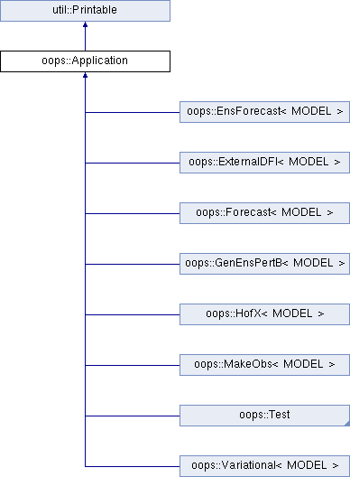
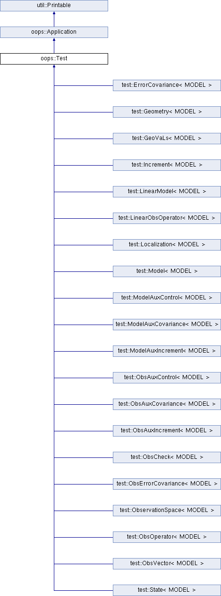

.. _jedi-testing:

JEDI Testing
============

Each JEDI bundle has its own suite of tests.  To run them, first build and compile the bundle as described in :ref:`build-jedi`.  The first step after building and compiling your bundle is to test the code with :code:`ctest`.  This step is described in the :ref:`following section <running-ctest>`.

After describing the basic functionality of ctest, we proceed to give a more detailed overview of how tests are organized and implemented in JEDI.  This is a prelude to the instructions for :ref:`adding-a-test` on the next page, which describes how you -- yes *you!*  -- can implement your own JEDI unit tests.

.. _running-ctest:

Running ctest
-------------

The standard practice after building and compiling a bundle is to run :code:`ctest` with no arguments in order to see if the bundle is operating correctly.
First you need to run :code:`ulimit -s unlimited` (on a linux machine; you may not be able to do this on macOS) to ensure that you don't encounter memory or stack size issues. Then you can test your build with:

.. code-block:: bash

   cd <build-directory>
   ctest

This will run all tests in the test suite for that bundle. This can take a while so be patient.  When the tests are complete, ctest will print out a summary, highlighting which tests, if any, failed.  For example:

.. code-block:: bash

    98% tests passed, 2 tests failed out of 130

    Label Time Summary:
    boost         = 2253.85 sec (75 tests)
    executable    = 2253.85 sec (75 tests)
    fv3jedi       = 2241.67 sec (10 tests)
    mpi           = 2242.21 sec (11 tests)
    oops          =  28.63 sec (111 tests)
    script        =  26.18 sec (55 tests)
    ufo           =   9.73 sec (9 tests)

    Total Test time (real) = 2280.20 sec

    The following tests FAILED:
  	    123 - test_fv3jedi_aninit (Failed)
	    130 - test_fv3jedi_localization (Timeout)
    Errors while running CTest

Run the command :code:`ctest --help` for more a long list of options for running tests. Conveniently,
the arguments for the :code:`ctest` options recognize regular expressions (AKA *regex*). Particularly,
useful is the dollar sign :code:`$` which indicates the end of a string. This can be used to only run
one of a series of tests which have similar names.

For example, if you want to run a single test or a subset of tests, you can do this with the :code:`-R` option

.. code-block:: bash

   ctest -R test_fv3jedi_linearmodel # run a single test
   ctest -R test_qg # run a subset of tests - all tests with names starting with 'test_qg'
   ctest -R test_qg_hofx$ # run only test with complete name 'test_qg_hofx'; WILL NOT run 'test_qg_hofx3d'

Another useful :code:`ctest` option is the :code:`-I [Start,End,Stride]` flag. This will run tests starting from the test numbered :code:`Start` up to the test numbered :code:`End` (optional). Less useful is the (optional) :code:`Stride` argument which lets you skip tests. So it will run every other test if :code:`Stride` is :code:`2`, or every third test if :code:`Stride` is :code:`3`, and so on:

.. code-block:: bash

   ctest -I 423 # run all tests starting at test with index 423
   ctest -I 423,2142 # run all tests from index 423 up to 2142
   ctest -I 0,2142,2 #run only even numbered tests, because why not*?
   # *running only the even tests will result in test
   #  failures due to test dependencies

The output from these tests (stdout) will be printed to the screen but, to allow for greater scrutiny, it will also be written to the file **LastTest.log** in the directory :code:`<build-directory>/Testing/Temporary`.  In that same directory you will also find a file called **LastTestsFailed.log** that lists the last tests that failed.  This may be from the last time you ran ctest or, if all those tests passed, it may be from a previous invocation.

If you're not happy with the information in LastTest.log and you want to know more, you can ask ctest to be **verbose**

.. code-block:: bash

   ctest -V -R test_fv3jedi_linearmodel

...or even **extra-verbose** (hypercaffeinated mode):

.. code-block:: bash

   ctest -VV -R test_fv3jedi_linearmodel

The :code:`-V` and even :code:`-VV` display the output messages on the screen in addition to writing them to the LastTest.log file.  However, sometimes the amount of information written to LastTest.log isn't much different than if you were to run ctest without these options, particularly if all the tests pass.

Another way to get more information is to set one or more of these environment variables before you run ctest:

.. code-block:: bash

   export OOPS_DEBUG=1
   export MAIN_DEBUG=1
   export OOPS_TRACE=1

The first two enable debug messages within the JEDI code that would not otherwise be written.  The second produces messages that follow the progress of the code as it executes.  These tools are provided by :code:`eckit` (see :ref:`cmake_devtools`).   Though higher values of these variables could in principle be set, few JEDI routines exploit this functionality.  So, setting these variables to values greater than 1 will make little difference.  Both can be disabled by setting them to zero.
More information about the use of these variables is available here: :ref:`OOPS environment variables <oops-env-vars>`

You can also display the output messages only for the failed tests by using :code:`--output-on-failure`

.. code:: bash

   ctest --output-on-failure

**ctest** also has an option to only re-run the tests that failed last time:

.. code-block:: bash

   ctest --rerun-failed

To see a list of tests for your bundle without running them, enter

.. code-block:: bash

   ctest -N

For a complete list of ctest options, enter :code:`man ctest`, :code:`ctest --help`, or check out our :ref:`cmake_devtools`.  As described there, CTest is a component of CMake, so you can also consult the `CMake online documentation <https://cmake.org/documentation/>`_ for the most comprehensive documentation available.

.. _manual-testing:

Manual Execution
----------------

You can also run the executable test files directly, without going through ctest.  To do this, first find the executable in the build directory. Unit tests are typically found in one of the :code:`test` directories that branch off each repository name.  For example, :code:`test_qg_state` can be found in :code:`<build-directory>/oops/qg/test` and :code:`test_ufo_geovals` can be found in :code:`<build-directory>/ufo/test`.  Then just :code:`cd` to that directory and run the executable from the command line, specifying the appropriate input (configuration) file, e.g.

.. code-block:: bash

    test_qg_state testinput/interfaces.yaml

You can determine which executable and which configuration file each test uses by viewing the :code:`CMakeLists.txt` file in the corresponding :code:`test` directory of the repository.  If you're running the ufo bundle, then the relevant :code:`CMakeLists.txt` files for the examples above would be :code:`<src-directory>/ufo-bundle/oops/qg/test` and :code:`<src-directory>/ufo-bundle/ufo/test`.  Just open the relevant :code:`CMakeLists.txt` file and search on the name of the test.  See :doc:`Adding a New Test <adding_a_test>` for further details on how to interpret the syntax.

If you do run the tests without ctest, keep in in mind a few tips.  First, the test name is not always the same as the executable name.  Second, since the the integration and system tests generally focus on JEDI Applications (other than :code:`oops::Test` objects - see :ref:`below <test-apps>`) they usually have a :code:`.x` extension.  Furthermore, these executables are generally located in the :code:`<build-directory>/bin` directory as opposed to the :code:`test` directories.  For example, to run :code:`test_qg_truth` from the :code:`<build-directory>/oops/qg/test` directory, you would enter the following:

.. code-block:: bash

    ../../../bin/qg_forecast.x testinput/truth.yaml

.. _jedi-tests:

The JEDI test suite
-------------------

What lies "*under the hood*" when you run :code:`ctest`?  Currently, there are two types of tests implemented in JEDI:

1. Unit tests
2. Integration and system tests (aka Application tests)

This does not include other types of system and acceptance testing that may be run
outside of the CTest framework by individual developers and testers.
Integration and system tests are referred to as **Application tests** for
reasons that will become clear in the :ref:`next section <test-apps>`.

**Unit tests** are implemented in JEDI using the :code:`eckit` unit testing framework
for initializing and organizing our suite of unit tests.  :ref:`See below <init-test>` for details on how tests are implemented.

Unit testing generally involves evaluating one or more Boolean expressions during the
execution of some particular component or components of the code.
For example, one can read in a model state from an input file and then check whether
some measure of the State norm agrees with a known value to within some specified tolerance.
Alternatively, one can test whether a particular variable is positive (such as temperature or density) or whether a particular function executes without an error.

By contrast, **Application tests** check the operation of some application as a whole.
Some may make use of eckit boolean tests but most focus on the output that these applications
generate.  For example, one may wish to run a 4-day forecast with a particular model
and initial condition and then check to see that the result of the forecast matches
a well-established solution. This is currently done by comparing the test output
to an analogous "reference" output file from a previous execution of the test.
Such reference files are included in many JEDI repositories and can generally be
found in a :code:`test/testoutput` subdirectory.  See :ref:`Integration and System testing <app-testing>` for details.

As mentioned above, each JEDI bundle has its own suite of tests and you can list them (without running them) by entering this from the build directory:

.. code-block:: bash

   ctest -N

Though all tests in a bundle are part of the same master suite, they are defined within each of the bundle's individual repositories.  Furthermore, you can generally determine where each test is defined by its name.  For example, all :code:`test_qg_*` tests are defined in :code:`oops/qg`; all :code:`test_ufo_*` tests are defined in :code:`ufo`; all :code:`test_fv3jedi_*` tests are defined in the :code:`fv3-jedi` repo, and so on.

With few exceptions, all JEDI repositories contain a :code:`test` directory that defines the tests associated with that repository.  oops itself is one exception because it orchestrates the operation of the code as a whole but there you will find archetypical test directories within the :code:`qg` and :code:`l95` model directories.

Within each :code:`test` directory you will find a file called :code:`CMakeLists.txt`.  This is where each test is added, one by one, to the suite of tests that is executed by CTest.  As described in the `CMake documentation <https://cmake.org/documentation/>`_, this is ultimately achieved by repeated calls to the CMake :code:`add_test()` command.

However, the :ref:`ecbuild package <cmake_devtools>` offers a convenient interface to CMake's :code:`add_test()` command called :code:`ecbuild_add_test()`. For further details on how to interpret this argument list see :doc:`Adding a New Unit Test <adding_a_test>`.

Since it relies on the net result of an application, each Application test is typically associated with a single CTest executable.  However, applications of type :code:`oops::Test` (see :ref:`next section <test-apps>`) will typically execute multiple unit tests for each executable, or in other words each item in the CTest suite.  So, in this sense, the suite of unit tests is nested within each of the individual tests defined by CTest.  And, it is this nested suite of unit tests. (see :ref:`below <init-test>`).

.. _test-apps:

Tests as Applications
---------------------

The JEDI philosophy is to exploit high-level abstraction in order to promote code flexibility, portability, functionality, efficiency, and elegance.  This abstraction is achieved through object-oriented design principles.

As such, the execution of the JEDI code is achieved by means of an :code:`Application` object class that is defined in the :code:`oops` namespace.  As illustrated in the following class hierarchy, :code:`oops::Test` is a sub-class of the :code:`oops::Application` class, along with other applications such as individual or ensemble forecasts:

Unit tests are implemented through :code:`oops::Test` objects as described in this and the following sections.  The other type of test in the :ref:`JEDI test suite <jedi-tests>`, namely Application tests, generally check the operation of JEDI applications as a whole - the same applications that are used for production runs and operational forecasting.  In other words, application tests are used to test the operation of the Application classes in the diagram above that are *not* sub-classes of :code:`oops::Test`.

To appreciate how a JEDI Application is actually run, consider the following program, which represents the entire (functional) content of the file :code:`oops/qg/test/executables/TestState.cc`:

.. code-block:: C++

   int main(int argc,  char ** argv) {
     oops::Run run(argc, argv);
     test::State<qg::QgTraits> tests;
     run.execute(tests);
     return 0;
   };

This program begins by defining an object of type :code:`oops::Run`, passing the constructor the arguments from the command line.  These command-line arguments generally include a :ref:`configuration file <jedi-config>` that specifies the parameters, input files, and other information that is necessary to run the application (in this case, a test).

Then the program proceeds to define an object of type :code:`test::State<qg::QgTraits>` called :code:`tests`, which is a sub-class of :code:`oops::Test` as illustrated here:

Since :code:`test::State<qg::QgTraits>` is a sub-class of :code:`oops::Test` (through the appropriate instantiation of the :code:`test::State<MODEL>` template), then the :code:`tests` object is also an Application (:code:`oops::Application`).

So, after defining each of the objects, the program above proceeds to pass the Application object (:code:`tests`) to the :code:`execute()` method of the :code:`oops::Run` object.  Other applications are executed in a similar way.

Source code for the executable unit tests in a given JEDI repository can typically be found in a sub-directory labelled :code:`test/executables` or :code:`test/mains`.  Similarly, the source code for executable JEDI Applications that are not :code:`oops::Test` objects can typically be found in a :code:`mains` directory that branches from the top level of the repository.

.. _init-test:

Initialization and Execution of Unit Tests
------------------------------------------

As described :ref:`above <test-apps>`, an :code:`oops::Test` object is an application that is passed to the :code:`execute()` method in an :code:`oops::Run` object.  To describe what happens next, we will continue to focus on the :code:`test_qg_state` example introduced in the previous section as a representative example.

First, it is important to realize that the :code:`test::State<Model>` class is not the same as the :code:`oops::State<Model>` class.  The former is an application as described in the previous section whereas the latter contains information about and operations on the current model state.

Second, as an application, a :code:`test::State<Model>` object also has an :code:`execute()` method, which is called by the :code:`execute()` method of the :code:`oops::Run` object as shown here (code excerpt from :code:`oops/src/oops/runs/Run.cc`):

.. code-block:: C++

   void Run::execute(const Application & app) {
     int status = 1;
     Log::info() << "Run: Starting " << app << std::endl;
     try {
       status = app.execute(*config_);
     }
     [...]

The :code:`execute()` method for an :code:`oops::Test` is defined in the
file :code:`oops/src/oops/runs/Test.h`.  The main purpose of this routine is
to initialize and run the suite of unit tests.

The :code:`execute()` method in each :code:`oops::Test` object then proceeds to register the tests with :code:`oops::Test::register_tests()` and run them with a call to eckit's :code:`run_tests()` function (:code:`argc` and :code:`argv` are parsed from the :code:`args` variable above):

.. code-block:: C++

    // Run the tests
      Log::trace() << "Registering the unit tests" << std::endl;
      register_tests();
      Log::trace() << "Running the unit tests" << std::endl;
      int result = eckit::testing::run_tests(argc, argv, false);
      Log::trace() << "Finished running the unit tests" << std::endl;
      Log::error() << "Finished running the unit tests, result = " << result << std::endl;

So, the real difference between different :code:`oops::Test` objects is encapsulated in the :code:`oops::Test::register_tests()` method.   Each test application (i.e. each item in ctest's list of tests) will register a different suite of unit tests.

In the case of :code:`test::State<MODEL>` (which you may recall from the previous section is a sub-class of :code:`oops::Test`), this method is defined as follows (see :code:`oops/src/test/interface/State.h`):

.. code-block:: C++

  void register_tests() const {
    std::vector<eckit::testing::Test>& ts = eckit::testing::specification();

    ts.emplace_back(CASE("interface/State/testStateConstructors")
      { testStateConstructors<MODEL>(); });
    ts.emplace_back(CASE("interface/State/testStateInterpolation")
      { testStateInterpolation<MODEL>(); });
  }

This is where the eckit unit test suite is actually initiated: A :code:`ts` object is created by calling :code:`specification()`, tests are added to testing suite :code:`ts` by :code:`emplace_back`.

Note that all this occurs within the :code:`test::State<MODEL>` class template so there will be a different instance of each of these unit tests for each model.  So, our example application :code:`test_qg_state` will call :code:`test::State<qg:QgTraits>::register_tests()` whereas other models and other applications (as defined in other sub-classes of :code:`oops::Test` - see :ref:`above <test-apps>`) will register different unit tests.

So, in short, members of the **ctest** test suite are added by means of :code:`ecbuild_add_test()` commands in the appropriate :code:`CMakeLists.txt` file (see :ref:`above <jedi-tests>`) while members of the nested unit test suite are added by means of the :code:`oops::Test::register_tests()` method.

.. _unit-test:

Anatomy of a Unit Test
----------------------

Let's continue to use :code:`test_qg_state` as an example in order to illustrate how unit tests are currently implemented in JEDI.  As described in the previous two sections, the execution of this test (a single test from the perspective of **ctest**) will call :code:`test::State<qg:QgTraits>::register_tests()` to register a suite of unit tests and it will call :code:`eckit::testing::run_tests()` to run them.

As demonstrated in the previous section, this particular suite of unit tests includes two members, namely :code:`testStateConstructors<MODEL>()` and :code:`TestStateInterpolation<MODEL>()`, with :code:`MODEL` instantiated as :code:`qg:QgTraits`.  What happens when we run one of these unit tests?

Here we will focus on the first, :code:`TestStateConstructors<MODEL>()`.  Both are defined in :code:`oops/src/test/interface/State.h`, where you will find this code segment:

.. code-block:: C++

  template <typename MODEL> void testStateConstructors() {
    typedef StateFixture<MODEL>   Test_;
    typedef oops::State<MODEL>    State_;

    const double norm = Test_::test().getDouble("norm-file");
    const double tol = Test_::test().getDouble("tolerance");
    const util::DateTime vt(Test_::test().getString("date"));

    // Test main constructor
    const eckit::LocalConfiguration conf(Test_::test(), "StateFile");
    const oops::Variables vars(conf);
    boost::scoped_ptr<State_> xx1(new State_(Test_::resol(), vars, conf));

    EXPECT(xx1.get());
    const double norm1 = xx1->norm();
    EXPECT(oops::is_close(norm1, norm, tol));
    EXPECT(xx1->validTime() == vt);

    [...]

This starts by defining :code:`Test_` as an alias for the :code:`StateFixture<MODEL>` class.  Other test objects also have corresponding fixture classes, for example :code:`test::ModelFixture<MODEL>`, :code:`test::ObsTestsFixture<MODEL>`, etc.  These are primarily used to access relevant sections of the configuration file.  In the above example, they are used to extract a reference value for the State norm, a tolerance level for the norm test, and a reference date for the State object that is about to be created.

Then the "StateFile" section of the config file is extracted through the StateFixture and, together with information about the geometry (in :code:`Test_::resol()`), is used to create a new State object called :code:`*xx1` (:code:`boost::scoped_ptr<>` is a type of smart pointer defined by Boost similar to :code:`std::unique_ptr<>` in C++11).

Then the unit tests really begin, with multiple calls to check Boolean expressions, including exit codes.  The first call to :code:`EXPECT()` checks to see if the pointer is properly defined with the help of the :code:`get()` method of :code:`boost::scoped_ptr<>`.  In other words, it checks to see if a State object was successfully created.

The call to :code:`EXPECT(oops::is_close(norm1, norm, tol))` then checks to see if the norm that was read from the configuration file is equal to the value computed with the :code:`norm()` method of the State object, with the specified tolerance.

:code:`EXPECT()` with double equal sign is used to verify that the State object is equal to the reference value read from the configuration file.

The function above then proceeds to perform similar tests for the copy constructor (not shown).

If any of these nested unit tests fail, **ctest** registers a failure for the parent application and an appropriate message is written to the ctest log file (as well as :code:`stdout` if **ctest** is run in verbose mode).

.. _app-testing:

Integration and System (Application) Testing
--------------------------------------------

Though each executable in a CTest suite may run a number of unit tests as
described in the previous two sections, others are used for higher-level integration
and system testing.  As described in :ref:`The JEDI Test Suite <jedi-tests>` above,
these application tests are implemented by comparing the output of these executables to known solutions.

Reference files define these known solutions and are found in
the :code:`test/testoutput` directory of JEDI repositories.
For example, :code:`test_qg_state` is a unit test suite (:ref:`Type 1 <jedi-tests>`) as opposed to an Application test (:ref:`Type 2 <jedi-tests>`) so it does not have a reference output file.
However, as an Application test, :code:`test_qg_truth` does have such a file, which is named :code:`truth.test`. This file includes all the messages written using :code:`oops::Log::test()` command such as:

.. code-block:: bash

    Initial state: 13.1
    Final state: 15.1417

This lists the norm of the initial and final states in an 18 day forecast.
So, the ostensibly sparse contents of this file are misleading: *a lot of things
have to go right in order for those two data points to agree precisely*!

Currently, there are two comparing methods implemented in JEDI. One uses :code:`compare.py` and
the other compares the test output and the reference file internally as the final step of the C++ executable.  Eventually all tests will use the C++ comparison rather than :code:`compare.py`.

Testing using compare.py
~~~~~~~~~~~~~~~~~~~~~~~~~~~~~~

.. warning::

   The :code:`compare.py` script is being replaced by a new method of testing
   using the internal test reference comparison

**compare.py** (or in some repository **compare.sh**) takes run file (test output),
reference file (established solution), float tolerance, and integer difference as input and can be used as:

.. code:: bash

  compare.py run_file ref_file float_tolerance integer_difference

Tolerance values are used to allow for small differences between test output and the reference values.
Float tolerance is the maximum relative difference between floating numbers in the run file and the reference file.
Integer difference is the maximum difference between integer numbers in the run file and the reference file.
Example below shows how :code:`compare.py` can be used with :code:`ecbuild_add_test` to add a
test for comparing test output with a reference file. You can find more examples in :code:`test/CMakeLists.txt` in different JEDI repositories

.. code:: bash

  ecbuild_add_test( TARGET       test_fv3jedi_forecast_fv3-gfs_compare
                    TYPE         SCRIPT
                    COMMAND      ${CMAKE_BINARY_DIR}/bin/compare.py
                    ARGS         testoutput/forecast_fv3-gfs.run testoutput/forecast_fv3-gfs.ref 1.0e-3 0
                    TEST_DEPENDS test_fv3jedi_forecast_fv3-gfs )

When the test is executed, the :code:`compare.py` script in the :code:`test` directory
of the repository (which also has a soft link in the build directory) will compare
the output file to the reference file by first extracting the lines that begin
with "Test" (using :code:`grep`) and then comparing the (text) results (using :code:`diff`).
In our example, the two files to be compared are :code:`test.truth` and :code:`test.truth.test.out`.
If these do not match, :code:`ctest` registers a failure.

Testing using the internal test reference comparison
~~~~~~~~~~~~~~~~~~~~~~~~~~~~~~~~~~~~~~~~~~~~~~~~~~~~~~~~~~~~

Alternatively, comparison of the test log and reference file can be done internally as the final step of the C++ execution, removing the need for :code:`compare.py`.  The :code:`test` section of the test's YAML configuration is used to control the test-reference comparison.
For example, the :code:`test:` section in an application test's YAML file might look like:

.. code:: bash

  test:
    reference filename: testoutput/4dvar.obsbias.test
    #  Optional:
    float relative tolerance: 1.0e-5       # default value of 1.0e-6
    float absolute tolerance: 1.0e-5       # default value of 0
    integer tolerance: 0                   # default value of 0
    log output filename: testoutput/4dvar.obsbias.log.out  # writes out the content
    test output filename: testoutput/4dvar.obsbias.test.out

The floating-point formatting of the test output channel is always displayed at full precision.

The :code:`reference filename` specifies the reference file name that will be used to compare with the test output channel.

The test channel output and the reference file are compared line-by-line, and must contain the same number of lines.  If there are no numeric elements in the lines, they must match exactly.  Empty lines and trailing whitespaces are ignored.  Lines that contain numeric elements are compared numerically.  Each line must have the same count of numeric elements, and each of the numeric elements must be within tolerance.  Tolerance values for integer and floating-point variables may optionally be specified but default to 0 for :code:`float absolute tolerance` and :code:`integer tolerance`, and 1.0e-6 for :code:`float relative tolerance`.  If numeric elements from the test and reference files parse as integers, the  :code:`integer tolerance` controls the acceptable tolerance.  Otherwise, numeric values are treated as floating point. Floating-points values are considered acceptable if they meet the relative tolerance OR the absolute tolerance:

Relative tolerance:

.. math::

   |test - reference| / (0.5*(reference + test))  < relative tolerance

Absolute tolerance:

.. math::

   |test - reference| < absolute tolerance

If the test channel fails to match the reference file, an exception from a sub-class of :code:`oops::TestReferenceError` containing relevant information about the cause of the mismatch is thrown.

Additional options for the :code:`test:` YAML sub-section:

* :code:`log output filename` - *(Optional)* A file to save the complete log output.
* :code:`test output filename` - *(Optional)* A file to save the test-channel specific log output.  This file can be used to replace the test reference file when needed.

After adding the test section to the YAML file, the test can simply be added in :code:`test/CMakeLists.txt`
using :code:`ecbuild_add_test`:

.. code:: bash

  ecbuild_add_test( TARGET test_l95_4dvar.obsbias
                    COMMAND l95_4dvar.x
                    ARGS testinput/4dvar.obsbias.yaml
                    TEST_DEPENDS test_l95_forecast test_l95_makeobsbias )

.. note::
  An advantage of the internal comparison method is that filenames are not hard-coded into the `CMakeLists.txt`.  Instead, they are easily modified in the test's YAML file without triggering the CMake configuration phase to rerun on each build.  In most cases, this will lead to faster rebuilds when developing and debugging application tests.

.. _test-framework:

JEDI Testing Framework
----------------------

In this document we have described :ref:`how unit tests are implemented as oops::Test (Application) objects <test-apps>` and we have described how they are executed by :ref:`passing these Application objects to an oops::Run object <init-test>`.  We have focused on the :code:`oops` repository where this testing framework is currently most mature.  However, **the ultimate objective is to replicate this structure for all JEDI repositories.**

Using :code:`oops` as a model, the objective is to have the :code:`test` directory in each JEDI repository mirror the :code:`src` directory.  So, ideally, every class that is defined in the :code:`src` directory will have a corresponding test in the :code:`test` directory.  Furthermore, each of these tests is really a suite of unit tests as described :ref:`above <jedi-tests>`.

Let's consider ufo as an example.  Here the main source code is located in :code:`ufo/src/ufo`.  In particular, the :code:`.h` and :code:`.cc` files in this directory define the classes that are central to the operation of ufo.  For each of these classes, there should be a corresponding :code:`.h` file in :code:`ufo/test/ufo` that defines the unit test suite for objects of that class.  These are not yet all in place, but this is what we are working toward.  The same applies to all other JEDI repositories.

Each unit test suite should be defined as a sub-class of :code:`oops::Test` as described :ref:`above <test-apps>`.  Then it can be passed to an :code:`oops::Run` object :ref:`as an application to be executed <test-apps>`.

For further details on how developers can contribute to achieving this vision, please see :doc:`Adding a New Test <adding_a_test>`.
