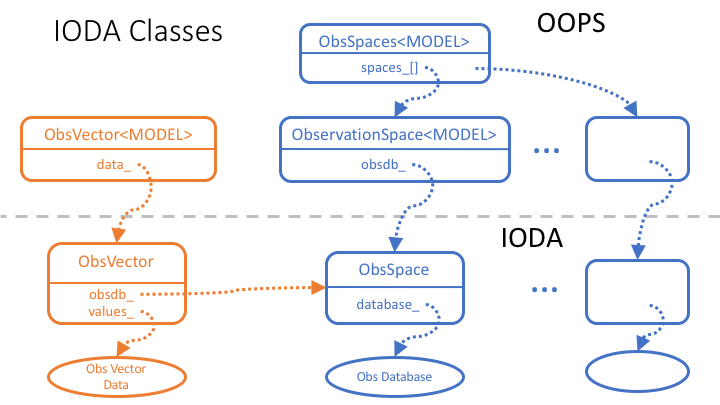
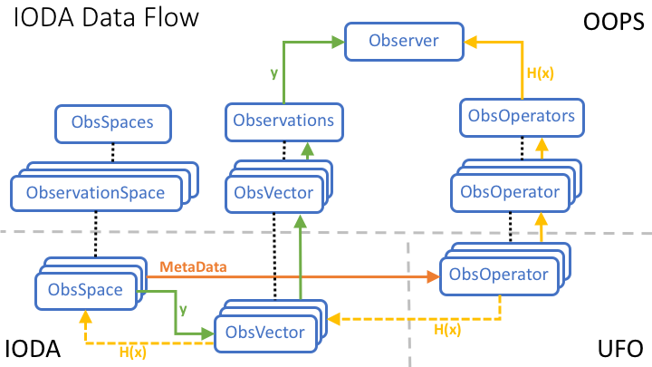

.. _top-ioda-class-structure:

IODA Class Structure
====================

Relationship Between OOPS and IODA
----------------------------------

OOPS provides an abstract interface layer for classes involved in the DA operation.
The OOPS classes are templated so that a variety of concrete objects can be instantiated for those classes.
For example, in the current JEDI system there are two "toy" models, lorenz95 and qg, that implement their own concrete ObsVector class.
In addition, IODA provides a third concrete ObsVector class.
The selection of the ObsVector for a particular DA run is accomplished by declaring which ObsVector you want through the <MODEL> template in the OOPS abstract ObsVector class.

IODA provides concrete implementations for two of the OOPS abstract classes, ObsVector and ObsSpace, as shown in :numref:`ioda-classes`.

.. _ioda-classes:

   Class relationships between OOPS and IODA

The transition from the OOPS abstract class to the corresponding IODA concrete class is handled through a pointer to an instantiated object of the IODA class.
In the ObsVector case, the selection of the IODA ObsVector class is done by substituting "ioda::ObsVector" for the <MODEL> type in the OOPS template, and the OOPS data member "data\_" is set up to point to an object of the IODA ObsVector.

The OOPS classes also define the interface to the concrete objects that lie below.
The member methods of the OOPS class simply call the same named methods, in the instantiated object, with the same list of arguments for those methods in the instantiated object.

Multiple ObsSpace Objects
-------------------------

Note that the ObsSpace structure contains a set of ObsSpace objects (:numref:`ioda-classes`).
At the top of the structre in OOPS, there is a class, ObsSpaces (note the plural), that contains a vector of pointers (data member "spaces\_") that reference a set of ObservationSpace objects with their corresponding IODA ObsSpace objects.

Each IODA ObsSpace object instantiated by OOPS ObsSpaces is associated with a corresponding UFO ObsOperator.
The ObsOperator is the object that simulates observation values, H(x).
The ObsSpace, ObsOperator pairs tend to form according to observation type (e.g., radiance, radiosonde, aircraft) that only work on those types as opposed to the entire set of observations.
This breaks the problem up into smaller more managable pieces, and facilitates the observation simulation since each observation type tends to require a different algorithm for its simulation.

Note that there will exist multiple ObsVector objects for two reasons.
First because of the multiple ObsSpace objects, and second because both actual observations (the y vector) and simulated observations (the H(x) vector).
Each ObsVector is associated with a single ObsSpace that stores its values in the corresponding Obs Database (:numref:`ioda-classes`).

IODA Data Flow
--------------

During the execution of a DA run, observation data are read into multiple ObsSpace objects (according to observation type) forming the pieces of the y vector.
Multiple ObsOperator objects are created that correspond to the ObsSpace objects for the purpose of calculating the simulated observations forming the pieces of the H(x) vector.
The total y and H(x) vectors are assembled from the data presented by the multiple ObsSpace and ObsOperator objects by an OOPS object called Observer as show in :numref:`ioda-obj-dflow`.

.. _ioda-obj-dflow:

   Data flow through IODA, UFO and OOPS objects

At various points in the DA run, results such as H(x), O-A, or O-B (i.e., any quantity corresponding to a observation vector) can be stored into the multiple ObsSpace objects for subsequent writing out into a results file.
An example for H(x) is shown in :numref:`ioda-obj-dflow` along the dashed line path.
The data written into the results file can later be used for analysis of the DA run.
