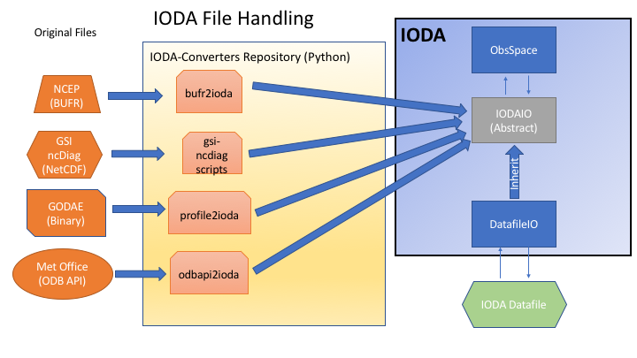
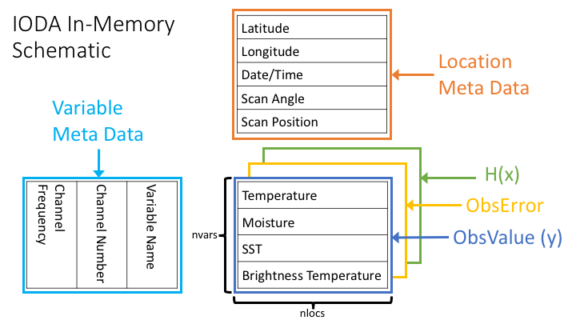

.. _top-ioda-interface:

IODA Interfaces
===============

Background
----------

IODA interacts with external observation data on one side and with the OOPS and UFO components of JEDI on the other side (:numref:`ioda-hlev-dflow`).
On the observation data side there exist huge amounts of data, thus creating the need to pare these data down to a manageable size for JEDI during a particular DA run.
The primary mechanism for accomplishing this is to filter out all of the observations that lie outside the current DA timing window, and present only that subset to be read into memory during a DA run.

There are many different types of observations that come with a variety of ways that the observation data are organized.
To the extent that is feasible, it is desireable to devise a common data organization of which all of these observation types can employ.
The memory representation of observation data in IODA has started with a prototype along these lines that successfully places a number of observation types (radiosonde, aircraft, AMSU-A, GNSSRO, plus several more) into a common organization.

At this point, we have a prototype architecture defined for the handling of files containing observation data (:numref:`ioda-file-handling`).

.. _ioda-file-handling:

   IODA file handling

The intent of this architecture is to enable the use of one IODA file reader/writer implementation, namely the IodaIO class in :numref:`ioda-file-handling`.
Using the single IodaIO class will make future maintenance much simpler, especially since we have not yet settled on the particular file format to use for the IODA Datafile piece.

A first pass implementation of this architecture has been created in the `ioda-converters github repository <https://github.com/JCSDA/ioda-converters>`_.
This implementation is not quite in the form of the prototype architecture, but is evolving toward that goal.
Currently, we are using netcdf for the IODA Datafile format (subject to change) and we have a common netcdf writer in the ioda-converters with a collection of readers for the various observation data file formats.
Work is in progress to evolve the current implementation to the prototype architecture.

A prototype interface, using a common data organization (:numref:`ioda-inmem-schematic`, has been defined for access to observation data from the JEDI components OOPS and UFO.

.. _ioda-inmem-schematic:

   Schematic view of the IODA in-memory represention

Central to this scheme are the 2D arrays holding the osbervation data quantities (ObsValue, ObsError, HofX in :numref:`ioda-inmem-schematic`).

.. warning::
   The IODA interfaces are newly formed and under much development at the time of the writing of this documentation, and as such are subject to change.

External Observation Data
-------------------------

Data Tanks
^^^^^^^^^^

Diagnostic Files
^^^^^^^^^^^^^^^^

JEDI Components
---------------

OOPS Interface
^^^^^^^^^^^^^^

UFO Interface
^^^^^^^^^^^^^

