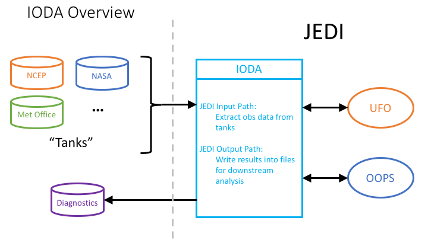

.. _top-ioda-intro:

IODA Introduction
=======================

Overview
--------

The Interface for Observation Data Access (IODA) component of JEDI provides the interfaces that bridge the external observation data to the components within JEDI that utilize those data, namely OOPS and UFO.
As shown in :numref:`ioda-hlev-dflow`, data flows in two directions through the IODA subsystem.

.. _ioda-hlev-dflow:

   High level data flow through the IODA subsystem

Data stored in observation data "tanks" at different centers are extracted, loaded into memory and presented through an interface to the JEDI OOPS and UFO subsystems. 
The DA run produces various results such as H(x), O-A, and O-B, which are (selectively) written out into files that can be used for plotting and other diagnostic purposes.

The goal for IODA is to be able to handle an immense amount of data from the tanks (, left side) without overwhelming the DA run.
In addition, IODA needs to present observation data in different manners (e.g., spatially localized clusters of observations) for consumption by UFO and OOPS as well as write DA results in a format amenable to the user's diagnostics tools.

Representation of Model and Observation Data
--------------------------------------------

Earth system quantities (variables such at temperature, humidity, ocean salinity) are typically represented as 4-dimensional fields.
Three spatial dimensions and time (x,y,z,t) comprise the total dimensions of these fields.
For the spatial dimensions, a common way to define x and y (horizontal) are longitude and latitude, respectively, however the vertical dimension can be represented in many ways such as height, pressure, and a variety of terrain-following systems.
Using atmospheric temperature (T) as an example, the variable is mathematically represented as T(x,y,z,t) in the governing equations.
Model fields are commonly dense arrays with every element defined over the model domain, so these fields are typically stored in 4D arrays.
Observations on the other hand tend to be sparse (relative to the model representation), so these can be thought of as 2D arrays that are dimensioned by variables versus locations.
Each location is an (x,y,z,t) tuple that defines where the corresponding observation value is located in the 4D field.

.. note::

   Some observation quantities, for example many satellite instrument measurements, result from a vertical (column) integration thus eliminating the vertical dimension.
   In these cases, the location is an (x,y,t) tuple instead where the z component is not necessary.

Because of the sparse nature of the observation data, these data are viewed within JEDI as 2D arrays (variables versus locations) and the associated location values (the x, y, z, t coordinate values) are treated as meta data.
Location #1 is a particular combination of x, y, z, t values, location #2 is another combination of x, y, z, t values, and so forth.
During the execution of the DA run, the observation data and location meta data are passed around in objects to the subsystems that require these data.

JEDI Components that are Clients of IODA
----------------------------------------

As seen in :numref:`ioda-hlev-dflow`, the clients of IODA within the JEDI system are UFO and OOPS.
UFO is responsible for computing the simulated observations, H(x), from the model fields.
Therefore, UFO takes the observation location meta data from IODA, queries the model for the field values at those locations and then runs the corresponding forward operators to calculate H(x) at all of the observation locations.
One task for OOPS is to run minimization which operates in part on the difference between the actual observations, y, and the simulated observations, H(x).
OOPS collects H(x) from UFO and y from IODA to form a departure, y - H(x), that is used in the minimization process.

External Observation Data
-------------------------

The data centers (eg. NCEP, in :numref:`ioda-hlev-dflow`) store observation data in a wide variety of formats.
Because of this, the general idea in IODA is to convert these formats to a common format, the "IODA data store", to facilitate access by IODA.
This way, the different manners is which JEDI may want to select, query, or distribute the observation data can be done through one API to the IODA data store format, as opposed to many API's to the various data center formats.
After the DA run completes, it is often desired to analyze different aspects of that run.
IODA will provide a diagnostics file for this purpose whose contents will be selectable via the DA run configuration.
"O minus A" is an example of a quantity that could be saved in the diagnostics file.
