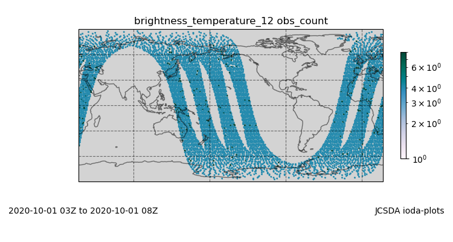

.. _top-tut-hofx-nrt:

Tutorial: Simulating Observations with UFO
==========================================

Learning Goals:
 - Create simulated observations similar to those highlighted on JCSDA's `Near Real-Time (NRT) Observation Modeling web site <http://nrt.jcsda.org>`_
 - Acquaint yourself with the rich variety of observation operators now available in :doc:`UFO <../../../inside/jedi-components/ufo/index>`

Prerequisites:
 - Either :doc:`Run JEDI in a Container <run-jedi>` or :doc:`Building and Testing FV3 Bundle <dev-container>`

.. _hofxnrt-overview:

Overview
--------

If you have finished either the :doc:`Run JEDI in a Container <run-jedi>` tutorial or the :doc:`Building and Testing FV3 bundle <dev-container>` tutorial, you now have a version of ``fv3-bundle`` compiled and ready to use.  In the former case, it came pre-packaged inside an application container.  In the latter case, you build it yourself inside a development container.

A small clarification on the case of the development container; You built fve-bundle while inside the container but since the container and host environment share the same home directory, you should still be able to access it outside of the container.  But, if you try to run any tests or applications from outside the container you'll find that they fail.  This is because, at run time as well as at compile time, the tests and applications need to link to the libraries and executables inside the container.

The comparison between observations and forecasts is an essential component of any data assimilation (DA) system and is critical for accurate Earth System Prediction.  It is common practice to do this comparison in observation space.  In JEDI, this is done by the Unified Forward Operator (:doc:`UFO <../../../inside/jedi-components/ufo/index>`).  Thus, the principle job of UFO is to start from a model background state and to then simulate what that state would look like from the perspective of different observational instruments and measurements.

In the data assimilation literature, this procedure is often represented by the expression :math:`H({\bf x})`.  Here :math:`{\bf x}` represents prognostic variables on the model grid, typically obtained from a forecast, and :math:`H` represents the *observation operator* that generates simulated observations from that model state.  The sophistication of observation operators varies widely, from in situ measurements where it may just involve interpolation and possibly a change of variables (e.g. radiosondes), to remote sensing measurements that require physical modeling to produce a meaningful result (e.g. radiance, GNSSRO).

So, in this tutorial, we will be running an application called :math:`H({\bf x})`, which is often denoted in program and function names as ``Hofx``.  This in turn will highlight the capabilities of JEDI's Unified Forward Operator (:doc:`UFO <../../../inside/jedi-components/ufo/index>`).

The goal is to create plots comparable to JCSDA's `Near Real-Time (NRT) Observation Modeling web site <http://nrt.jcsda.org>`_  This site regularly ingests observation data for the complete set of operational instruments at NOAA.  And, it compares these observations to forecasts made through NOAA's operational Global Forecasting System (FV3-GFS) and NASA's Goddard Earth Observing System (FV3-GEOS).

But there is a caveat.  The NRT web site regularly simulates millions of observations using model backgrounds with operational resolution - and it does this every six hours!  That requires substantial high-performance computing (HPC) resources.  We want to mimic this procedure in a way that can be run on a laptop computer.  So, the model background we will use will be at a much lower horizonal resolution (c48, corresponding to about 14 thousand points in latitude and longitude) than the NRT website (GFS operational resolution of c768, corresponing to about 3.5 million points).

Step 1: Acquire input files
---------------------------

The description in the previous section gives us a good idea of what we need to run :math:`H({\bf x})`.  First, we need :math:`{\bf x}` - the model state.  In this tutorial we will use background states from the FV3-GFS model with a resolution of c48, as mentioned above.

Next, we need observations to compare our forecast to.  Observations included in this tutorial include (see the :doc:`NRT website <http://nrt.jcsda.org>` for an explanation of acronyms):

* Aircraft
* Sonde
* Satwinds
* Scatwinds
* Vadwind
* Windprof
* SST
* Ship
* Surface
* cris-npp
* cris-n20
* airs-aqua
* gome-metopa
* gome-metopb
* sbuv2-n19
* amsua-aqua
* amsua-n15
* Amsua-n18
* amsua-n19
* amsua-metopa
* amsua-metopb
* amsua-metopc
* iasi-metopa
* iasi-metopb
* seviri-m08
* seviri-m11
* mhs-metopa
* mhs-metopb
* mhs-metopc
* mhs-n19
* ssmis-f17
* ssmis-f18
* atms-n20

The script to get these background and observation files is already in fv3-bundle.  But, before we run it, we should find a good place to run our application.  If you are using an application container, ``fv3-bundle`` is inside the container so that directory is read-only; that will not do.  Or, if you are using a development container, you could write to it but it is good practice to keep the repository clean of output files.

So, whichever container you are running in, it's a good idea to copy the files you need over to your home directory that is dedicated to running the tutorial:

.. code-block:: bash

   mkdir -p $HOME/jedi/tutorials
   cp -r <path-to-fv3-bundle>/tutorials/Hofx $HOME/jedi/tutorials
   cd $HOME/jedi/tutorials/Hofx

Here ``<path-to-fv3-bundle>`` is the path to your copy of ``fv3-bundle``.  If you previously did the :doc:`Run JEDI in a Container <run-jedi>` tutorial this will be ``/opt/jedi/fv3-bundle``.  Or, if you did the :doc:`Building and Testing FV3 Bundle <dev-container>` tutorial, this may be ``$HOME/jedi/fv3-bundle``.

We'll call ``$HOME/jedi/tutorials/Hofx`` the run directory.

Now we are ready to run the script to obtain the input data (from the run directory):

.. code-block:: bash

    ./get_input.bash

You only need to run this once.  It will retrieve the background and observation files from a remote server and place them in a directory called ``input``.

You may have already noticed that there is another directory in your run directory called ``config``.  Take a look.  Here are a different type of input files, including configuration (:doc:`yaml <../../../inside/jedi-components/configuration/configuration>`) files that specify the parameters for the JEDI applications we'll run and fortran namelist files that specify configuration details specific to the FV3-GFS model.

Step 2: Run the Hofx application
--------------------------------

There is a file in the run directory called ``run.bash``.  Take a look.  This is what we will be using to run our Hofx application.

When you are ready, try it out:

.. code-block:: bash

   ./run.bash

If you omit the arguments, the script just gives you a list of instruments that are available in this tutorial.  For Step 2 we will focus on radiance data from the `AMSU-A instrument on the NOAA-19 satellite`_:

.. code-block:: bash

   ./run.bash Amsua_n19

If you get a prompt to ``Please enter the JEDI build directory`` then that probably means you built fv3-bundle yourself as part of the :doc:`Building and Testing FV3 Bundle <dev-container>` tutorial.  If that's the case then you should enter ``$HOME/jedi/build``, or whatever directory is appropriate if you built it elsewhere.  This tells the script where to find the fv3-jedi executables.

.. tip::

   To avoid entering your build directory every time you run the ``run.bash`` script, you can set the following environment variable:

   .. code-block:: bash

       export JEDI_BUILD_DIR=$HOME/jedi/build

Skim the text output as it is flowing by.  Can you spot where the quality control (QC) on the observations is being applied?

Step 3: View the Simulated Observations
---------------------------------------

You'll find the graphical output from Step 2 in the ``output/plots/Amsua_n19`` directory.

You can use the linux utility ``feh`` to view the png files:

.. code-block:: bash

   cd output/plots/Amsua_n19
   feh brightness_temperature_12_latlon_obs_count.png

If you get an error message it may be because you are accessing singularity from a remote machine.  As with other remote graphical applications, you need to make sure you use the `-Y` option to ``ssh`` to enable X forwarding, e.g. ``ssh -Y ...``.  Another tip is to open another window on that same machine and see what your ``DISPLAY`` environment variable is set to:

.. code-block:: bash

    echo $DISPLAY    # run this from outside the container

Then, set the ``DISPLAY`` variable to be the same *inside* the container, for example:

.. code-block:: bash

   export DISPLAY=localhost:11.0

If this still does not work, it might be worthwhile to copy the png files to your laptop or workstation for easier viewing.  Similar arguments apply if you are running singularity in a Vagrant virtual machine: see our :doc:`Vagrant documentation <../../../using/jedi_environment/vagrant>` for tips on setting up X forwarding in that case or on viewing the files from the host.

When are able to view the plot, it should look something like what is shown on the JCSDA `NRT web site <http://nrt.jcsda.org/gfs/gfs/amsu-a-noaa19.html>`_:

This shows the spatial coverage of the observational measurements over a 6-hour period.  Each band of points corresponds to an orbit of the spacecraft.

Now look at some of the other fields.   We have already seen that ``count`` reflects the number of observations, organized into regular bins in latitude and longitued.  Also plotted are the ``mean`` and the standard deviation ``stddev`` of the observations in each bin.  The files marked with ``obs`` correspond to the observations and the files marked with ``hofx`` represent the simulated observations computed by means of the :math:`H({\bf x})` operation described :ref:`above <hofxnrt-overview>`.  This forward operator relies on JCSDA's Community Radiative Transfer Model (`CRTM <https://github.com/JCSDA/crtm>`_) to predict what this instrument would see for that model background state.

The files marked ``ombg`` represent the difference between the two: observations minus background.  In data assimilation this is often referred to as the *innovation* and it plays a critical role in the forecasting process; it contains newly available information from the latest observations that can be used to improve the next forecast.  To see the innovation for this instrument over this time period, view this file:

.. code-block:: bash

   feh brightness_temperature_12_latlon_ombg_mean.png

If you are curious, you can find the output of the actual application output in the directory called ``output/hofx``. There you'll see 12 files generated, one for each of the 12 MPI tasks. This is the data from which the plots are created. The output filenames include information about the application (``hofx3d``), the model and resolution of the background (``gfs_c48``), the file format (``ncdiag``), the instrument (e.g. ``aircraft``), and the time stamp.

Step 4: Explore
---------------

The main objective here is to return to Steps 2 and 3 and repeat for different observation types.  Try running another observation type and look at the results in the ``output/plots`` directory.  A few suggestions: look at how the aircraft observations trace popular flight routes; look at the mean vertical temperature and wind profiles as determined from radiosondes; discover what observational quantities are derived from Global Navigation Satellite System radio occultation measurements (GNSSRO), revel in the 22 wavelength channels of the Advanced Technology Microwave Sounder (`ATMS <http://nrt.jcsda.org/gfs/gfs/atms-n20.htmlATMS>`_).  For more information on any of these instruments, consult JCSDA's `NRT Observation Modeling web site <http://nrt.jcsda.org>`_.

The most attentive users may notice an unused configuration file in the ``config`` directory called ``Medley_gfs.hofx3d.jedi.yaml``.  Advanced users may seek to run this themselves, guided by the ``run.bash`` script.  This runs a large number of different observation types so it takes much longer to run.  We have not included plot configurations for all of them so the plots are not automatically generated.  Thus, we don't recommend trying to do Step 3 with Medley.   This is included in the tutorial merely to give you the flavor of what is involved in creating the NRT site.  This generates plots for over 40 instruments every six hours, using higher-resolution model backgrounds that have more than :ref:`250 times more horizontal points <hofxnrt-overview>` than what we are running here.  The `GEOS-NRT <http://nrt.jcsda.org/geos/>`_ site goes a step further in terms of computational resources - displaying continuous *4D* :math:`H({\bf x})` calculations.