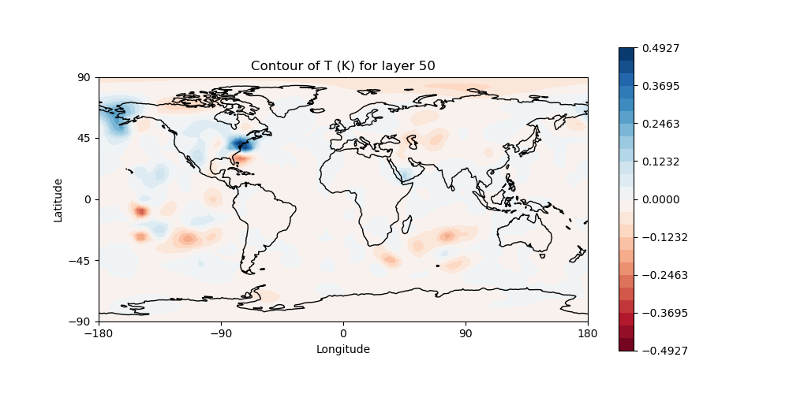

.. _top-tut-run-jedi:

Tutorial: Run JEDI-FV3 in a Container
=====================================

Learning Goals:
 - How to download and run/enter a JEDI application container
 - Introduction to the JEDI source code and directory structure
 - How to run a JEDI DA application inside the container
 - How to view an increment

Prerequisites:
 - Read the :doc:`tutorial overview <../index>`

Overview
--------

In this tutorial we will be running a low-resolution version of the FV3 model as implemented in NOAA's Global Forecast System, :doc:`FV3-GFS <../../../inside/jedi-components/fv3-jedi/index>`.  We'll run both 3D and 4D ensemble variational applications (3DEnVar, 4DEnVar) and compare the increments that each produces.  Along the way, we will get to know the JEDI singularity container; we will run these applications without compiling any code - JEDI is already in the container and ready to go.

JEDI packages are organized into bundles. A bundle includes a collection of GitHub repositories needed to build and run JEDI with a particular model.  In this tutorial, we will be building ``fv3-bundle``.

All JEDI bundles include the base JEDI component of the Object Oriented Prediction System (:doc:`OOPS <../../../inside/jedi-components/oops/index>`), the Interface for Observational Data Access (:doc:`IODA <../../../inside/jedi-components/ioda/index>`), the Unified Forward Operator (:doc:`UFO <../../../inside/jedi-components/ufo/index>`) and the System-Agnostic Background Error Representation (:doc:`SABER <../../../inside/jedi-components/saber/index>`).  The interface between FV3-based models and JEDI is implemented through the :doc:`FV3-JEDI <../../../inside/jedi-components/fv3-jedi/index>` code repository.

Most bundles will also include additional repositories that provide the forecast model and the physics packages or software infrastructure that supports it. Some bundles may also include supplementary repositories that support different observation types, such as an alternative radiative transfer model or tools for working with radio occultation measurements from global navigation satellite systems.

Which JEDI bundle you build depends on which atmospheric or oceanic model you plan to work with.

Step 1: Download and Enter the JEDI Container
---------------------------------------------

The first step in this and all JEDI tutorials is to download the appropriate JEDI tutorial Singularity container.  In this activity we'll use the ``jedi-tutorial`` container:

.. code-block:: bash

   singularity pull library://jcsda/public/jedi-tutorial

If you get an error message that singularity is not found then you'll have to install it or otherwise gain access to it.  For further information see the :doc:`tutorials overview <../index>`.

If the pull was successful, you should see a new file in your current directory with the name ``jedi-tutorial_latest.sif``.  If it has a different name or a different extension you may have an older version of Singularity.  It is recommended that you use Singularity version 3.0 or later.

If you wish, you can verify that the container came from JCSDA by entering:

.. code-block:: bash

   singularity verify jedi-tutorial_latest.sif

Now you *enter the container* with the following command:

.. code-block:: bash

   singularity shell -e jedi-tutorial_latest.sif

To exit the container at any time (not now), simply enter

.. code-block:: bash

   exit

Before running any JEDI applications or tests inside or outside a container, it's a good idea to make sure that your system is ready for it.  If you are running on a laptop or virtual machine, it is likely that some of the tests will require more MPI tasks than the number of compute cores you have available on your machine.  So, we have to tell OpenMPI that it is ok if some cores run more than one MPI task.

To do this, first see if the following directory exists on your system:

.. code-block:: bash

    ls $HOME/.openmpi

If it does not exist, run the following commands to create and initialize it:

.. code-block:: bash

    mkdir -p $HOME/.openmpi
    echo 'rmaps_base_oversubscribe = 1' > $HOME/.openmpi/mca-params.conf

If the ``$HOME/.openmpi`` directory already exists, edit it to make sure it contains an ``mca-params.conf`` file with the line ``rmaps_base_oversubscribe = 1``.  This turns on OpenMPI's "oversubscribe" mode.

It is interesting to note that this is something that we cannot include in the container.  When you are inside the singularity container, you have the same home directory (and user name) as you do outside of the container.  This is a Good Thing; it provides a convenient work environment that is familiar to most scientists and software engineers, where you can see the files in your home directory without having to explicitly mount it in the container (as you would with Docker).  But, it also means that some things, like this ``$HOME/.openmpi`` directory are shared by your container enviroment and your host environment.

Another common source of spurious test failure is memory faults due to an insufficient stack size.  To avoid this, run the following commands:

.. code-block:: bash

    ulimit -s unlimited
    ulimit -v unlimited

.. _meet-the-container:

Step 2: Get to know the Container
---------------------------------

When you ran the ``singularity shell`` command in Step 1, you entered a new world, or at least a new computing environment.  Take a moment to explore it.

First, notice that you are in the same directory as before:

.. code-block:: bash

  echo $PWD

So, things may look the same, though your command line prompt has likely changed.  And, you can see that your username is the same as before and your home directory has not changed:

.. code-block:: bash

  whoami
  echo $HOME
  cd ~
  ls

You are still the same person.  And, more importantly from a system administrator's perspective, you still have the same access permissions that you did outside of the container.  You can still see all the files in your home directory.  And, you can still edit them and create new files (give it a try).  But things have indeed changed.  Enter this:

.. code-block:: bash

  lsb_release --all

This tells you that you are now running an ubuntu 18.04 operating system, regardless of what host computer you are on and what operating system it has.  Furthermore, take a look at some of the system directories such as:

.. code-block:: bash

   ls /usr/local/lib

There you will see a host of JEDI dependencies, such as netcdf, lapack, and eckit, that may not be installed on your host system.  Thus, singularity provides its own version of system directories such as ``/usr`` but shares other directories with the host system, such as ``$HOME``.  If you're familiar with any of these libraries, you can run some commands, for example:

.. code-block:: bash

   nc-config --all

You can find the JEDI code in the ``/opt/jedi`` directory:

.. code-block:: bash

   cd /opt/jedi
   ls

There are two subdirectories here.  One is ``fv3-bundle``.  Go inside and look around.  :ref:`As described above <top-tut-run-jedi>`, jedi applications are best built as part of **bundles** that include all the different JEDI code repositories needed to compile that particular application.  So, you will see the fv3-bundle components of OOP, IODA, UFO, SABER, and FV3-JEDI, along with a few other supporting code repositories.

Also in the ``/opt/jedi`` directory is a subdirectory called ``build``.  This contains the compiled code, including the executables that are located in ``/opt/jedi/build/bin``.  Again, have a look around.

The files in the ``/opt/jedi`` directory are part of the container and cannot be readily accessed after you exit singularity.  Furthermore, the files in the container read-only.  And, since the unit tests in general produce output files, you will not be able to run the tests in the ``/opt/jedi/build`` directory.  But, you can still look at them.

The tests for each code repository are defined within that repository.  So, they can be found within each corresponding directory, usually in a subdirectory called ``test``.  See, for example, the ``ufo/test`` and ``saber/test`` subdirectories in ``/opt/jedi/build``.  As the top-level code component, OOPS is structured a bit differently.  Here the QG and Lorentz 95 toy models have their own test directories (``oops/qg/test`` and ``oops/l95/test`` respectively), with a few other test configurations in ``oops/src/test``.

Step 3: Run a JEDI Application
------------------------------

The container contains everything you need to run a Data Assimilation (DA) application.  In addition to the executables and test data files in ``/opt/jedi/build``, there are also various configuration files in the ``/opt/jedi/fv3-bundle/tutorials`` directory.  To proceed, let's create a new directory suitable for running the application and then copy the files over for this tutorial:

.. code-block:: bash

   mkdir -p $HOME/jedi/tutorials
   cp -r /opt/jedi/fv3-bundle/tutorials/runjedi $HOME/jedi/tutorials
   cd $HOME/jedi/tutorials/runjedi
   chmod a+x run.bash

.. note::

   If you are running on an HPC system with very little space in your home directory, you could alternatively create a directory in some larger work or scratch space and then mount it in the container with:

   .. code-block:: bash

      singularity shell --bind <scratch-directory>:/worktmp -e jedi-tutorial_latest.sif

   where ``<scratch-directory`` is the path to your work directory outside the container.  This will then be accessible within the container as ``/worktmp``.  Alternatively, you could ``cd`` to your directory of choice and enter the container by specifying your current directory as your home directory inside the container:

   .. code-block:: bash

      singularity shell --home=$PWD -e jedi-tutorial_latest.sif

   For further details see :ref:`Working with Singularity <working-with-singularity>`.

Take a look at the files you just copied over.  The run script defines a workflow that is needed to run a variational data assimilation application with :doc:`FV3-JEDI <../../../inside/jedi-components/fv3-jedi/index>` and the B-Matrix Unstructured Mesh Package (:doc:`BUMP <../../../inside/jedi-components/saber/BUMP>`).  First BUMP is used to compute the correlation statistics and localization for the background error covariance matrix (B-Matrix).  Then the variational application is run, and a separate application computes the increment.  Each application runs with at least 6 MPI tasks (the minimum for fv3) and requires only one argument, namely a (yaml) :doc:`configuration file <../../../inside/jedi-components/configuration/configuration>`).  A log file is also specified for saving the text output.

The ``conf`` directory contains jedi configuration files in ``yaml`` format that govern the execution of the application, including the specification of input data files, control flags, and parameter values.  If you look inside, you'll see references to where the input data files are.  For example, the ``/jedi/build/fv3-jedi/test/Data/fv3files`` directory contains namelist and other configuration files for the FV3 model and the ``/jedi/build/fv3-jedi/test/Data/inputs/gfs_c12`` directory contains model backgrounds and ensemble states that are used to define the grid, initialize forecasts, and compute the B-Matrix.  The ``c12`` refers to the horizontal resolution, signifying 12 by 12 grid points on each of the 6 faces of the cubed sphere grid, or 864 horizontal grid points total.  This is, of course, much lower resolution than operational forecasts but it is sufficient to run efficiently for a tutorial!

If you peruse the config files further, you may see references to the ``/jedi/build/fv3-jedi/test/Data/obs`` directory, which contains links to the observation files that are being assimilated.  Another source of input data is the ``/jedi/build/fv3-jedi/test/Data/crtm`` directory, which contains coefficients for JCSDA's Community Radiative Transfer Model (`CRTM <https://github.com/JCSDA/crtm>`_) that are used to compute simulated satellite radiance observations from model states (i..e. observation operators).

We again encourage you to explore these various directories to get a feel for how the input to jedi applications is provided.

Now let's run a 3D variational data assimilation application that uses an ensemble-based background error covariance matrix:

.. code-block:: bash

   ./run.bash 3denvar

Before we view the results, let's also run the 4D equivalent:

.. code-block:: bash

   ./run.bash 4denvar

The objective of the ``run.bash`` script is to produce an *increment*.  In DA terminology, this represents a change to the background state that will bring it in closer agreement with the observations.  This can be done either by minimizing a cost function at a fixed model time (3denvar) or by taking into account the dynamical evolution of the model state over the assimilation time interval (4denvar).  The latter is expected to be more accurate, but also more computationally intensive.

The output of each of these experiments can now be found in the ``run-3denvar`` and ``run-4denvar`` directories respectively.  A detailed investigation of this output is beyond the scope of this tutorial but you may wish to take a few moments to survey the types of output files that are produced.

Step 4: View the Increment
--------------------------

As mentioned above, the last application in the ``run.bash`` script generates an increment that can be used for visualization.  This is rendered as a netcdf file.  To create an image for viewing, go to the 3denvar increment directory and run this program:

.. code-block:: bash

   cd run-3denvar/increment
   fv3jedi_plot_field.x --inputfile=3denvar.latlon.20180415_000000z.nc4 --fieldname=T --layer=50

Here we have specified the input file, the field we want to see, in this case temperature, and the vertical layer.  You can view the resulting image file using the linux utility ``feh``:

.. code-block:: bash

   feh 3denvar.latlon.20180415_000000z_T_layer-50.png

If this produced an error, the chances are good that you are running Singularity remotely.  As with other graphical applications, you need to use the ``-Y`` option to ``ssh`` in order to set up X forwarding when you log on to a remote machine.  In addition, you need to make sure your ``DISPLAY`` environment variable is set correctly.  A good rule of thumb is to see what ``DISPLAY`` is set to *outside* the container by accessing the remote system in another window:

.. code-block:: bash

   echo $DISPLAY   # enter this outside the container

Then, copy and paste that value and set it to the same value *inside* the container, for example:

.. code-block:: bash

   export DISPLAY localhost:10.0 # enter this inside the container - replace with the result of the above echo command

If X-forwarding is set up properly, that should work.  If you are still having problems, you can always copy the image files to your laptop or workstation for easier viewing.  Alternative, if you are running Singularity in a Vagrant virtual machine, see our :doc:`Vagrant documentation <../../../using/jedi_environment/vagrant>` for tips on setting up X forwarding and/or viewing files on the host machine.

If you prefer, NASA's interactive `Panoply <https://www.giss.nasa.gov/tools/panoply/>`_ data viewer is also available in the container by running the command ``panoply.sh``.  If you have X forwarding set up, this can be used instead of ``fv3jedi_plot_field.x``.  However, an interactive GUI like this is often frustrating to run over the internet unless you have a fast connection.

However you decide to view it, you should now be able to see the temperature increment and it should look something like this:

This is the change to the model temperature that will bring the forecast in closer agreement with observations, as determined by the 3denvar algorithm.

Now we invite you to explore.  Try viewing the surface pressure increment as follows (note this is a 2D field so there is no need to specify a layer).

.. code-block:: bash

   fv3jedi_plot_field.x --inputfile=3denvar.latlon.20180415_000000z.nc4 --fieldname=ps
   feh 3denvar.latlon.20180415_000000z_ps.png

Feel free to view other fields and levels.  The list of field names to choose from is the same list that is specified near the bottom of the ``3denvar-increment.yaml`` configuration file in the ``config`` directory: ``ua``, ``va``, ``T``, ``ps``, ``sphum``, ``ice_wat``, ``liq_wat``, and ``o3mr``.  Available levels range from 1 (top of the atmosphere) to 64 (ground level).  In each case the program will tell you the name of the image file it is creating.

When you are finished exploring the 3denvar increment, move to the ``run-4denvar/increment`` directory and repeat the process there (note that the input file has a different name).  The list of available variables and levels is the same, so you can compare.

Step 5: Change the Configuration (Optional)
-------------------------------------------

This is really a :doc:`Padawan level activity <../level2/index>` so feel free to come back to it after you've done some of the other more advanced tutorials.  But, experienced practitioners of data assimilation might wish to edit the configuration files in the ``config`` directory and see how that effects the resulting increments.

Here are a few possible activities - we encourage you to come up with your own:

- change the variable list in one or more of the observations that are assimilated.   For example, you can remove ``eastward_wind`` and ``northward_wind`` from the aircraft and/or radiosonde observations, leaving only temperature.
- remove one of the observation types entirely, such as aircraft or GNSSRO refractivity measurements (*hint: you may wish to review the* `basic yaml syntax <https://learn.getgrav.org/16/advanced/yaml>`_ *to see how components of a particular yaml item are defined*).
- change the localization length scales for bump (*hint:* ``rh`` *and* ``rv`` *correspond to horizonal and vertical length scales respectively, in units of meters*)

After each change remember to run the ``run.bash`` script again to generate new output.
