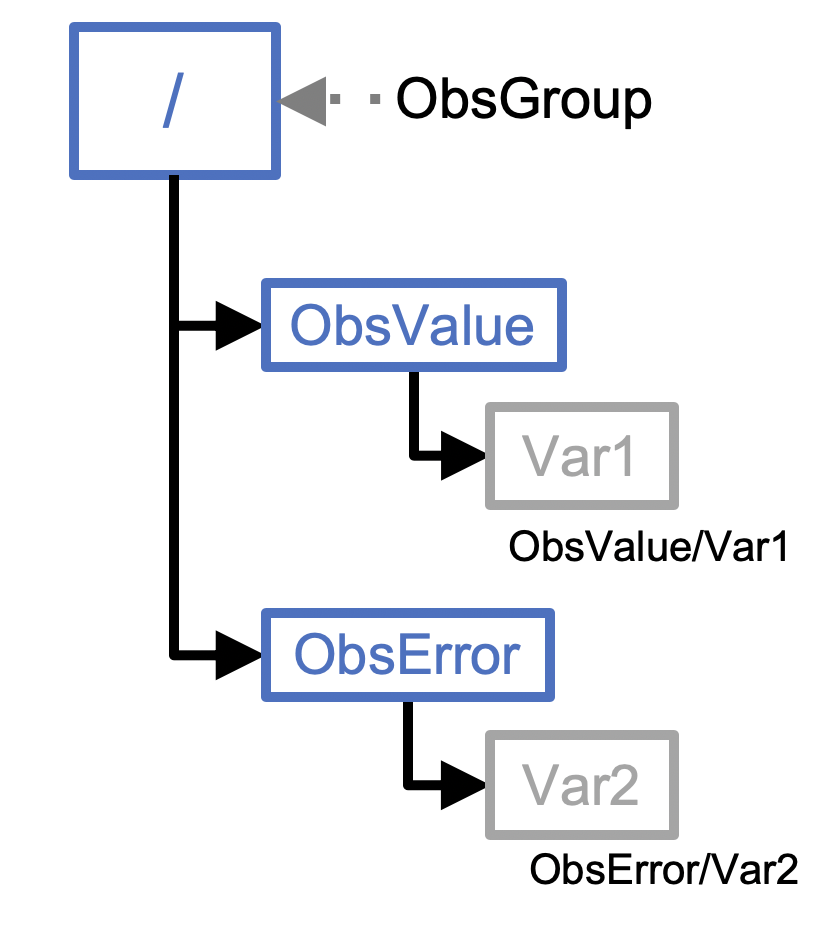

.. _top-tut-ioda-python:

Tutorial: Working with IODA through the Python API
==================================================

Learning Goals:
 - Gain insight into the IODA data model through the Python API
 - Learn how to read a IODA file into python for plotting and diagnostics

Prerequisites:
 - read the :doc:`tutorial overview <../index>`
 - :doc:`Run JEDI in a Container <../level1/run-jedi>`
 - familiarity with python programming

Overview
--------

The :doc:`Interface for Observational Data Assimilation (IODA) <../../../inside/jedi-components/ioda/introduction>` is the component of JEDI that handles observational data.  The principle software design objective that guides IODA development is what is known in the software engineering world as *the separation of concerns.*  In short, developers who are implementing new DA algorithms or interfacing new models into JEDI should not need to worry about the details of how observational data is organized in files.  Conversely, scientists and developers who are integrating new observational instruments into JEDI need not concern themselves with the details of how these observational data will be used.  This separation of concerns is achieved through an abstract data model that is implemented through a generic set of interfaces; what programmers call an API (Application Programming Interface).

The IODA data model is based on the `HDF5 Data Model <https://support.hdfgroup.org/HDF5/doc1.6/UG/03_Model.html>`_ both in its high-level design and its low-level implementation.  `HDF5 (Hierarchical Data Format, version 5) <https://www.hdfgroup.org/solutions/hdf5/>`_ is a well-established standard in the high-performance computing (HPC) community for for efficient processing and storage of large data volumes.  HDF5 also forms the basis of the popular `NetCDF (version 4) file format <https://www.unidata.ucar.edu/software/netcdf/>`_ that is widely used in the weather forecasting community.

That is not to say that IODA relies on HDF5 or NetCDF4 for its input.  In the code component we call ioda-engines, we separate out how the data are stored (the backend engine) from how an end user can access it (the frontend engine).  The same frontend API can thus access data through a variety of file formats and other data channels, implemented as backend engines.  As IODA development proceeds, we expect the diversity of supported backend engines to continue to grow.

Data in IODA are stored in a structure Groups, Variables, and
Attributes. A Group is like a folder. It is a logical
collection of Variables and Attributes that describes some
portion of the overall data. A Variable stores bulk data.
An Attribute stores smaller quantities of metadata, and can
be attached to either a Group or a Variable.  Groups can be nested.

The following figure illustrates this organization.  Observational data for a particular instrument and time interval is stored in one or more variables, here represented as ``Var1``.  The variables are organized into a group called ``ObsValue``.  Each measurement has an associated error estimate, which is similarly represented by one or more variables and organized into a group called ``ObsError``.  These are then combined into a top-level ``ObsGroup`` represented here by a ``/``.  Other groups may also be included in the ObsGroup, including ``ObsBias`` and ``PreQC``.  Attributes can then be added at the ``ObsGroup`` level, at the nested group level, or even at the variable level, as appropriate.   Though Attributes can contain a diverse range of metadata, it is often beneficial to also include a separate ``MetaData`` group within the ``ObsGroup`` for additional metadata that may have distinct values for each of the data points.  Examples include latitude, longitude, and date/time.



The IODA data model is implemented through abstract base classes in C++.  This leverages the generic, object-oriented capabilities of the C++ language to allow for multiple implementations.  An added benefit is these base classes can be accessed from python through a package called `pybind11 <https://github.com/pybind/pybind11>`_.  They can also be accessed from Fortran through the ``ISO_C_BINDING``.

In this tutorial we will explore the IODA data model through the python API.

Step 1: Enter the Container
---------------------------

If you have already done the :doc:`Run JEDI in a Container <../level1/run-jedi>` tutorial then you already have downloaded and verified the JEDI tutorial container.  Navigate to that directory and re-enter the container, if you are not already there:

.. code-block:: bash

   singularity shell -e jedi-tutorial_latest.sif

If you have not done that tutorial then do it now to gain access to the tutorial container.


Step 2: The IODA Python API
---------------------------

The IODA code repository includes a number of examples on how to work with the ioda-engines API from C++, C, or python.  These examples are located in the container in the following directory: ``/opt/jedi/fv3-bundle/ioda/src/engines/Examples``.

Here we will focus on the python API.  In order to work with the ioda python module, we need to first make sure that the libraries are properly linked, which we can do by setting the following environment variables:

.. code-block:: bash

   export LD_LIBRARY_PATH=/opt/jedi/build/lib:$LD_LIBRARY_PATH:/usr/local/miniconda3/lib
   export PYTHONPATH=/opt/jedi/build/lib/python3.8:$PYTHONPATH

Now, since some of these programs create output files, we will not be able to run them in the ``/opt`` directory, which is read-only.  So, for convenience, we will define an environment variable called ``PYIODA`` that points to the location of these examples.  And, we can use that to run the examples in a different directory.  For example:

.. code-block:: bash

   export PYIODA=/opt/jedi/fv3-bundle/ioda/src/engines/Examples/Python
   mkdir -p $HOME/jedi/tutorials/ioda_python_api
   cd $HOME/jedi/tutorials/ioda_python_api
   python $PYIODA/05-ObsGroup.py

This should have created an HDF5 file called ``Example-05-python.hdf5``.  You can see what this contains by using the HDF5 utility ``h5dump``:

.. code-block:: bash

   h5dump --contents Example-05a-python.hdf5

Or, since HDF5 forms the substrate of NetCDF4, you can also use the ``ncdump`` command:

.. code-block:: bash

  ncdump -h Example-05a-python.hdf5

You can see that the program has created an ObsGroup with two subgroups, ``MetaData`` and ``ObsValue``.  ``MetaData`` has two variables (each an HDF5 ``dataset``), namely ``latitude`` and ``longitude``.  The observational data (here artificial) is stored in the ``brightness_temperature`` variable in the ``ObsValue`` group.

The enumerated location and channel, ``nlocs`` and ``nchans`` are each stored as an HDF5 ``dataset`` at the top level of the ``ObsGroup``.  This is done during the creation of the ``ObsGroup`` on line 104 of ``$PYIODA/05-ObsGroup.py``:

.. code-block:: python

   og = ioda.ObsGroup.generate(g, newDims)

This python method is linked to the corresponding ``ObsGroup::generate`` method in the `C++ ObsGroup class <obsgroup_generate_>`_.  This generate method also links the ObsGroup to the output file, though ``Group`` ``g``, which was created a few lines earlier on line 67:

.. code-block:: python

   g = ioda.Engines.HH.createFile(
    name = "Example-05a-python.hdf5",
    mode = ioda.Engines.BackendCreateModes.Truncate_If_Exists)

So, in short, a ``ioda::Group`` object is created as a new HDF5 output file, and then a  ``ioda::ObsGroup`` object is created from that.  Data within the file can then be accessed through the ``ObsGroup`` object.  This includes reading and writing groups, variables, and attributes.  This is accomplished ostensibly through python calls but these calls and the objects they create are linked to the underlying IODA C++ classes.  To see the result of running this script, do a full data dump (press the space bar to scroll through)

.. code-block:: bash

   ncdump Example-05a-python.hdf5 | more

Here you can see the attributes that are added to the top-level ``ObsGroup`` and to each of the variables.  From the output, try to find the dimensions of the ``brightness_temperature`` variable, its "long name", its units, and its valid range.

For further details on how this all works, we encourage you to take a close look at the python script with whichever one of the editors available in the container that you are most familiar with (``vi``, ``vim``, ``emacs``, or ``nano``).

.. code-block:: bash

   vi $PYIODA/05-ObsGroup.py

We also encourage you to take a moment now and run some of the other examples (1-4) in the ``$PYIODA`` directory (but don't run ``$PYIODA/06-ReadIodaOutputFile.py`` until Step 3 of the tutorial).  And, while you are at it, look in detail at the (well documented) python scripts.  This should give you a good feel for how the IODA data model works.

Step 3: Reading a IODA Data File
--------------------------------

If you are a JEDI user, there is a good chance that at some point you will want to be able to read an output file from a JEDI application and plot it.  Or, perhaps you have some other analysis in mind.  JCSDA is actively developing community tools for diagnostics but nevertheless, learning how to work with JEDI application output is a valuable skill.

This is the focus of the sixth example of the python IODA API.  We have included some sample output files from JEDI applications in the ``/opt/jedi/fv3-bundle/ioda-data`` directory of the container.  As before, it's convenient to define an environment variable as shorthand so we don't have to write out the full path name every time we refer to it.  So, try entering the following commands to read in simulated AMSUA radiance observations from a JEDI Hoxf application:

.. code-block:: bash

   export IODA_DATA_DIR=/opt/jedi/fv3-bundle/test-data-release/ioda/2.0.0/testinput_tier_1/
   python $PYIODA/06-ReadIodaOutputFile.py $IODA_DATA_DIR/sample_hofx_output_amsua_n19.nc4

As before, you can use ``h5dump`` and ``ncdump`` commands to see what is in the file:

.. code-block:: bash

   h5dump --contents $IODA_DATA_DIR/sample_hofx_output_amsua_n19.nc4

And you can view the file itself to see how the data is read in with the IODA python API:

.. code-block:: bash

   vi $PYIODA/06-ReadIodaOutputFile.py

But this script will not work for other types of data, such as radiosonde measurements.  You can see for yourself with the data file ``$IODA_DATA_DIR/sample_hofx_output_sondes.nc4``.  In the next step of this tutorial, we will write a script to read this data into python.

Step 4: Write your own IODA reader
----------------------------------

In this step we will write a python program to read the Radiosonde data from the file ``$IODA_DATA_DIR/sample_hofx_output_sondes.nc4``.

As before, you whichever editor you are most comfortable with: ``vi/vim``, ``emacs``, or ``nano``.  We can use the ```$PYIODA/06-ReadIodaOutputFile.py`` file for guidance.

To proceed, create a file in the ``jedi/tutorials/ioda_python_api`` directory: we'll call ours ``read_ioda_sonde.py``.  We'll start with a few lines intended to read the name of the input file

.. code-block:: python

   import sys
   InFile = sys.argv[1]
   print(f"Reading data from radiosonde file {InFile}")

Now we can create a ioda ``Group`` object using the file as a ioda engine "back end".  This is similar to Step 2 above, but now the file that is attached to the group is read-only.  The print statement is added so you can see what type of python object is returned by the call to ``ioda.Engines.HH.openFile()``:

.. code-block:: python

   import ioda
   g = ioda.Engines.HH.openFile(
   name = InFile,
   mode = ioda.Engines.BackendOpenModes.Read_Only)
   print("type of g:", type(g))

Now, as in the example in Step 2, the next step is to create a ``ObsGroup`` object from the ``Group`` object so it is linked to the input file:

.. code-block:: python

   og = ioda.ObsGroup(g)
   print("type of og: ", type(og))

Now we can use ``h5dump`` and/or ``ncdump`` to probe the contents of the file.  Here

.. code-block:: bash

   ncdump -h $IODA_DATA_DIR/sample_hofx_output_sondes.nc4

There are many interesting variables here but let's start with the observations themselves:

.. code-block:: bash

   # output from ncdump - do not include in your python script
   group: ObsValue {
     variables:
           float air_temperature(nlocs) ;
           float eastward_wind(nlocs) ;
           float northward_wind(nlocs) ;
           float specific_humidity(nlocs) ;
           float surface_pressure(nlocs) ;
     } // group ObsValue


Let's modify our python script to read the air temperature as follows:

.. code-block:: python

   t_ObsVar = og.vars.open("ObsValue/air_temperature")
   t_ObsData = t_ObsVar.readNPArray.float()
   print("type of t_ObsVar", type(t_ObsVar))
   print("type of t_ObsData", type(t_ObsData))

Here you can see that the ``vars.open()`` method of the ObsGroup class creates a ioda ``Variable`` object which generally includes attributes (such as units) as well as data.  Then the ``readNPArray.float()`` method of the ``Variable`` class is used to access the data itself as a ``numpy`` array.

You can also extract the data as a list if you wish.  Let's do that for the latitude and longitude, which are metadata:

.. code-block:: python

   lat_Var = og.vars.open("MetaData/latitude")
   lon_Var = og.vars.open("MetaData/longitude")
   lat = lat_Var.readVector.float()
   lon = lon_Var.readVector.float()
   print(type(lat))

Let's now read the simulated air temperature from the application for comparison

.. code-block:: python

   t_HofxVar = og.vars.open("hofx/air_temperature")
   t_HofxData = t_HofxVar.readNPArray.float()

Negative temperature values represent missing data.  So, we can compare only valid data as follows:

.. code-block:: python

   print('\n' + '-'*60 + '\n')
   print("Comparison of valid obs to Hofx simulated obs")
   import numpy as np
   for i in np.arange(t_ObsData.size):
       if t_ObsData[i] > 0:
           print(t_ObsData[i][0],' : ',t_HofxData[i][0])

You can run your python script at any time by entering

.. code-block:: bash

   python read_ioda_sonde.py $IODA_DATA_DIR/sample_hofx_output_sondes.nc4

Step 5 (Optional): Extracurricular Activities
---------------------------------------------

You have the tools now to enhance the scripts you have and to write more.  Here are a few potential activities to try

* Extend your python script to read, print, and perhaps plot some of the other variables, groups, and attributes in the ``$IODA_DATA_DIR/sample_hofx_output_sondes.nc4`` file.  For tips on listing and extracting attributes and groups, see the detailed examples in the ``$PYIODA`` directory.

* Get your script to work with another satellite radiance Hofx example file, ``$IODA_DATA_DIR/sample_hofx_output_mhs_metop-a.nc4``

* Explore some of the other ioda test files in the ``$IODA_DATA_DIR`` directory.  Have a look at their contents with the ``ncdump`` and ``h5dump`` commands.  Pick an interesting file and adapt your reader to read it in.  If you feel ambitious and if you are adept at visualizing atmospheric data, you can generate some plots (common tools like ``matplotlib`` and ``cartopy`` are available in the container).

*  If you have done the :doc:`Simulating Observations with UFO <../level1/hofx_nrt>` tutorial, then you have a number of output files in the ``output/hofx`` directory.  Pick one of those files and adapt your reader to read it in.

.. link definitions - update these with the proper permalink after the release has been tagged.

.. _obsgroup_generate: https://github.com/JCSDA-internal/ioda/blob/ddb789f5593c9cf30ecebb5a8fd82ab58193355c/src/engines/ioda/include/ioda/ObsGroup.h#L57
