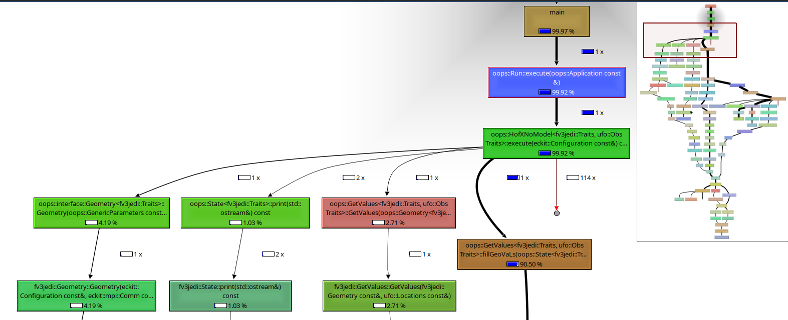
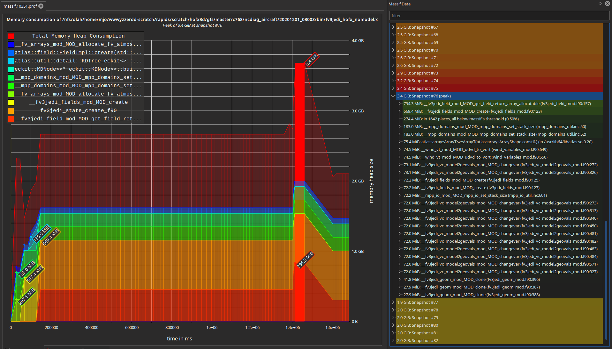

# Profiling JEDI MPI Applications

Profiling of parallel programs is necessarily more complicated than profiling serial programs.  Profiling code requires a carefully prepared build environment, and knowledge of the available profilers: their strengths and weaknesses.  Additionally, each HPC environment has a different set of available profilers and different conditions under which they can be effectively run due to hardware differences, kernel configurations, permissions, and filesystem limitations.

## Preparing the build environment

Profiling runs should always use the release-level compiler optimization and processor tuning flags, with debugging overhead disabled.  However, to get accurate source-level annotations in the profiling tools, it is also necessary to build with the `-g` flag which generates additional annotation sections in the ELF executable which help to associate each assembly command with the lines of source code that generated it.  These debug flags are different than setting the [`CMAKE_BUILD_TYPE`](https://cmake.org/cmake/help/latest/variable/CMAKE_BUILD_TYPE.html).  For performance analysis, always keep the default value of `CMAKE_BUILD_TYPE=Release` which is the only level at which performance critical compiler options are currently activated for the JEDI packages.

The easiest way to enable debug flags simultaneously with `Release` mode is due to the [non-standard way ecbuild handles compiler flags](https://github.com/ecmwf/ecbuild/blob/master/cmake/ecbuild_compiler_flags.cmake) is to set the shell environment variables:
* `CFLAGS="-g"`
* `FFLAGS="-g"`
* `CXXFLAGS="-g"`
* `LDFLAGS="-Wl,-z,now"`

Then rebuild the bundle with a fresh build directory.  On a successful application of these variables, they should show up in the ecbuild bundle summary printed at the end of the CMake configuration phase.  For example, for a `RelWithDebInfo` build, you might see something like this:

    ...
    -- ---------------------------------------------------------
    -- C -- GNU 10.2.0
    --     compiler   : /usr/bin/cc
    --     flags      : -g -pipe -O2 -g -DNDEBUG
    --     link flags :
    -- CXX -- GNU 10.2.0
    --     compiler   : /usr/bin/c++
    --     flags      : -g -pipe -O2 -g -DNDEBUG
    --     link flags :
    -- Fortran -- GNU 10.2.0
    --     compiler   : /usr/bin/gfortran
    --     flags      : -g -O2 -g -DNDEBUG
    --     link flags :
    -- linker : /usr/bin/ld
    -- ar     : /usr/bin/ar
    -- ranlib : /usr/bin/ranlib
    -- link flags
    --     executable [-Wl,-z,now    -Wl,--disable-new-dtags ]
    --     shared lib [-Wl,-z,now -Wl,--disable-new-dtags ]
    --     static lib [-Wl,-z,now -Wl,--disable-new-dtags ]
    -- install rpath  : $ORIGIN/../lib64
    ...

### Environment variables

OOPS listens for several environment variables which are useful for debugging, but problematic for performance analysis because they enable significant overhead especially in regards to MPI communications.
* `OOPS_DEBUG`: Must be unset or 0
* `OOPS_TRACE`: Must be unset or 0
* `OOPS_PROFILE`: Must be unset or 0, unless using GPTL profiler.

### Valgrind

[Valgrind](https://valgrind.org/) is an open-source and free generic framework for dynamic program analysis tools.  Each of the valgrind tools presents a view of different aspects of a program's execution.  The valgrind tools are thread-aware and work well with OpenMP code.  When analyzing MPI programs, each MPI process is run with it's own valgrind process.  Valgrind is a simulation based profiler and as such can provide a complete view of the program execution, but simulating the execution requires an ~10x-200x increase in run-time.  Therefore it's easiest to profile short-running executables where the expected behavior can be analyzed in detail on a small example and the performance can be extrapolated by comparing to longer runs without profiling overhead.

#### Callgrind

[Callgrind](https://valgrind.org/docs/manual/cl-manual.html) provides a complete analysis of the call-graph structure of a program execution.

    $ <mpiexec> -n <np> valgrind --tool=callgrind --callgrind-out-file=<name>.callgrind.prof <callgrind-args> <jedi-exe> <jedi-yaml>

To visualize the output use the KDE [KCachegrind](https://apps.kde.org/kcachegrind/) viewer.
<table style="width:100%">
<tr> <th> Calltree graph layout </th> <th> Source code annotation </th> <th> Caller/Callee Tables </th> </tr>

<tr> <th>

</th>
<th>

</th>
<th>

</th> </tr>
</table>

#### Massif

[Massif](https://www.valgrind.org/docs/manual/ms-manual.html) is a heap allocation profilier.  It periodically takes a snapshot of all the heap allocations and the stack backtraces at the moment of allocation.  This can be enormously useful in understanding both the temporal heap allocation behavior, but also gives direct insight into the exact lines of code responsible for the allocations.  The maximum heap allocation is estimated only to the precision at which the full sampling is done.

    $ <mpiexec> -n <np> valgrind --tool=massif --massif-out-file=<name>.massif.prof <massif-args> <jedi-exe> <jedi-yaml>

Recommended options:
* `--threshold=0.5`: Size threshold at which to record allocations. Smaller values require more overhead but increase detail of heap breakdown.
* `--time-unit=ms`: Reporting time units
* `--detailed-freq=1`: Frequency in seconds at which to take detailed snapshots.  Smaller values increase overhead but also increase likelihood of locating true heap maxima.
* `--pages-as-heap=no`: Controls how memory allocations are accounted for.  Normally set to `no`, but can be enabled for details of other non-heap allocation overhead (typically non-significant in JEDI applications).  See the [Massif documentation Sec. 9.2.8. "Measuring All Memory in a Process"](https://www.valgrind.org/docs/manual/ms-manual.html) for details.

To visualize the output use the KDE app [Massif-Visualizer](https://apps.kde.org/massif-visualizer/).
<table style="width:100%">
<tr> <th> Temporal heap allocation plot </th> <th> Allocation stack backtrace </th> <th> Heap layout and backtrace at maximum </th> </tr>
<tr> <th>

</th>
<th>

</th>
<th>

</th> </tr>
</table>

#### DHat

[DHat](https://valgrind.org/docs/manual/dh-manual.html) is anouther valgrind tool for analyzing heap allocations.

    $ <mpiexec> -n <np> valgrind --tool=dhat --dhat-out-file=<name>.dhat.prof <dhat-args> <jedi-exe> <jedi-yaml>

The DHat output can be viewed with the browser by pointing to the `dh_view.html` provided with the valgrind installation.

<table style="width:200px">
<tr> <th>

</th> </tr>
</table>

### Linux perf

All the profiling tools listed here in some way utilize the the Linux performance counters interface.  The `perf` tool is developed by the kernel developers for allowing powerful control over the performance tools, and simple performance profiling of multi-threaded processes.  See the excellent [perf documentation](https://perf.wiki.kernel.org/index.php/Main_Page) for details on getting started.  There are many perf subcommands which enable direct access to the stats or recording and reporting.

* [`perf stat`](https://perf.wiki.kernel.org/index.php/Tutorial#Counting_with_perf_stat): obtain event counts
* [`perf record`](https://perf.wiki.kernel.org/index.php/Tutorial#Sampling_with_perf_record): record events for later reporting
* [`perf report`](https://perf.wiki.kernel.org/index.php/Tutorial#Sample_analysis_with_perf_report): break down events by process, function, etc.
* [`perf annotate`](https://perf.wiki.kernel.org/index.php/Tutorial#Source_level_analysis_with_perf_annotate): annotate assembly or source code with event counts
* [`perf top`](https://perf.wiki.kernel.org/index.php/Tutorial#Live_analysis_with_perf_top): see live event count

### GPTL

The [General Purpose Timing Library](https://jmrosinski.github.io/GPTL/) was developed at UCAR by Jim Rosinski.  The library requires compile-time integration to enable it's instrumentation, but otherwise works well with low-overhead even on massively parallel MPI executions.  It is able to instrument the whole program or be enabled for particular sub-sections.  The tool is free and easy to build and provided by the [jedi-stack](https://github.com/jcsda-internal/jedi-stack), so it can be considered available on all platforms.

Analysis output is entirely text-based and does not currently demangle C++ names, so additional post-processing is required for easy visual analysis of programs.  For expert users it provides a simple tool for debugging when other options are constrained by the MPI execution size (VTune) or license restrictions (ARM Tools).

To enable the use of GPTL, both compile-time and run-time variables must be set.  When building an ecbuild bundle, enable the following CMake variables:
* `-DENABLE_GPTL=On`
* `-DENABLE_AUTOPROFILING=On`

When running an OOPS executable, set the following environment variables:
* `OOPS_PROFILE=1`: Enable GPTL profiling
* `OOPS_SYNC_MPI=1`: Enable GPTL MPI profiling
* `OOPS_MEMUSAGE=1`: Enable GPTL memory usage estimation
* `OOPS_UNDERLYING_TIMER=nanotime`: Enable nano-second resolution

<table style="width:200px">
<tr> <th>

</th> <th>

</th> </tr>
</table>

### ArmForge MAP

Arm Forge MAP profiler is both the single best profiler with the easiest to use command-line usage, but is simultaneously the most difficult to actually use for larger runs because of license restrictions.  Most HPC systems with an ARMForge license have a shared maximum count of tokens which are in contention with other users and ones own queued batch jobs.

Unlike every other profiler in the list the arm profiler is MPI aware and will modify the mpiexec command itself so as to propagate itself through the MPI execution initialization.  The net effect is that the `map` executable comes *before* the `mpiexec`.

    $ map <map-args> <mpiexec> -n <np> <mpiexec-args> <jedi-exe> <jedi-yaml>

<table style="width:100%">
<tr> <th>

</th> <th>

</th> <th>

</th> <th>

</th> </tr>
</table>

### Vtune

VTune is an excellent and now free tool with the capability of analyzing very large MPI/OpenMP executions.  VTune is now part of the [Intel OneAPI](https://software.intel.com/content/www/us/en/develop/tools/oneapi.html) suite and is available on most every HPC and can be installed easily on any Linux machine or Cloud instance.  A JEDI developer will want both the [OneAPI Base Toolkit](https://software.intel.com/content/www/us/en/develop/tools/oneapi/base-toolkit/download.html) and the [OneAPI HPC Toolkit](https://software.intel.com/content/www/us/en/develop/tools/oneapi/hpc-toolkit/download.html) for full MPI support.

VTune includes many tools known as [*Analysis Types*](https://software.intel.com/content/www/us/en/develop/documentation/vtune-help/top/set-up-project/analysis-types.html) which can get users different views of compute time, memory usage, MPI performance, micro-architecture usage, GPU accelerator usage, etc.

The [Intel VTune Users Guide Command Line Analysis documentation](https://software.intel.com/content/www/us/en/develop/documentation/vtune-help/top/command-line-interface/running-command-line-analysis.html) is the definitive source for the details of each of the analysis types.
* [`performance-snapshot`](https://software.intel.com/content/www/us/en/develop/documentation/vtune-help/top/command-line-interface/running-command-line-analysis/running-performance-snapshot-from-the-command-line.html): Low overhead view of overall performance
* [`hotspots`](https://software.intel.com/content/www/us/en/develop/documentation/vtune-help/top/command-line-interface/running-command-line-analysis/running-basic-hotspots-analysis-from-the-command-line.html): This is generally the most useful for understanding compute time performance analysis and how it relates to multi-threading and processor instruction usage.
* [`threading`](https://software.intel.com/content/www/us/en/develop/documentation/vtune-help/top/command-line-interface/running-command-line-analysis/running-threading-analysis-from-the-command-line.html): Detailed threading analysis
* [`hpc-performance`](https://software.intel.com/content/www/us/en/develop/documentation/vtune-help/top/command-line-interface/running-command-line-analysis/running-hpc-performance-analysis-from-the-command-line.html): A more appropriate version of `prefomance-snapshot` for MPI applications
* [`memory-consumption`](https://software.intel.com/content/www/us/en/develop/documentation/vtune-help/top/command-line-interface/running-command-line-analysis/running-memory-consumption-analysis-from-the-command-line.html): A heap allocation analyzer.  Not yet available/functioning in all HPC environments.
* [`memory-access`](https://software.intel.com/content/www/us/en/develop/documentation/vtune-help/top/command-line-interface/running-command-line-analysis/running-memory-access-analysis-from-the-command-line.html): Memory access analysis and bandwidth limitation analysis.

VTune must be run after the `mpiexec` call, and will record a separate analysis for each MPI process.  The data are then recombined on the first time the `vtune-gui` or other analysis tools are run on the output.  The intermediate output can be very large especially for longer runs or when there are many MPI tasks.  The number and size of files can overwhelm many HPC file systems, so care should be taken to run the VTune analysis only in appropriate file systems that can handle the iNode load.  The analysis can technically be run on another machine, but the link to the source code will be incorrect and the full annotation of source lines will be incorrect.

 $ <mpiexec> -n <np> <mpiexec-args> vtune -collect <analysis-type> <vtune-args> -- <jedi-exe> <jedi-yaml>

To view the analysis use the `vtune-gui` application:

    $ vtune-gui <analysis-output-dir>

<table style="width:100%">
<tr> <th>

</th> <th>

</th> <th>

</th> <th>

</th> </tr>
</table>

### Intel MPI trace analyzer (ITAC)

The [Intel Trace Analyzer and Collector](https://software.intel.com/content/www/us/en/develop/tools/oneapi/components/trace-analyzer.html) is a tool for profiling MPI calls in a massively parallel program with low profiling overhead (lower than VTune for certain).  It is available in the [Intel OneAPI HPC Toolkit](https://software.intel.com/content/www/us/en/develop/tools/oneapi/hpc-toolkit/download.html).  Discover has this package available and supported.  Some of the other HPC environments do not have this installed.

The [official Intel documentation](https://software.intel.com/content/www/us/en/develop/documentation/itc-user-and-reference-guide/top/user-guide.html) has detailed information on setting up and gathering the MPI trace data and running the analysis tools.

<table style="width:100%">
<tr> <th>

</th> <th>

</th> </tr>
</table>

## Profiling Platform Support and Notes

All referenced profiling tools require Linux kernel specific features and cannot be reliably run on non-Linux operating systems.

The functionality of some features is controlled by the configuration of the kernel and the permissions required to enable the profiling features.  In general on a cloud-based VM with root-access it is possible to enable the required features.  For some HPC environments the kernel version or access restrictions are sometimes problematic.  Containers always use the host-OS kernel, so they in general will not enable any additional profiling features not possible on the host kernel.

### Containers: Docker and Singularity

In principal it should be possible to profile an MPI execution inside a container exactly the same as outside the container.  It's important that the profiler is called directly on the MPI executable and not on another helper executable e.g., (`docker`, `singularity`) that is acting as the intermediary container loader/executor.  This means either the profiler is called from a shell inside the container, or the container driver is used as the outer-most executable, e.g.,

 $ docker <docker-args> run <image> <mpiexec> -n <np> <profiler> <profiler-args> <jedi-executable> <jedi-yaml>

 $ singularity <singularity-args> exec <image>.sif <mpiexec> -n <np> <profiler> <profiler-args> <jedi-executable> <jedi-yaml>

 See the [`docker run` documentation](https://docs.docker.com/engine/reference/commandline/run/), or the [`singularity exec` documentation](https://sylabs.io/guides/3.8/user-guide/cli/singularity_exec.html) for details on invoking containerize executables.

### Ubuntu based Linux

Valgrind and visualization tools are all available as packages.

    $ sudo apt install valgrind kcachegrind massif-visualizer

Linux perf is part of `linux-tools-common`.

    $ sudo apt install linux-tools-common

For Intel tools, download the appropriate versions from directly Intel, the HPC toolkit is required for MPI tools.

* [Intel OneAPI Base Toolkit](https://software.intel.com/content/www/us/en/develop/tools/oneapi/base-toolkit/download.html)
* [Intel OneAPI HPC Toolkit](https://software.intel.com/content/www/us/en/develop/tools/oneapi/hpc-toolkit/download.html)

### Orion

Orion has the ArmForge MAP profiler available.

    $ module load armforge

There is a shared maximum number of total MPI task that can utilize the profiler at once.  For this reason multiple batch runs of the MAP profiler should use appropriate scheduling to avoid running simultaneously if possible.  If other users are using the profiler and not-enough tokens are available the batch process will exit with an error from MAP.

Also intel vtune and other components are available with system modules:

    $ module load vtune

### S4

S4 mainly uses Intel compilers and tools.  VTune is the main profiler to use on this system.  ITAC was not found to be functional.

    $ module load vtune

### Cheyenne

Cheyenne currently has an ArmForge license and MAP is the preferred profiler:

    $ module load arm-forge

Also a valgrind module is available with callgrind, massif, and dhat profiler tool support.

    $ module load valgrind

Older versions of VTune are available using the `amplxe-cl` older tool names:

    $ module load intel

### Discover

Discover has VTune available as a module.

    $ module load vtune

The ArmForge license for discover was expired on last inspection (03/2021).
